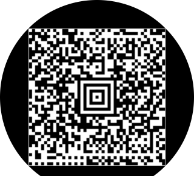

# Android 可穿戴设备的QR码：让用户快速通过

原标题：Android Wear & QR Code: Putting Users through the Fast Track

链接：[https://android-developers.googleblog.com/2015/01/android-wear-qr-code-putting-users.html](https://android-developers.googleblog.com/2015/01/android-wear-qr-code-putting-users.html)    
作者：Hoi Lam玩游戏合(开发倡导者)  
翻译：[shanyaodan](https://github.com/shanyaodan)

冲上火车，进入音乐会，或者只是点一份咖啡，我们都看到过用户（或我们自己）通过信用卡或移动app获得正确的登机牌，机票或会员卡。 借助Android Wear和移动app中的几行代码，这一切都可以像魔术一样使用。

## Android支持库中有什么新功能

虽然QR码图像可能会在Android Wear平台首次发布后附加到通知中，但开发人员被要求希望他们改善的两种情况：

  1.使用圆形显示屏，开发人员很难知道QR码是否全部显示并且未被裁剪。

  2.为了节省电量，Android Wear在闲置五秒钟后关闭屏幕。 但是，这使得用户很难确保当QR码到达显示队列的前端时仍然显示在他们的手腕上。

借助最新的支持库，我们为[WearableExtender](https://developer.android.com/reference/android/support/v4/app/NotificationCompat.WearableExtender?utm_campaign=wearQR-115&utm_source=dac&utm_medium=blog)添加了两个额外的方法，使开发人员能够更好地控制通知中背景图像的显示方式。 这些新的API可用于多种场景，我们将重点介绍这篇文章中的QR码使用案例：
* 确保图像未被裁剪 - [setHintAvoidBackgroundClipping(true)](https://developer.android.com/reference/android/support/v4/app/NotificationCompat.WearableExtender?utm_campaign=wearQR-115&utm_source=dac&utm_medium=blog#setHintScreenTimeout(int))

  使用这种新方法，开发人员可以确保整个QR码始终可见。

 | 错误: setHintAvoidBackgroundClipping (false) //默认     | 正确：  setHintAvoidBackgroundClipping (true)    |
 | :------------- | :------------- |
 |          |         |

* 确保当用户到达队列的前端时QR码仍然显示 - [setHintScreenTimeout(timeInMS)](https://developer.android.com/reference/android/support/v4/app/NotificationCompat.WearableExtender?utm_campaign=wearQR-115&utm_source=dac&utm_medium=blog#setHintScreenTimeout%28int%29)

这种新的方法使开发人员能够对一个特定超时操作起作用。

## 设计最佳实践

我们已经尝试了一些QR码的定制选项，下面是一些经验教训：

### 可以

* 使用您的设备进行测试 - 部署之前，请使用QR码阅读器进行测试，以确保穿戴式设备上显示的QR码能够与您的设备配合使用。

* 请使用黑白QR码 - 这可确保最大的对比度，并使读者更容易阅读信息。

* 在文本通知中只显示核心信息 - 请记住，少即是多。 可视性对可穿戴设备很重要。

* 使用圆形和方形手表进行测试 - 可以在通知上显示的文字数量，尤其取决于形状因数（正方形和圆形）。

* 使用图标做品牌 - 在Android Wear流的主要通知中，开发人员可以使用setLargeIcon设置全彩图标来标记您的通知。

* 使用背景传达附加信息 - 为了获得更好的效果，请考虑通过setBackground设置上情景敏感的背景，例如火车目的地的照片或体育场的图片。

* 请使用400x400像素或更大的QR码 - 与其他背景图像一致，推荐的QR码最小尺寸为400x400像素。

### 不可以

* 不要在QR码上打商标 - Android Wear上的屏幕空间有限，并且将其中一些用于品牌推广可能会导致QR码无法正常工作。

* 不要使用除了灰色或默认主题颜色以外的任何其他颜色来显示通知文本 - 尽管Android Wear通知支持基本文本格式设置，例如设置文本颜色，但应该在设置为默认或灰色的颜色下使用。 原因是Android 4.x的Holo主题具有黑色的默认背景，而包括Android Wear在内的Android 5的材质设计主题具有白色背景。 这使得颜色很难适用于这两种主题。 粗体和斜体是很好的格式选择。

## Android Wear面向移动中的用户

在Android Wear上使用QR码是非常愉快的体验。 用户需要的信息恰到好处地放在手腕上。 使用新的API，您现在可以解锁比以往任何时候都更多的方法，并为用户提供更便捷的操作。

示例代码可以在[这里](https://github.com/hoitab/QRCodeOnAndroidWear)下载
