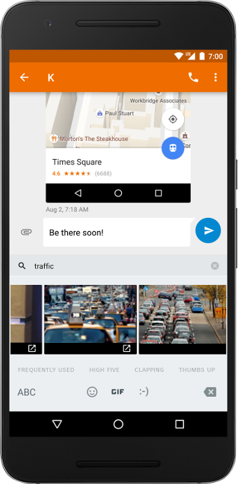

# 即将推出：Android 7.1开发者预览版

原标题：Coming soon: Android 7.1 Developer Preview  
链接：[https://android-developers.googleblog.com/2016/10/android-71-developer-preview.html](https://android-developers.googleblog.com/2016/10/android-71-developer-preview.html)  
作者：Dave Burke (工程副总裁)  
翻译：[arjinmc](https://github.com/arjinmc)  

今天，我们正在采取Android 7.1 Nougat这个最新版本的平台。在上周的活动中，你可能已经看到了一个抢先的地方。这是基于Android 7.0的增量更新，但包括面向消费者和开发者的新功能 - 从<strong>Daydream VR支持</strong>和<strong>A / B系统更新</strong>到<strong>应用程序快捷方式</strong>和<strong>图像键盘支持</strong>。

我们已经与设备制造商密切合作，让他们为Android 7.1做好准备，接下来我们会让你访问此更新，以便你可以开始准备好应用。

本月晚些时候，我们将把Android 7.1平台作为一个开放的开发者预览版，就像我们为Android 7.0所做的那样。你将能够在新平台上进行测试和构建，并尝试最新功能。

与往常一样，我们将通过[Android Beta程序](https://www.google.com/android/beta)提供开发人员预览，这使得参与非常容易。

## Android 7.1中有什么？

Android 7.1提供了Android 7.0的生产力，安全性和性能，以及各种优化和bug修复，功能以及新的API（API 25）。

对于开发者来说，Android 7.1增加了新的功能，可以帮助你推动应用程序的参与，并提供改进的用户体验，例如：

* <strong>应用快捷方式API</strong> - 可让你直接在启动器中显示关键操作，并让你的用户即刻深入你的应用。你最多可以创建5个快捷方式，无论是静态还是动态。
* <strong>圆形应用程序图标支持</strong> - 让你提供与像素和其他启动器相匹配的外观圆润的图标资源。
* <strong>增强的动态壁纸元数据</strong> - 可让你提供有关你的动态壁纸的元数据，作为预览显示壁纸的任何选择器。你可以显示现有的元数据，如标签，说明和作者，以及新的上下文URL和标题以链接到更多信息。

Android 7.1还将这些要求很高的开发者功能添加到平台中：

* <strong>图像键盘支持</strong> - 扩展用户可以从键盘输入的内容类型，让他们通过自定义贴纸，动画GIF等表达自己的内容。应用程序可以告诉键盘他们接受什么类型的内容，键盘可以提供他们提供给用户的所有图像和其他内容。为了广泛的兼容性，这个API也将在支持库中可用。
* <strong>存储管理器Intent</strong> - 让应用程序直接将用户带到新的“设置”屏幕，清除未使用的文件并释放设备上的存储空间。

对于运营商和通话应用程序，该平台包含新的API以支持<strong>多端点呼叫</strong>和新的<strong>电话配置选项</strong>。

  
图像键盘支持：让用户直接从键盘输入图像和其他内容。

  
应用快捷方式：使用应用快捷方式来展示关键操作，并让用户即刻深入你的应用。

## 准备好你的应用程序

Android 7.1是一个增量版本，但确保你的应用程序外观和运行非常重要，特别是在设备开始接触消费者时。

Android 7.1开发者预览版将为你提供测试应用程序所需的一切，或使用快捷键或键盘图像等新功能扩展它们。包括带有新的API，构建工具，文档和示例的SDK，以及用于在支持的Nexus设备上运行应用程序的模拟器和设备系统映像。我们还将包括支持应用程序快捷方式的启动器和应用程序，以及支持键盘图像的键盘和应用程序。

如果你想自动收到开发者预览版，请访问[Android Beta](https://www.google.com/android/beta)并注册你的设备。如果你以前注册过某个设备但尚未取消注册，则你的设备将收到该更新。如果你已经注册但不想接收更新，请访问[Android Beta](https://www.google.com/android/beta)尽快注销设备。

最初，我们将为Nexus 5X，Nexus 6P和Pixel C设备提供开发者预览，并在预览结束时扩展到其他受支持的设备。在12月初发布的Android 7.1.x平台的最终版本中，我们将推出更新到支持的设备 - Nexus 6,5X，6P，9，Player，Pixel C和受支持的Android One设备 - 以及像素和像素XL设备。

## 即将到来的消费类设备

我们正在与合作伙伴合作，在未来数月内将Android 7.1带入生态系统中的设备，因此我们建议你尽快下载Android 7.1开发者预览版。测试你的应用程序的兼容性，并优化它们以获得最佳效果，例如通过提供循环应用程序图标和添加应用程序快捷方式。

同时，敬请期待，我们将尽快分享有关开发者预览的更多细节！