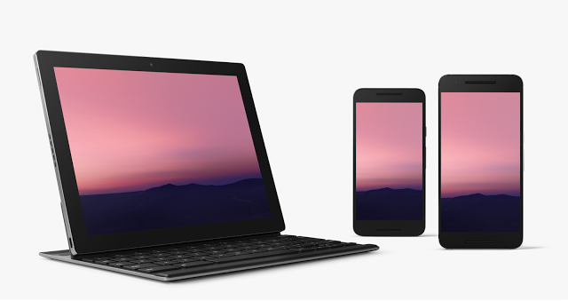
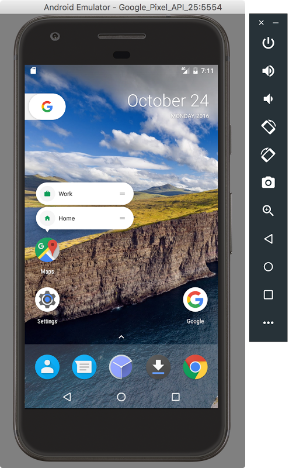
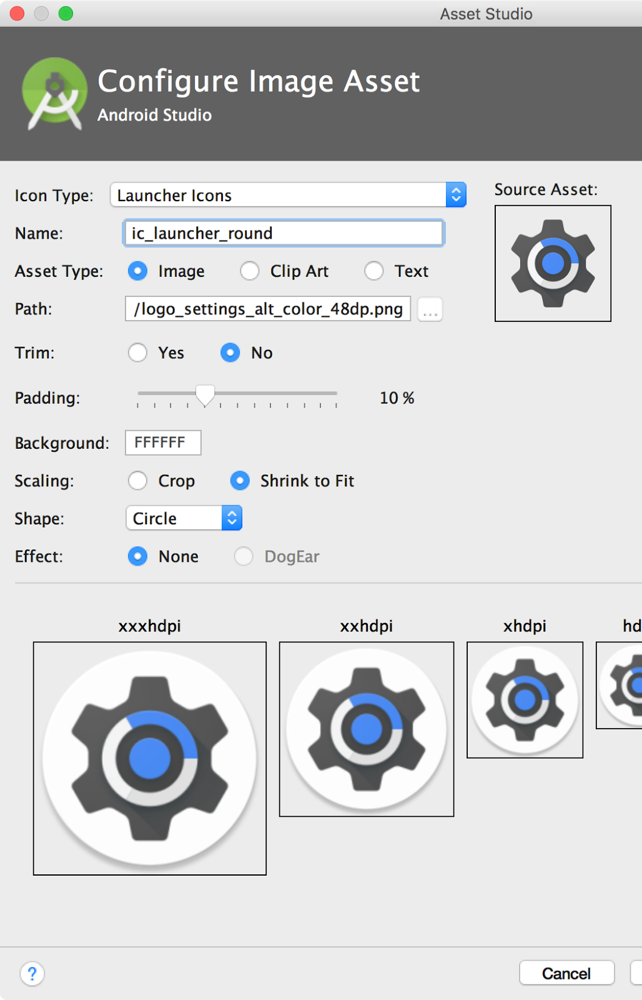

# 现在可用：Android 7.1开发者预览

原标题：Now available: Android 7.1 Developer Preview  
链接：[https://android-developers.googleblog.com/2016/10/android71-dev-preview-available.html](https://android-developers.googleblog.com/2016/10/android71-dev-preview-available.html)  
作者：Dave Burke (工程副总裁)  
翻译：[arjinmc](https://github.com/arjinmc)  

几个星期前，我们[宣布](http://android-developers.blogspot.com/2016/10/android-71-developer-preview.html)Android 7.1 Nougat 的[开发者预览版](https://developer.android.com/preview/index.html?utm_campaign=android_discussion_preview_101916&utm_source=anddev&utm_medium=blog)正在发展中。你可以通过下载SDK和工具来开始使用这个新版本。要在符合条件的设备上获得7.1版本，请将你的设备注册到[Android Beta程序](https://www.android.com/beta)中。如果你的设备已经注册，你将自动收到更新。

## 开发者预览中有什么？

Android 7.1 Developer Preview为你提供在新平台上测试应用程序所需的一切，或者使用应用程序快捷方式和图像键盘支持等[新功能](https://developer.android.com/preview/api-overview.html?utm_campaign=android_discussion_preview_101916&utm_source=anddev&utm_medium=blog)扩展它。它包括更新的SDK和工具，文档和示例，以及用于在受支持设备上运行应用程序的模拟器和设备系统映像。

我们继续使用N和更早版本中使用的模型，而Android 7.1是增量版本，有几点需要强调：

* 由于7.1已经在Pixel上推出，我们正在为Nexus产品线提供beta版质量的初始开发者预览版。目标是梳理出任何设备特定的问题。
* 我们已经将新的API定为API 25
* 我们已经开始在Google Play上发布针对新API级别的应用，因此你可以尽快更新自己的应用。

在最初的预览版发布之后，我们计划在十一月份发布一个更新，然后在十二月份向Android开放源代码项目（AOSP）发布最终的公开发布。最初在Nexus 5X，Nexus 6P和Pixel C设备上可用，我们将在11月将开发者预览版扩展到其他设备。

  

## 让你的应用程序准备好Android 7.1

要开始，请更新到Android Studio 2.2.2并下载API 25平台，仿真器系统映像和工具。最终的API 25 SDK可通过[Android Studio](https://developer.android.com/studio/index.html?utm_campaign=android_launch_npreview_061516&utm_source=anddev&utm_medium=blog)中的SDK Manager下载。

安装API 25 SDK后，你可以将项目更新<i>compileSdkVersion</i>为25，以便根据新的API进行构建和测试。如果你正在进行兼容性测试，我们建议将你的应用更新<i>targetSdkVersion</i>为25，以禁用兼容性行为来测试你的应用。有关如何使用API​​ 25 SDK 设置应用程序的详细信息，请参阅[设置预览](https://developer.android.com/preview/setup-sdk.html?utm_campaign=android_launch_npreview_061516&utm_source=anddev&utm_medium=blog)。

如果你要将应用快捷方式或圆形启动器图标添加到应用中，则可以使用Android Studio内置的Image Asset Studio快速帮助你创建符合[material design准则](https://material.google.com/style/icons.html#icons-product-icons)的不同大小的图标。

Android API 25 SDK附带的Google API仿真器系统映像支持圆形图标和新的Google像素启动器。Google API系统映像允许你测试应用程序的圆形应用程序图标在支持圆形图标的设备中的外观。此外，如果你正在开发动态壁纸，还可以使用Android模拟器中的新系统图像来测试Android 7.1中增强的预览元数据。

为了帮助你添加图像键盘支持，你可以使用预览系统映像中包含的Messenger和Google键盘应用程序进行测试，因为它们包括对此新API的支持。

除了API 25 SDK之外，我们还将[Android支持库](https://developer.android.com/topic/libraries/support-library/revisions.html?utm_campaign=android_launch_npreview_061516&utm_source=anddev&utm_medium=blog)更新为25.0.0。新版本允许你将兼容图像键盘的支持添加到API级别13的兼容性中。它还引入了[BottomNavigationView](https://material.google.com/components/bottom-navigation.html)小部件，该小部件实现了材质设计指南中的底部导航模式。

有关API 25的详细信息，请查看[开发者预览网站](https://developer.android.com/preview/index.html)上的[API差异](https://developer.android.com/sdk/api_diff/25/changes.html?utm_campaign=android_launch_npreview_061516&utm_source=anddev&utm_medium=blog)和更新的[API参考](https://developer.android.com/reference/packages.html?utm_campaign=android_launch_npreview_061516&utm_source=anddev&utm_medium=blog)。

  
Nexus 6P上的图像键盘支持  
你可以使用Android Studio中的Android模拟器在启动器中测试你的循环应用图标和快捷方式

  
Nexus 6P上的应用程序快捷方式  
你可以使用图像资源工具快速创建圆形图标资源。

## 将你的应用发布到Google Play的Alpha版，测试版或制作频道

由于Android 7.1 API是最终的，因此你可以发布使用API​​ 25进行编译的更新，并且可以选择将API 25定位到Google Play。你现在可以在Google Play开发者控制台中发布使用API​​ 25的应用更新到Alpha 版，[测试版](https://developer.android.com/distribute/engage/beta.html?utm_campaign=android_launch_npreview_061516&utm_source=anddev&utm_medium=blog)甚至生产渠道。通过这种方式，将你的应用更新推送给运行Android 7.1的用户，例如Pixel和Android Beta设备。

## 如何在你的合资格的设备上获取Android 7.1开发者预览版

如果你已经注册了[Android Beta程序](https://www.android.com/beta)，那么你有符合条件的注册设备将立即获得Android 7.1开发者预览版更新，你不需要执行任何操作。如果你还没有加入Android Beta，最简单的方法就是访问[android.com/beta](https://www.android.com/beta)，然后选择加入你的Android手机或平板电脑 - 你很快就会收到此（及更高版本）预览更新-空气。如果你有已注册的设备并且不想接收更新，只需访问Android Beta并取消注册该设备。你也可以手动下载并[更新此更新](https://developer.android.com/preview/download.html?utm_campaign=android_launch_npreview_061516&utm_source=anddev&utm_medium=blog#flash)。

我们欢迎你在[开发者预览版问题跟踪器](https://code.google.com/p/android/issues/list?can=1&q=label%3ADevPreview-N-7.1)，[N预览开发者社区](https://plus.google.com/communities/105153134372062985968/stream/755bb91d-c101-4e32-9277-1e560c4e26d2)或[Android Beta社区](https://plus.google.com/communities/106765800802768335079)中提供反馈，因为我们将在12月份发布消费者版本！