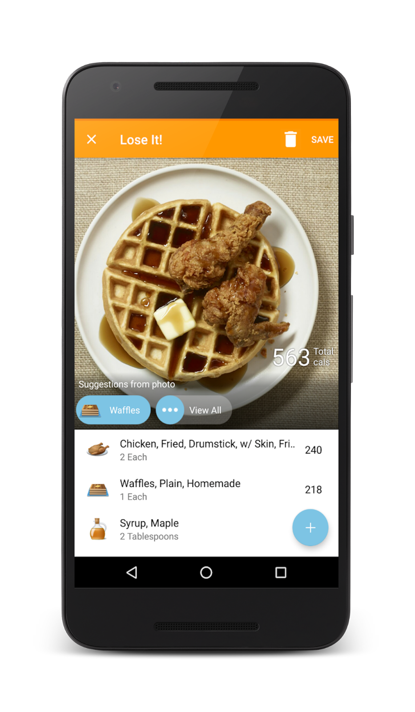
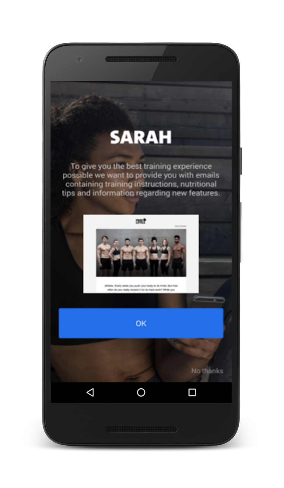

# 3个技巧为你的健身应用程序模范化

原标题：3 Exercises To Get Your Fitness App In Shape  
链接：[https://android-developers.googleblog.com/2016/10/3-exercises-to-get-your-fitness-app-in.html](https://android-developers.googleblog.com/2016/10/3-exercises-to-get-your-fitness-app-in.html)  
作者：Mary Liz McCurdy (Google Play健康与健身领导)  
（最初发布在[Android中心](http://www.androidcentral.com/3-exercises-get-your-fitness-app-shape)）
翻译：[arjinmc](https://github.com/arjinmc)  

成为健康和健身应用程序开发者是一个激动人心的时刻。随着人们对健身的冲击比以往任何时候都大，我们看到了高水平的健身房成员和出席率，精品健身的兴起以及对连网设备的重视。

这个增长最重要的是智能技术的整合。无论是通过流媒体视频，可穿戴设备还是移动应用程序，技术使我们能够立即获得高质量的训练，传感器生物反馈和无尽的按需灵感。在[Google Play](https://play.google.com/store/apps/category/HEALTH_AND_FITNESS)上，我们看到了健康与健身应用令人难以置信的受欢迎程度所带来的增长。事实上，这是Google Play发展最快的应用类别之一，拥有最活跃的30d活跃用户。

作为Google Play上的常驻健康与健身专家，我有机会在最近的[可穿戴技术展](http://www.wtsusa.show/)上讨论导致该类别增长的因素。以下是我与观众分享的前三条建议，旨在帮助指导开发者构建更有价值的应用体验：

## ＃1：隐形

我们都知道手动记录活动和生物测定是多么的痛苦 - 是卡路里跟踪，锻炼，情绪或激素周期。手动记录实际上是用户退出的头号原因。

<strong>你应该做什么</strong>：尽可能减少分散注意力，同时在适当的时候最大化价值。请记住，你很可能是主要事件的伴随经验。

[Lose It!](https://play.google.com/store/apps/details?id=com.fitnow.loseit)通过使用手机的相机和图像识别技术来识别食物及其营养信息，从而使食物跟踪更加轻松。再见手动卡路里计数！

  
Lose It!

[Strava](https://play.google.com/store/apps/details?id=com.strava)使用自动暂停检测功能，可以识别你在运动中休息的时间，因此你不需要摆弄设备，并且可以保持安全。

## ＃2：个性化

强化个性化投资一直是推动许多顶尖开发者之间的应用互动和买家转换的驱动因素。

<strong>你应该做什么</strong>：通过利用[Awareness API](https://developers.google.com/awareness/)，[Fit API](https://developers.google.com/fit/rest/)，[Google登录](https://developers.google.com/identity/sign-in/android/start-integrating)和[Facebook登录](https://developers.facebook.com/docs/facebook-login/android)等技术来智能地提取相关用户数据，从而为每个用户或不同用户群体个性化体验。想想你的初次使用者，高级使用者，高价值使用者等等，并把它们独一无二地对待。

[Freeletics](https://play.google.com/store/apps/details?id=com.freeletics.lite)将个性化的入门和基于性别和健身水平的总体应用程序体验导致每周活动会话数量增加58％。

  
Freeletics

通过基于用户健身评估，目标和锻炼模式的个性化训练计划，通过Skimble的[Workout Tranner(锻炼教练)](https://play.google.com/store/apps/details?id=com.skimble.workouts)增加了30％的用户参与度。

## ＃3：辅助

智能手机，可穿戴设备和物联网的兴起使我们在数据和仪表板上游泳，并留下了许多消费者的疑惑，那又如何呢？

<strong>你应该做的</strong>：提供见解和建议，而不仅仅是原始数据。用户不是工程师，通常不想处理复杂的数据或仪表板。在大多数情况下，他们希望你告诉他们现在做什么，或者在事后提供可消化的总结。把事情简单化。

[Glow](https://play.google.com/store/apps/details?id=com.glow.android)提供个性化的见解，利用用户输入的数据和[Google健身](https://developers.google.com/fit/android/)中的第三方数据来帮助夫妇实现其生育目标。

  
Glow

[Beddit](https://play.google.com/store/apps/details?id=com.beddit.beddit)通过分析睡眠周期，休息心率，呼吸，室温等，提供个性化的每日提示，以改善你的睡眠和健康状况。

在一天结束时，改变健康和健身习惯是困难的。通过使其更容易为用户<strong>无缝地引导</strong>他们，在他们 的<strong>个人</strong>需要做什么来实现他们的目标。这就是这么简单;）我们鼓励你尝试这些练习，以使你的应用适合希望过上更健康，更幸福生活的数百万Android用户。