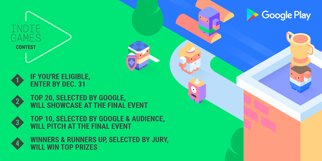
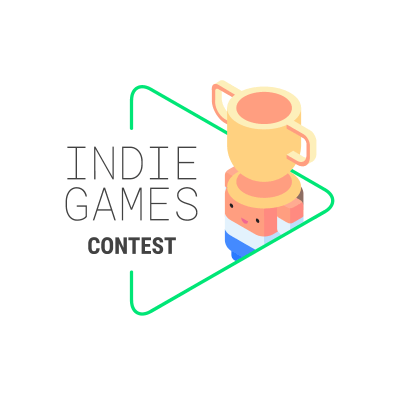

# 呼吁欧洲游戏开发者，在12月31日前进入独立游戏大赛

原标题：Calling European game developers, enter the Indie Games Contest by December 31  
链接：[https://android-developers.googleblog.com/2016/11/calling-european-game-developers-enter.html](https://android-developers.googleblog.com/2016/11/calling-european-game-developers-enter.html)  
作者：Matteo Vallone （Google Play游戏业务发展）
最初发布在[Google Developers博客](https://developers.googleblog.com/2016/11/calling-european-game-developers-enter-the-indie-games-contest-by-december-31.html)  
翻译：[arjinmc](https://github.com/arjinmc)  

为了提高对独立游戏开发者在Google Play上为用户带来的卓越创新和艺术的认识，过去一年来，我们在[Indie Corner(独立游戏角)](https://play.google.com/store/info/topic?id=topic_b000054_games_indie_corner_tp&e=-EnableAppDetailsPageRedesign)等项目上投入了大量资金，以及 Google Play独立游戏节在[北美](https://events.withgoogle.com/google-play-indie-game-festival/)和[韩国](https://events.withgoogle.com/google-play-indie-games-fes/)。

作为持续努力的一部分，我们也希望通过首次在欧洲推出[Google Play独立游戏大赛](https://events.withgoogle.com/indie-games-contest-europe/)来庆祝独立游戏开发商的激情和创新 。比赛将认可在几个国家最好的独立游戏，并提供奖品，将帮助你让你的游戏世界各地的行业专家和玩家注意到。

[视频介绍](https://youtu.be/XmMKcR_sREo)  

## 入围和获奖者奖品：

* 在伦敦萨奇画廊举行的开放展示
* YouTube影响力活动价值高达10万欧元
* Google Play上的高级展示位置
* 2017年Google I / O门票和其他顶级行业活动的门票
* 我们的渠道促销
* 最佳Unity游戏的特别奖品
* 还有[更多](https://events.withgoogle.com/indie-games-contest-europe/prizes/)！

## 参加比赛：

如果你位于捷克共和国，丹麦，芬兰，法国（即将推出），德国，冰岛，以色列，荷兰，挪威，波兰（即将推出），罗马尼亚，西班牙，瑞典，土耳其或英国（不包括北爱尔兰），拥有15名或以下的全职员工，并于2016年1月1日之后在Google Play上发布新游戏，符合资格的你现在可以[参加比赛](https://events.withgoogle.com/indie-games-contest-europe/)。如果你计划即将发布新游戏，则还可以通过提交私人测试版进入。查看[条款和细节约束](https://events.withgoogle.com/indie-games-contest-europe/terms/)。提交截止日期为2016年12月31日。

  

## 流程：

多达20名决赛选手将于2017年2月16日在伦敦萨奇画廊（Saatchi Gallery）举行的公开赛上展示他们的比赛。在比赛中，前10名将由与会者和Google Play小组挑选。届时，前十位将有机会向业内专家评审团提出评选结果，最终获奖者和亚军将被选中。

## 即使有人不参加比赛：

即使你没有资格参加比赛，您仍然可以注册参加2017年2月16日在伦敦举行的最终展示活动，查看一些优秀的独立游戏，并与各行业专家和独立开发者取经。我们还将在第二天在欧洲Kings Cross的新谷歌办公室，中东和非洲地区的所有独立游戏开发者举办一个研讨会，所以这将是一个紧张的一周。

## 准备开始：

[现在进入独立游戏比赛](https://events.withgoogle.com/indie-games-contest-europe/)，访问[比赛网站](https://events.withgoogle.com/indie-games-contest-europe/)，了解比赛，赛事和研讨会的更多信息。

  