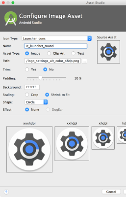
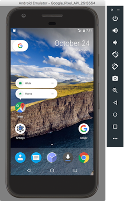

# Android 7.1 Developer Preview的最终更新

原标题：Final update to Android 7.1 Developer Preview  
链接：[https://android-developers.googleblog.com/2016/11/final-update-to-android-7-1-developer-preview.html](https://android-developers.googleblog.com/2016/11/final-update-to-android-7-1-developer-preview.html)  
作者：Dave Burke(工程副总裁)  
翻译：[arjinmc](https://github.com/arjinmc)  
 
今天，我们正在推出Android 7.1开发者预览版的最新版本，这是我们最终将Android 7.1.1平台发布到生态系统之前的最新版本。Android 7.1.1包含了Pixel和Pixel XL设备上已有的开发人员功能，并在基本的Android 7.1平台之上增加了优化和bug修复。使用开发者预览版2，你可以确保你的应用程序已准备好用于Android 7.1.1以及即将在其设备上运行的用户。

正如[十月份强调](https://android-developers.blogspot.com/2016/10/android71-dev-preview-available.html)的那样，我们还将可以接收该开发者预览更新的设备范围扩大到Nexus 5X，Nexus 6P，Nexus 9和Pixel C.

如果你的[Android beta 计划](http://www.android.com/beta)已注册支持的设备，那么你将在下周收到开发者预览版2的更新。如果你还没有注册你的设备，只需访问该[网站](http://www.android.com/beta)注册的设备并获取更新。

在十二月初，我们将推出Android 7.1.1以支持所有设备以及Pixel和Pixel XL设备。

## 这个更新有什么？

开发者预览版2是Android 7.1.1的发布候选版本，你可以使用它来完成应用程序开发和测试，为即将到来的最终版本做准备。包括近乎最终的系统行为和用户界面，以及整个系统和Google应用程序的最新bug修复和优化。

它还包括Developer Preview 1中已经介绍的开发者功能和API（API级别25）。如果你尚未探索开发者功能，则需要查看[应用程序快捷方式](https://developer.android.com/preview/shortcuts.html?utm_campaign=android_launch_developerpreview_112216&utm_source=anddev&utm_medium=blog)，[圆形图标](https://developer.android.com/preview/api-overview.html?utm_campaign=android_launch_developerpreview_112216&utm_source=anddev&utm_medium=blog#circular-icons)资源和[图像键盘支持](https://developer.android.com/preview/image-keyboard.html?utm_campaign=android_launch_developerpreview_112216&utm_source=anddev&utm_medium=blog)等等 - 你可以在这里看到[开发者功能的完整列表](https://developer.android.com/preview/api-overview.html?utm_campaign=android_launch_developerpreview_112216&utm_source=anddev&utm_medium=blog)。

通过Developer Preview 2，我们还将更新Android Studio，Android 7.1.1平台和API Level 25仿真器系统映像中的SDK构建和平台工具。最新版本的支持库（[25.0.1](https://developer.android.com/topic/libraries/support-library/revisions.html?utm_campaign=android_launch_developerpreview_112216&utm_source=anddev&utm_medium=blog)）也可以为运行API Level 25或更低版本的设备添加[图像键盘支持](https://developer.android.com/reference/android/support/v13/view/inputmethod/InputConnectionCompat.OnCommitContentListener.html?utm_campaign=android_launch_developerpreview_112216&utm_source=anddev&utm_medium=blog)，[底部导航](https://developer.android.com/reference/android/support/design/widget/BottomNavigationView.html?utm_campaign=android_launch_developerpreview_112216&utm_source=anddev&utm_medium=blog)和其他功能。

有关API Level 25的详细信息，请查看[开发者预览网站](https://developer.android.com/preview/index.html)上的[API差异](https://developer.android.com/sdk/api_diff/25/changes.html?utm_campaign=android_launch_npreview_061516&utm_source=anddev&utm_medium=blog)和更新的[API参考](https://developer.android.com/reference/packages.html?utm_campaign=android_launch_npreview_061516&utm_source=anddev&utm_medium=blog)。

## 让你的应用程序准备好Android 7.1

现在是时候优化你的应用程序，以在Android 7.1.1上发挥最佳效果。要开始，请更新到[Android Studio](https://developer.android.com/studio/index.html?utm_campaign=android_launch_npreview_061516&utm_source=anddev&utm_medium=blog) 2.2.2，然后通过Android Studio中的SDK Manager下载API Level 25平台，仿真器系统映像和工具。

安装API Level 25 SDK后，可以将项目的compileSdkVersion更新为25，以便根据新的API进行构建和测试。如果你正在进行兼容性测试，我们建议你将应用的targetSdkVersion更新为25，以禁用兼容性行为来测试你的应用。有关如何使用API​​ Level 25 SDK 设置应用程序的详细信息，请参阅[设置预览](https://developer.android.com/preview/setup-sdk.html?utm_campaign=android_launch_npreview_061516&utm_source=anddev&utm_medium=blog)。

如果你要将应用快捷方式或圆形启动器图标添加到应用中，则可以使用Android Studio内置的Image Asset Studio快速帮助你创建符合[material design准则](https://material.google.com/style/icons.html#icons-product-icons)的不同大小的图标。你可以在API级别25的Google API模拟器上测试圆形图标，其中包括对圆形图标和新的Google像素启动器的支持。

   
Android Studio和Google API模拟器可让你快速创建并测试你的圆形图标资源。

如果你要添加图像键盘支持，则可以使用预览系统映像中包含的Messenger和Google键盘应用进行测试，因为它们包括对此新API的支持。

## 使用适用于Android的Firebase测试实验室来扩展你的测试

为了帮助扩展你的测试，请确保利用[Android版Firebase测试实验室](http://android-developers.blogspot.com/2016/11/android-dev-preview-in-firebase-test-lab.html)，并在包括开发者预览版2（API 25）在内的所有虚拟设备的预览期间免费运行云端测试。你可以使用自动爬虫（[Robo Test](https://firebase.google.com/docs/test-lab/robo-ux-test)）来测试你的应用程序，而无需编写任何测试脚本，也可以上传自己的测试工具（如Espresso）。你可以在这里上传你的[测试](https://console.firebase.google.com/project/_/testlab/run)。

## 将你的应用发布到Google Play的Alpha版，测试版或制作频道

完成最终测试后，你可以发布针对Google Play的API 25编译的更新，并可以选择将其定向到API 25。你可以在Google Play开发者控制台中发布到你的Alpha 版，[测试版](https://developer.android.com/distribute/engage/beta.html?utm_campaign=android_launch_npreview_061516&utm_source=anddev&utm_medium=blog)甚至是制作频道。通过这种方式，将你的应用更新推送给运行Android 7.1的用户，例如Pixel和Android Beta设备。

## 在合资格的设备上获取开发者预览版2

如果你的设备符合[Android beta 计划](https://android.com/beta)的条件并已经注册了，则设备将在下周收到“开发者预览版2”更新。你不需要采取任何行动。如果你尚未加入此计划，最简单的方法就是访问[android.com/beta](https://android.com/beta)并选择加入你的Android手机或平板电脑 - 你将很快收到预览更新。与往常一样，你也可以[手动下载并更新此更新](https://developer.android.com/preview/download.html?utm_campaign=android_launch_npreview_061516&utm_source=anddev&utm_medium=blog#flash)。

如上所述，此开发者预览更新适用于Nexus 5X，Nexus 6P，Nexus 9和Pixel C设备。

我们期待在短短的几周内推出Android 7.1.1的最终版本从12月份开始，我们将推出Android 7.1.1以支持所有支持的预览设备，以及最近推出的Pixel和Pixel XL设备。那时候，我们也会把资源推给AOSP，所以我们的设备制造商合作伙伴可以把这个新的平台更新带给消费者在他们的设备上。

同时，我们继续欢迎你在[在开发者预览版问题跟踪器](https://code.google.com/p/android/issues/list?can=1&q=label%3ADevPreview-N-7.1)，[N预览开发者社区](https://plus.google.com/communities/105153134372062985968/stream/755bb91d-c101-4e32-9277-1e560c4e26d2)或[Android Beta社区](https://plus.google.com/communities/106765800802768335079)中反馈，因为我们将在12月份发布最终消费者版本！