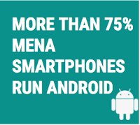
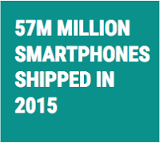
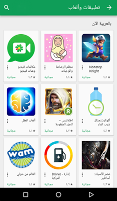

# 你的下一个增长市场：发掘中东和北非的潜力

原标题：Your next growth market: Realizing the potential of MENA  
链接：[https://android-developers.googleblog.com/2016/11/your-next-growth-market-realizing-the-potential-of-mena.html](https://android-developers.googleblog.com/2016/11/your-next-growth-market-realizing-the-potential-of-mena.html)  
作者：Mohammad El-Saadi (Google Play BD)  
翻译：[arjinmc](https://github.com/arjinmc)  

我们知道很多开发商希望利用新地区的增长机会，但由于不知道最重要的领域而受到阻碍。这就是为什么我们想分享我们在中东和北非（MENA）的合作伙伴的故事。对于Google Play来说，这是一个快速增长的地区，而且已经是一个可观的收入机会。他们已经分享了他们的经验以及一些关键的事情，如果你打算在这个地区开展业务。

## 中东和北非概述

    

MENA在可支配收入，连接性和智能手机渗透方面是一个多元化的地区。但是，将MENA大致分为两类市场：

<i>成长型市场</i>

* 例如：沙特阿​​拉伯，阿拉伯联合酋长国（阿联酋），科威特和其他海湾合作委员会（GCC）。
* 非常高的智能手机普及率（与欧洲顶级市场相当），
* 大的可支配收入
* 移动应用程序和游戏支出的增长强劲

<i>新兴市场</i>

* 例子：摩洛哥，埃及和伊拉克。
* 人口众多
* 智能手机（主要是Android）的大幅增长。

<strong>机会</strong>

<u>本土化</u>

如果你想在MENA取得成功，本地化是关键。在沙特阿拉伯，排名前20的应用程序和游戏中有19个将其Google Play商店列表本地化，其中大多数人都将其实际的应用程序/游戏本地化。通过本地化阿拉伯语，移动应用和游戏开发者在该地区取得了巨大的成功。

总部位于新加坡的[Wego.com](https://play.google.com/store/apps/details?id=com.wego.android)本地化为阿拉伯语，<strong>中东和北非地区同比增长超过200％</strong>，阿拉伯旅行者的应用等级从3.5增加到超过4.5，阿拉伯用户保留率提高了200％。今天，MENA代表了超过65％的用户。

为了做好本地化，这里有几件事情要考虑：

* 将你的商品详情本地化为阿拉伯文，包括你的视频，屏幕截图和文字。如果你针对的是中东和北非的特定国家，请考虑使用当地方言，否则使用正式的阿拉伯语。考虑使用商品详情实验来优化你的本地受众群体的商家信息。
* 如果适用，请将你的应用/游戏用户界面从右至左显示。
* 当本地化到阿拉伯语时，要小心常见的问题：阿拉伯文字母出现脱节或以相反的顺序出现，当句子同时包含拉丁语和阿拉伯语词汇时，
通过显示适当的本地货币和四舍五入来定位定价。请注意，MENA中的不同国家有不同的货币和支付能力/支付意愿。
* 围绕斋月圣地等当地主要事件进行规划，斋戒后从日落到日落，家人和亲人聚集吃饭，讲笑话，讲故事。我们发现，在这个月，中东和北非地区的应用和游戏使用量显着增加。
* 提供本地客户支持
* 在沟通和内容上保持文化敏感 - 避免刻板印象，并牢记该地区用户相对保守的性质
* 利用YouTube的强大力量吸引中东和北非地区的观众。就人均观看而言，沙特阿拉伯是全球第二大YouTube市场。

在本地化任何语言时， 请参阅我们的[本地化检查清单](https://developer.android.com/distribute/tools/localization-checklist.html?utm_campaign=android_discussion_mena_112116&utm_source=anddev&utm_medium=blog)以了解一些最佳实践。

<u>游戏</u>

游戏是中东和北非地区高增长和创收的机会。该地区大多数国家的平均年龄为30岁或更低，智能手机的增长将继续以两位数增长，这使得游戏成为该地区用户的关键部分。今日本地排名榜首，并以Midcore战略游戏为主。有趣的是，海湾合作委员会国家拥有全球最高的平均每用户收入。

“Clash of Clans”，“Clash Royale”，“Mobile Strike”，“Kings of Clash of Clash of Kings”等国际作品在该地区的表现令人难以置信。此外，专门针对中东和北非的标题也取得了巨大的成功。来自中国的ONEMT 对[Revenge of the Sultans(苏丹的复仇)](https://play.google.com/store/apps/dev?id=7006382305291329295)已经连续数个月在几个MENA国家中名列前茅。同样，当IGG.com推出阿拉伯版的“Arabic version of Castle Clash,(城堡冲突)”时，他们在4个月内<strong>增加了58％的收入</strong>。

随着市场的发展，其他类型（如RPG，FPS，体育等）在该地区尚未形成规模，也有巨大的机遇。

<strong>Google Play在MENA</strong>

我们继续投资，确保用户能够通过在MENA中启动本地相关的付款方式来支付他们喜欢的应用程序和游戏。今天，我们在沙特阿拉伯，阿联酋和科威特的主要网络都有运营商计费。我们计划在未来扩大在包括卡塔尔和巴林在内的更多国家的覆盖面。

我们还致力于增加阿拉伯语应用程序和游戏为中东和北非地区用户质量和可用性，这就是为什么我们推出了我们[现在在阿拉伯语](https://play.google.com/store/recommended?sp=CAEwAFovCilwcm9tb3Rpb25fMzAwMjUxMl9BcHBzX01FTkFfTm93X0luX0FyYWJpYxAHGAM%3D:S:ANO1ljLJ7kY&c=apps)合集特色应用和游戏最近本地化为阿拉伯语。这个收集将定期更新。如果你有兴趣加入，请[提交你的本地化应用程序/游戏](https://docs.google.com/a/google.com/forms/d/e/1FAIpQLSfuqUnnrY4a9XUsKlqrfow_7v9p1jMX_ae7DLnshk30pqOVZQ/viewform)。