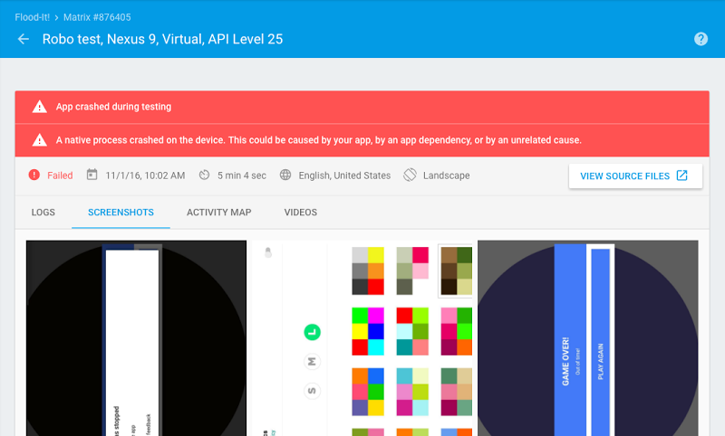

# 在Firebase测试实验室中测试Android 7.1开发者预览版

原标题：Test on Android 7.1 Developer Preview in Firebase Test Lab  
链接：[https://android-developers.googleblog.com/2016/11/android-dev-preview-in-firebase-test-lab.html](https://android-developers.googleblog.com/2016/11/android-dev-preview-in-firebase-test-lab.html)  
作者：Ahmed Mounir Gad (Firebase测试实验室产品经理)  
翻译：[arjinmc](https://github.com/arjinmc)  

为了提供最佳的用户体验，[Android版Firebase测试实验室](https://firebase.google.com/docs/test-lab/?utm_campaign=android_discussion_firebasetestlab_110316&utm_source=anddev&utm_medium=blog)允许你测试应用程序，并确保其与各种操作系统版本，屏幕方向和区域设置的兼容性。只需点击一下鼠标，你就可以在Google Cloud中的数百个设备配置上运行测试，并快速收到你的结果。

今天，我们很高兴地宣布<strong>在Firebase测试实验室</strong>[虚拟设备](https://firebase.google.com/docs/test-lab/avds)上提供<strong>可用</strong>[Android 7.1开发者预览版](https://developer.android.com/preview/index.html?utm_campaign=android_discussion_firebasetestlab_110316&utm_source=anddev&utm_medium=blog)。除了使用[Android Beta](https://www.google.com/android/beta)程序或在本地Android模拟器上在Android设备上测试Android 7.1 Developer Preview之外，还可以使用Firebase测试实验室将你的应用测试扩展到数百个Android虚拟设备。

你还可以使用Firebase测试实验室执行你自己的测试。如果你没有任何测试脚本，Robo测试非常适合在新平台上进行基本的兼容性测试。它抓取你的应用程序，试图找到崩溃。你也可以使用Android Studio中的[Espresso Test Recorder](https://developer.android.com/studio/test/espresso-test-recorder.html?utm_campaign=android_discussion_firebasetestlab_110316&utm_source=anddev&utm_medium=blog)来记录自己的仪器测试，而无需编写任何代码。

<strong>从即日起至12月底（2016年12月31日），所有虚拟设备的[Firebase Blaze计划](https://firebase.google.com/pricing/?utm_campaign=android_discussion_firebasetestlab_110316&utm_source=anddev&utm_medium=blog)将免费提供Firebase测试实验室</strong>，以帮助确保你的应用与Android 7.1开发人员预览版的兼容性，以及其他Android版本。

[准备你的应用程序以获得API 25](http://android-developers.blogspot.com/2016/10/android71-dev-preview-available.html)，然后转到[Firebase测试实验室控制台](https://firebase.corp.google.com/project/_/testlab/run)运行你的第一个测试。

快乐的测试！

  
机器人测试发现在Android 7.1开发者预览[Flood-It](https://play.google.com/store/apps/details?id=com.labpixies.flood)崩溃！应用程序。