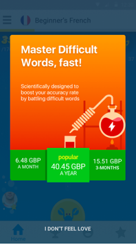
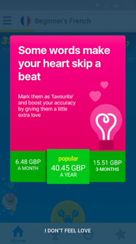
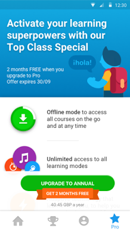

# 向Memrise学习技巧，通过价格经验来增加应用内购

原标题：Learn tips from Memrise to increase in-app conversions with pricing experiments  
链接：[https://android-developers.googleblog.com/2016/11/learn-tips-from-memrise-to-increase-in-app-conversions-with-pricing-experiments.html](https://android-developers.googleblog.com/2016/11/learn-tips-from-memrise-to-increase-in-app-conversions-with-pricing-experiments.html)    
作者：Tamzin Taylor(Google Play合作伙伴开发经理)和Kristina Narusk(Memrise产品主管)  
翻译：[arjinmc](https://github.com/arjinmc)  

让人们安装你的应用是一回事，让他们签名支持你的支付产品是另一回事。了解你的用户从安装你的应用程序到支付某些东西的全部旅程是非常重要的。一旦你这样做，你可以尝试流量来尝试和增加转换。Memrise在他们的语言学习应用程序的实验中取得了巨大的成功，增加了付费用户的数量。

<strong>Memrise使用四个体验来改善转换</strong>  

[Memrise](https://play.google.com/store/apps/details?id=com.memrise.android.memrisecompanion)使语言学习的更加有趣，你可以选择一些不同的学习模式，以帮助增加你选择的语言的词汇量。你可以免费下载应用程序，并玩一些模式，或利用他们的高级订阅提供名为“Memrise Pro”，它提供了新的游戏模式和附加功能，如离线学习。Memrise最近进行了一系列转换体验，主要目标是提高每日日常活动用户平均收入（ARPDAU）。这些实验测试了多个用户体验和定价实验场景。

<strong>1. A / B测试如何传递不同的用户好处可以影响转换</strong>  

<strong>他们做了什么</strong>：Memrise想知道什么动机和行动调度将转换大多数用户从应用程序锁定游戏模式购买专业版订阅。为了做到这一点，他们进行了两个类似设计的A / B测试，以不同的原因为用户升级，并将结果与​​原始升级消息进行比较。
                       
  
测试A：关注橙色背景的“困难”单词。

  
测试B：关注粉红色背景中的“最喜欢的”单词。 

<strong>结果</strong>：测试A表现最好。在测试A中转换成Pro比在测试B中高28％。相比于测试B，在测试A中Pro模式的使用率随后高出9.7％。

<strong>接下来的步骤</strong>：在看到测试A如何赢得了实验后，Memrise全面应用了这个创意。由特定模式驱动的订阅者占应用程序中所有订阅的百分比提高了16％。Memrise计划在应用程序的其他转换点处运行额外的A / B测试，以查看是否可以进一步提高结果。他们也会尝试调用不同的文本。

<strong>2.试验适应当地价格点是否会导致持续上涨</strong>

在2015年，Google Play在全球各个国家推出了新的最低当地价格水平。为了利用新的价格点，Memrise测试了降低某些市场的本地化价格以更好地匹配购买力。在这个实验中，价格平均低了6倍。 

<strong>结果</strong>： 30天后，Memrise看到了向付费用户转换的以下变化：

国旗 | 国家 | 转化率
--- | --- | ---
🇹🇷| 土耳其 | ⇧180 ％
🇧🇷 | 巴西 | ⇧182 ％
🇷🇺 | 俄国 |  ⇧99 ％
🇲🇽 | 墨西哥 |  ⇧115 ％
🇮🇳 | 印度 | ⇩5.1 ％
🇮🇩 | 印度尼西亚 |  ⇧152 ％
🇰🇷 | 韩国 |  ⇧120 ％
🇹🇭 | 泰国 | ⇧70 ％
🇲🇾 | 马来西亚 |  ⇧27 ％

<strong>后续步骤</strong>：价格变化影响了订阅动态，更多用户在大多数国家利用Memrise的应用内折扣优惠。该报价仅供年度用户使用，并对LTV产生积极影响。从实验中得出的一个见解是，印度用户最好有选择以每周或每月递增的方式订阅，而不是每年递交一次。Memrise仍然在仔细追踪，以确定折扣的订阅价格是否会导致转化率的上升。

<strong>3.试验你提供免费试用的时间和频率，看看是否会影响转换率</strong>

Memrise偶尔会提供非Pro用户的用户，通过各种免费模式循环免费试用Pro游戏模式之一。在免费试用期之后，用户被提供订阅的提议。Memrise尝试了提供的时机，使得用户在正常的免费会话中进行循环显示的频率更高。而不是每隔第49次会话之后，用户就会在第21次会话后看到解锁模式。

  
免费试用Pro模式的一个例子。

  
完成免费试用后，用户将看到折扣订阅优惠。

<strong>结果</strong>：免费试用更经常付清。转换率上升了50％，而所有其他转换率保持不变。

<strong>后续步骤</strong>：Memrise保持更频繁的优惠节奏，并因此带来收入增长。

<strong>4.试验季节性折扣是否会带来更多的转化 </strong>Memrise在2016年9月推出了一项“回到校园”活动，向所有用户提供一年的优惠计划，目标是转换更多用户，并从年度订阅中创造更高价值的用户计划。

  

<strong>结果</strong>： Memrise看到了季节性报价的两个影响。由于仅提供一个年度周期和每周和每月移除的结果，每天转换为Pro的用户数量减少了20％。然而，由于更多的人每年订阅的时间比订阅的时间更短，所以每天的平均收入增加了32％。

<strong>后续步骤</strong>：Memrise计划在未来通过订购产品组合测试不同的优惠。他们还将把重点放在像土耳其和墨西哥这样的国家，他们看到了转换率的最大增长。

<strong>不断尝试并利用新功能改善用户体验并提高转化率</strong>

在旧金山Playtime，[我们宣布](http://android-developers.blogspot.com/2016/11/welcome-to-playtime.html)订阅的介绍性定价即将到来，现在这个功能已经生效。通过不断测试消息，定价，优惠以及免费试用或折扣试用，你可以像Memrise一样提高应用的转化率和持续收入。详细了解[Google Play应用内结算订阅](https://developer.android.com/google/play/billing/billing_subscriptions.html?utm_campaign=android_discussion_pricingexperiments_113016&utm_source=anddev&utm_medium=blog)，并获取[Developers的Playbook应用](https://play.google.com/store/apps/details?id=com.google.android.apps.secrets)的最新功能和最佳实践，帮助你在Google Play上成功发展业务。