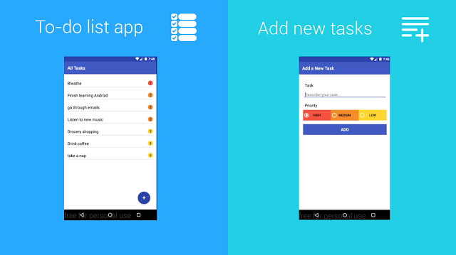

# 更新优达学城为学生准备的Associate Android Developer认证Android课程

原标题：Updated Udacity Android course prepares students for the Associate Android Developer Certification  
链接：[https://android-developers.googleblog.com/2016/11/updated-udacity-android-course-prepares-students-for-the-associate-android-developer-certification.html](https://android-developers.googleblog.com/2016/11/updated-udacity-android-course-prepares-students-for-the-associate-android-developer-certification.html)    
作者：Jocelyn Becker (Android培训高级项目经理)  
翻译：[arjinmc](http://github.com/arjinmc)  

作为我们最受欢迎的优达学城的课程之一，[开发Android应用程序](http://classroom.udacity.com/courses/ud851)课程最近更新，以确保开发者有资源建立高品质的应用程序。这个已经帮助超过五十万开发者学习构建Android应用程序的课程，已经通过洗车，并且更新到最好的内容了。

Google和优达学城一起合作更新课程，包括Android和Android Studio的最新变化，包括如何使用新的Constraint Layout编辑器以及如何使用Firebase作业调度程序。学习使用Android 7.0（Nougat）构建Android应用程序的最佳实践，同时保持你的应用程序在旧版本中向后兼容，在你自己的时间内按自己的步调进行学习。

你向我们发送的反馈意见，有些课程有点难以实现，所以我们重新整理了课程，并在你完成课程的过程中为你添加了更小的应用程序。因此，你不仅可以将阳光天气应用程序构建为一个涵盖整个课程的完整集成应用程序，还可以在每节课中创建一个应用程序，以帮助你了解各个概念。

  
构建To Do（待办事宜）应用程序，并在学习如何构建ContentProvider时添加新任务。

  
本课程将回顾来自Google的Android专家Dan Galpin和Reto Meier以及来自优达学城的Lyla Fujiwara，并介绍Google和优达学城的新面孔。

现在开始学习[https://www.udacity.com/course/ud851](https://www.udacity.com/course/ud851)。

<strong>合并开发Android应用程序课程和Associate Android Developer认证</strong>

此更新的课程将教授由Android Developer认证考试所测试的技能。优达学城提供的软件包将更新的[开发Android应用程序](https://www.udacity.com/course/ud851)课程与Associate Android Developer认证考试凭证相结合。如果你通过此考试，你将获得Android开发者认证证书，并证明你具备入门级Android开发者通常执行的任务的能力和技能。注册优达学城的[快速通道](https://www.udacity.com/course/associate-android-developer-fast-track--nd818)，准备好并参加Android开发者考试：[https://www.udacity.com/course/nd818](https://www.udacity.com/course/associate-android-developer-fast-track--nd818)。
