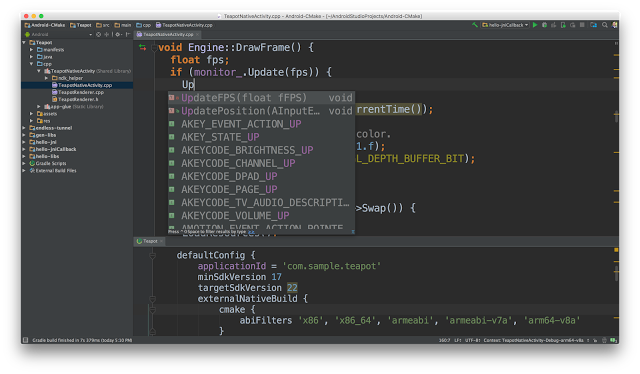

# Android Studio 2.2中的CMake和ndk-build支持  

原标题：CMake and ndk-build support in Android Studio 2.2  
链接：[https://android-developers.googleblog.com/2016/11/make-and-ndk-build-support-in-android.html](https://android-developers.googleblog.com/2016/11/make-and-ndk-build-support-in-android.html)  
作者：Kathryn Shih (Android产品经理)  
翻译：[arjinmc](https://github.com/arjinmc)  

除了支持实验性的Gradle插件外，[Android Studio 2.2](http://android-developers.blogspot.com/2016/09/android-studio-2-2.html)还允许你使用CMake和ndk-build构建Android项目的C / C++组件。

  

Android Studio团队计划继续支持实验性的Gradle插件。这将最终替代当前的Gradle插件，为C / C++开发者提供更多的紧密集成优势，如更智能的依赖关系管理。所以如果你有兴趣在IDE和你的编译系统之间有一个最聪明的接口，你不应该忽略实验性的插件。

在几种情况下，CMake和ndk-build是Gradle的有用替代方法：

* 已经在使用CMake或ndk-build的项目，比如传统的Eclipse ndk项目
* 无法承担使用C / C ++构建实验性插件的风险的项目
* 将跨多个平台共享C / C ++构建系统的项目
* C / C ++项目需要使用目前在实验Gradle中不可用的高级功能，如NEON支持

对于新项目，我们推荐使用CMake或实验Gradle。对于C++有限的新的Android项目，我们建议尝试一下实验性的Gradle插件。对于包含大量C ++的项目，或者需要最稳定的构建配置，我们建议使用CMake构建。Android Studio打算CMake成为一个永久支持的解决方案。

虽然我们认为有一个单一的构建系统可以处理Android应用程序的所有部分，但实验性插件的稳定性不是我们的选择，因为它依赖于仍在进行中的Gradle API。在Gradle API稳定之前，实验插件将会不断变化，特别是在其领域特定语言中，并且将严格依赖于Gradle本身的特定版本。

请注意，旧的，未记录的ndkCompile集成已被弃用。如果你正在使用它，你需要远离它，因为我们将在不久的将来彻底删除它。我们建议通过我们的[移植指南](https://developer.android.com/studio/projects/add-native-code.html?utm_campaign=android_discussion_cmake_110716&utm_source=anddev&utm_medium=blog)迁移到gradle + cmake 。

## 从Eclipse迁移到Android Studio

[我们不再支持Eclipse ADT](https://android-developers.blogspot.com/2016/11/support-ended-for-eclipse-android.html)。要开始迁移，请[下载并安装Android Studio](https://developer.android.com/studio/index.html?utm_campaign=android_discussion_cmake_110716&utm_source=anddev&utm_medium=blog)。对于大多数项目来说，迁移就像使用<strong>File</strong>→<strong>New</strong>→<strong>Import Project</strong>菜单选项在Android Studio中导入现有的Eclipse ADT项目一样简单 。有关迁移过程的更多详细信息，请查看[移植指南](https://developer.android.com/studio/intro/migrate.html?utm_campaign=android_discussion_cmake_110716&utm_source=anddev&utm_medium=blog)。

## 反馈和开源贡献

我们致力于使Android Studio成为构建Android应用程序的最佳集成开发环境，因此，如果有遗漏的功能或其他问题阻止你使用Android Studio，[我们希望了解它](https://goo.gl/forms/aGz9hQyRaTRQzN4s1) [ [请参阅我们的调查](https://goo.gl/forms/aGz9hQyRaTRQzN4s1) ]。你也可以直接向团队[提交bug或功能请求](http://tools.android.com/filing-bugs)，并通过我们的[Twitter](http://www.twitter.com/androidstudio)或[Google+](https://plus.google.com/103342515830390186255)帐户通知我们。

Android Studio是一个[开源](http://tools.android.com/build)项目，免费提供给所有人。查看我们的[开源项目页面](http://tools.android.com/contributing)，如果你有兴趣贡献或学习更多。