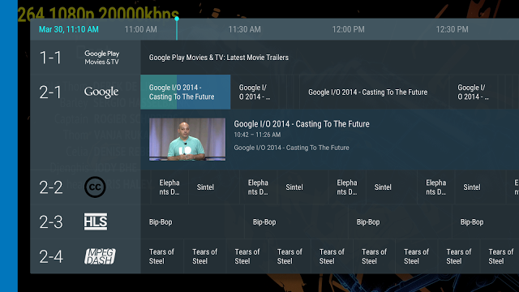

# 使用TIF Companion库向你的应用程序添加电视频道

原标题：Adding TV Channels to Your App with the TIF Companion Library  
链接：[https://android-developers.googleblog.com/2016/11/adding-tv-channels-to-your-app-with-the-tif-companion-library.html]()https://android-developers.googleblog.com/2016/11/adding-tv-channels-to-your-app-with-the-tif-companion-library.html  
作者：[Nick Felker](https://google.com/+NickFelker)和[Sachit Mishra](https://google.com/+SachitMishraDeveloper)（开发者项目工程师）  
翻译：[arjinmc](https://github.com/arjinmc)  

Android TV上 的[电视输入框架（TIF）](https://developer.android.com/training/tv/tif/tvinput.html?utm_campaign=android%20tv_discussion_tif_110916&utm_source=anddev&utm_medium=blog)使第三方应用程序开发者可以轻松地使用任何类型的线性媒体创建自己的电视频道。它为应用程序与高品质频道浏览体验的用户提供了一种全新的方式，并为用户提供单一界面来浏览和观看所有频道。

为帮助开发者开始构建电视频道，我们创建了[电视输入框架](http://github.com/googlesamples/androidtv-sample-inputs)，其中包含许多辅助方法和类，以使开发过程尽可能简单。

这个库提供了标准的类来设置一个后台任务，更新程序指南和一个界面，帮助你的媒体播放器与播放控制器集成，并支持Android Nougat中提供的新的电视录制API。它包括你需要开始在Android TV的实时电视应用上展示你的内容的一切。

  
（注：[源](https://github.com/googlesamples/androidtv-sample-inputs)从 [andrid-TV-示例输入](https://github.com/googlesamples/androidtv-sample-inputs) 示例）

要开始，请查看[示例应用程序](https://github.com/googlesamples/androidtv-sample-inputs)和[文档](https://developer.android.com/training/tv/tif/index.html?utm_campaign=android%20tv_discussion_tif_110916&utm_source=anddev&utm_medium=blog)。该示例演示了如何扩展此库以创建自定义频道并管理视频播放。开发者可以通过使用自己的内容更新[XMLTV文件](https://github.com/googlesamples/androidtv-sample-inputs/blob/master/app/src/main/res/raw/rich_tv_input_xmltv_feed.xml)或在[SampleJobService](https://github.com/googlesamples/androidtv-sample-inputs/blob/master/app/src/main/java/com/example/android/sampletvinput/SampleJobService.java)中动态创建通道，立即开始使用示例应用程序。

你可以将该库包含在你的应用程序中，方法是将library 示例中的目录复制到项目根目录中。然后，将以下内容添加到你的项目<i>settings.gradle</i>文件中：

```code
include ':library'
```

在你的应用程序<i>build.gradle</i>文件中，将以下内容添加到你的依赖关系中：

```code
compile project(':library')
```

Android TV持续增长，无论你的应用是按需还是直播媒体，TIF都是保持用户参与内容的绝佳方式。例如，Haystack TV等合作伙伴最近将TIF集成到他们的应用程序中，现在它占Android TV上新用户观看时间的16％。

查看我们的[电视开发者网站](https://developer.android.com/tv/index.html?utm_campaign=android%20tv_discussion_tif_110916&utm_source=anddev&utm_medium=blog)，了解更多关于Android TV的信息，并加入我们的Google+开发者社区[g.co/androidtvdev](https://g.co/androidtvdev)与电视开发者讨论这个图书馆和其他主题。