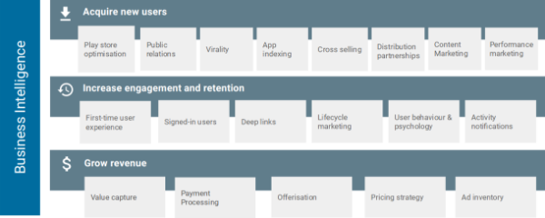
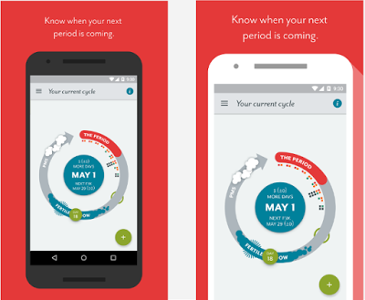
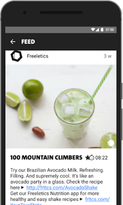

# 5个步骤实现可持续增长，并提升你的应用程序的长期成功

原标题：Five steps to achieve sustainable growth and boost your app's long term success  
链接：[https://android-developers.googleblog.com/2016/12/five-steps-to-achieve-sustainable-growth-and-boost-your-apps-long-term-success.html](https://android-developers.googleblog.com/2016/12/five-steps-to-achieve-sustainable-growth-and-boost-your-apps-long-term-success.html)  
作者：Maxim Play (Google Play业务开发经理)  
翻译：[arjinmc](https://github.com/arjinmc)  

即使是最高质量的应用程序，仍然难以保持可持续增长。在本视频中，通过以下5个步骤，你可以了解我们的一些领先的Android开发者如何应对增长。

[视频介绍](https://youtu.be/Nh2m9365i0I?list=PLWz5rJ2EKKc-XoJTVgYBviYbgxgSJqBws)

## 1）了解和定义你的应用程序的目标

取决于你的产品生命周期阶段，你将很可能将重点放在这三个不同强度的增长目标上：

* 获取新用户
* 增加参与和保留
* 增加收入

## 2）跟踪和衡量你的策略对你的每一个目标

列出你用来实现每个目标和跟踪他们的表现的策略。你可以使用记分卡来对其进行可视化处理，如下面的示例，由[Mobile Growth Stack](http://www.mobilegrowthstack.com/)创建。

  

## 3）运用你的成长策略

以下是开发商成功推动持续增长的具体策略的一些例子。

<strong>策略</strong>：女性健康应用[Clue](https://play.google.com/store/apps/details?id=com.clue.android)投资Play商店列表来增加转化次数。  
<strong>结果</strong>：6个月内安装转换率总计增加24％。  
<strong>他们是如何做到的</strong>：  

* 建立了持续的全球和本地化[商店列表体验](https://support.google.com/googleplay/android-developer/topic/7046704?hl=en&ref_topic=6299676)。
* 监测目标国家和渠道的[用户获取性能报告](https://support.google.com/googleplay/android-developer/answer/6263332?hl=en)中的变化。
* 从[评论分析](https://support.google.com/googleplay/android-developer/answer/138230)中收集用户的评论。

  
你认为哪个手机屏幕截图增加了Clue的安装转换？

<strong>策略</strong>：[ShareTheMeal](https://play.google.com/store/apps/details?id=org.sharethemeal.app)  是世界粮食计划署开发的一个非营利应用程序，将公共关系作为一个免费的可持续收购渠道。  
<strong>结果</strong>：迄今为止，总安装量的50％是由媒体报道的。  
<strong>他们是如何做到的</strong>：

* 开发了一个优秀的消息。
* 通过将公关与名人宣传和分销合作结合起来，提升了影响力。
* 据悉，电视报道对安装影响最大，但印刷是扩大电视覆盖面的有效开门工具。

<strong>策略</strong>：病毒式的增长。Virality是专注于共享的应用程序和游戏的核心增长工具，通常这个机制被嵌入到产品的核心用户体验中。但是，即使共享不是你的应用程序的关键组成部分，你仍然可以影响两个关键变量，以创建适当的环境来鼓励病毒式传播。  
<strong>如何做到这一点</strong>：

* 通过增加发送的邀请数量，增加单个用户为应用带来的额外用户数量。
* 减少你的“周期时间”，邀请用户和该用户发送下一轮的邀请给他们的朋友之间需要多长时间。
* 为用户分享应用程序或其内容时提供更多激励措施，这将有助于缩短周期时间并加速病毒的增长！

<strong>策略</strong>：[Freeletics Nutrition](https://play.google.com/store/apps/details?id=com.freeletics.nutrition)，一个应用程序来调整你的个人需求和目标的营养，使用交叉推广，以加快新产品的推出。  
<strong>结果</strong>：最初注册开发者的[体重](https://play.google.com/store/apps/details?id=com.freeletics.lite)训练应用程序的用户生成的新营养应用程序销售额的96％。  
<strong>他们是如何做到的</strong>：

* 在Bodyweight应用程序的活动饲料表面餐建议与旨在提高他们新的Freeletics营养应用程序接近推出意识。

  

## 4）建立强大的成长文化

为了使你的应用程序可持续增长，它需要成为你的文化的一部分。[Runtastic](https://play.google.com/store/apps/dev?id=8438666261259599516)是欧洲领先的健康和健身应用程序开发商之一，其在Google Play上大约76M总应用程序安装中的95％是有机地生成的。增长副总裁Mario Aichlseder认为，这是强大的增长文化和所有团队运作的增长原则的结果。例如，Runtastic的产品经理，设计师和工程师在应用程序开发过程中有意识地选择了定性和定量反馈循环的混合体，以确保他们遵守其成长原则。

## 5）沿途调整

跟踪你的策略与真实指标来衡量你的影响是非常重要的。这将帮助你决定在哪里增加或减少你的付出。你的优先级也将随着你的业务和产品生命周期的演变以及由于新技术可用等外部因素而发生变化，所以请定期调整你的策略。

从[今年的Playtime活动](http://android-developers.blogspot.co.uk/2016/12/watch-sessions-from-the-playtime-2016-events-to-learn-how-to-succeed-on-android-and-google-play.html)中获取更多技巧和最佳做法。