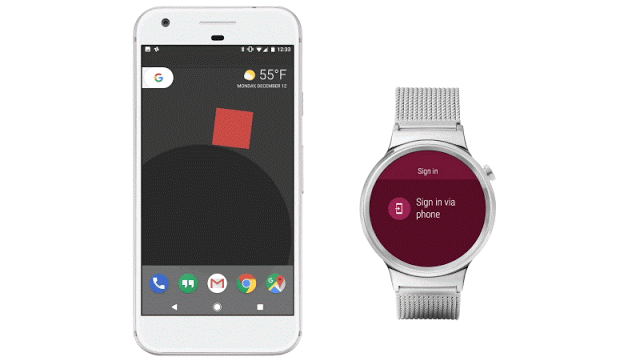

# Android Wear 2.0开发者预览版4：身份验证，应用内结算等等

原标题：Android Wear 2.0 Developer Preview 4: Authentication, In-App Billing, and more  
链接：[https://android-developers.googleblog.com/2016/12/android-wear-2-0-developer-preview-4-authentication-in-app-billing-and-more.html](https://android-developers.googleblog.com/2016/12/android-wear-2-0-developer-preview-4-authentication-in-app-billing-and-more.html)  
作者：Hoi Lam （开发者倡导者)
翻译：[arjinmc](https://github.com/arjinmc)  

  

[Android Wear 2.0](https://g.co/wearpreview)的一个关键部分就是让手表应用程序作为独立应用程序工作，即使手机不在身边，用户也可以回复消息，跟踪自己的健身状况并使用自己喜欢的应用程序。开发者预览版4包含许多新API，可帮助你构建更强大的独立应用程序。

## 无缝认证

为了使认证成为Android手机和iPhone用户的无缝体验，我们为[OAuth创建了新的API，并增加了对一键式Google登录的支持](https://developer.android.com/wear/preview/features/auth-wear.html?utm_campaign=android%20wear_launch_developerpreview_121316&utm_source=anddev&utm_medium=blog)。使用适用于Android Wear的OAuth API，用户可以点击手表上的按钮，在手机上打开身份验证屏幕。你的手表应用程序可以直接与你的服务器端API进行身份验证。使用Google登录功能可以更轻松。所有用户需要做的是选择他们想要认证的帐户，他们完成。

## 应用内结算

除了付费应用，我们还添加了[应用内结算](https://developer.android.com/training/in-app-billing/index.html?utm_campaign=android%20wear_launch_developerpreview_121316&utm_source=anddev&utm_medium=blog)支持，为你提供另一种通过Android Wear应用获利的方式。用户可以通过4位Google帐户PIN在手表上快速轻松地授权购买。无论是在游戏中的新水平还是在表盘上的新款式，如果你可以建立它，用户可以购买它。

## 跨设备提升

如果你的手表应用程序不能独立运行？或者，如果安装了手表和手机应用程序，它会提供更好的用户体验？我们一直在仔细聆听你的反馈意见，并且我们添加了[两个新的API](https://developer.android.com/wear/preview/features/standalone-apps.html?utm_campaign=android%20wear_launch_developerpreview_121316&utm_source=anddev&utm_medium=blog#detecting-your-app)（<i>PlayStoreAvailability</i>和<i>RemoteIntent</i>）以帮助你将用户导航到配对设备上的Play商店，以便他们可以更轻松地安装你的应用。开发人员还可以通过新的<i>RemoteIntent API</i>在手机上打开自定义URL;没有电话应用程序或数据层是必需的。

```java
// Check Play Store is available
int playStoreAvailabilityOnPhone =
    PlayStoreAvailability.getPlayStoreAvailabilityOnPhone(getApplicationContext());

if (playStoreAvailabilityOnPhone == PlayStoreAvailability.PLAY_STORE_ON_PHONE_AVAILABLE) {
    // To launch a web URL, setData to Uri.parse("https://g.co/wearpreview")
    Intent intent =
        new Intent(Intent.ACTION_VIEW)
            .addCategory(Intent.CATEGORY_BROWSABLE)
            .setData(Uri.parse("market://details?id=com.google.android.wearable.app"));
    // mResultReceiver is optional; it can be null.
    RemoteIntent.startRemoteActivity(this, intent, mResultReceiver);
}
```

## 轻扫就消失功能恢复了

你们中的许多人已经给我们反馈，Android Wear 1.0的轻扫手势是一种直观省时的方式。我们同意，并已恢复到以前的行为与此开发者预览版本。为了支持在这个版本中轻扫，我们做了以下的平台和API更改：

* <strong>activity现在自动支持轻扫到消失</strong>。 从左向右滑动活动将导致它消失，应用程序将向下导航回栈。
* 新的片段和视图支持。开发者可以将通常包含的片段或视图的视图包装在新<i>SwipeDismissFrameLayout</i>的实现中， 以实现自定义操作，例如在用户滑动而不是退出活动时向下堆栈。
* 硬件按钮现在映射到“电源”，而不是“后退”，这意味着它不能再被应用程序拦截。

其他详细信息可在Android Wear预览网站的[行为更改](https://developer.android.com/wear/preview/behavior-changes.html?utm_campaign=android%20wear_launch_developerpreview_121316&utm_source=anddev&utm_medium=blog)部分下找到。

## 与Android Wear 1.0应用程序兼容

使用传统嵌入式应用程序机制打包的Android Wear应用程序现在可以交付到Android Wear 2.0手表。当用户安装也包含嵌入式Android Wear应用程序的手机应用程序时，将提示用户通过通知安装嵌入式应用程序。如果他们选择不安装嵌入式应用程序，那么他们可以在Android Wear上的Play商店中找到名为“你已使用的应用程序”的特殊部分。

尽管支持现有的机制，但是转换到多APK传送机制的应用程序还是有很大好处的。[Multi-APK](https://developer.android.com/wear/preview/features/app-distribution.html?utm_campaign=android_discussion_wearpreview_092916&utm_source=anddev&utm_medium=blog#publish)允许在Android Wear的Play商店中搜索应用程序，以便有资格在主页上进行销售，并可以从网络远程安装到手表。因此，我们强烈建议开发者转移到Multi-APK。

## 开发者预览版4中增加了更多内容

* [动作和导航抽屉](https://developer.android.com/wear/preview/features/ui-nav-actions.html?utm_campaign=android%20wear_launch_developerpreview_121316&utm_source=anddev&utm_medium=blog)：偷窥行为的增强允许用户采取行动，而无需一直滚动到列表的顶部或底部。开发人员可以通过新的API来进一步调整抽屉窥视行为，例如<i>setShouldPeekOnScrollDown</i>抽屉。
* [WearableRecyclerView](https://developer.android.com/wear/preview/features/wearable-recycler-view.html?utm_campaign=android%20wear_launch_developerpreview_121316&utm_source=anddev&utm_medium=blog)： 弯曲的布局现在是选择性的，通过这个，WearableRecyclerView现在是RecyclerView的替代品。
* [并发的保护老化图标](https://developer.android.com/wear/preview/features/complications.html?utm_campaign=android%20wear_launch_developerpreview_121316&utm_source=anddev&utm_medium=blog#using_fields_for_complication_data)：并发数据提供者现在可以提供图标，以便在易于老化的屏幕上使用。这些老化图标通常是交互模式下图标的轮廓。以前，手表表面可能选择了在环境模式下根本不显示图标，以防止屏幕老化。

## 反馈欢迎！

感谢你提供有关Android Wear 2.0的极佳反馈。查看[g.co/wearpreview](https://g.co/wearpreview)了解最新版本和文档，通过在我们的[Android Wear开发者社区](https://plus.google.com/communities/113381227473021565406)[提交bug](https://g.co/wearpreviewbug)或发布反馈信息，敬请关注Android Wear Developer Preview 5！