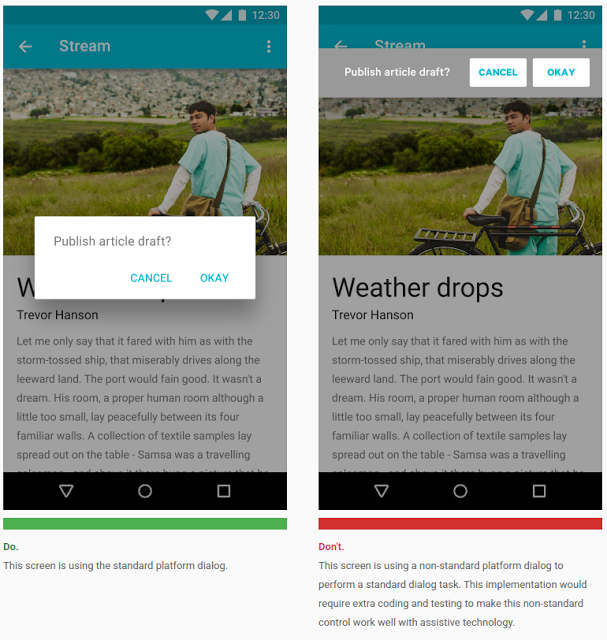
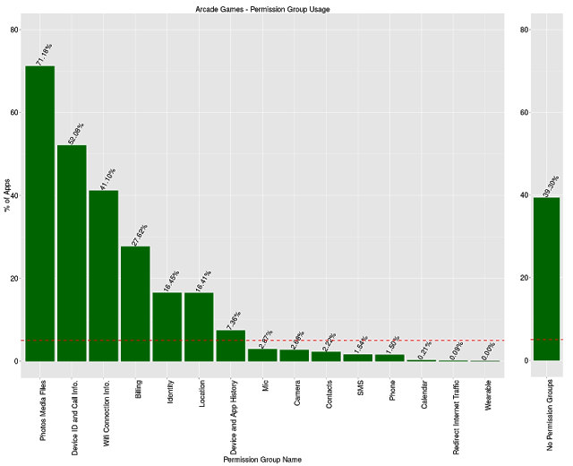
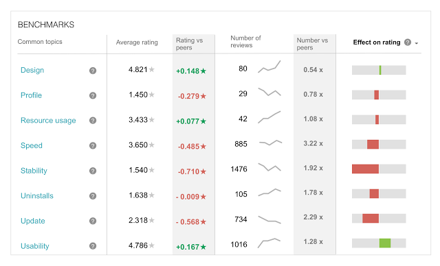

# 在Google Play上更好地被搜索和发现的技巧

原标题：Tips to be better found and discovered on Google Play  
链接：[https://android-developers.googleblog.com/2016/12/tips-to-be-better-found-and-discovered-on-google-play.html](https://android-developers.googleblog.com/2016/12/tips-to-be-better-found-and-discovered-on-google-play.html)  
作者：Andrew Ahn (Google Play产品经理)  
翻译：[arjinmc](https://github.com/arjinmc)  

我们正在不断努力让Google Play成为用户发现他们所喜爱的应用和游戏的绝佳场所。我们知道这对大多数开发者持续成功至关重要。你可以采取措施确保你的应用获得成功，这就是为什么我们要分享一些关于让你的应用在Google Play上发现的重要的技巧。

## 优质构建

首先，优质构建。Android用户期望高品质的应用程序。应用程序质量直接影响你的应用程序的长期成功 - 在安装，用户评分和评论，参与度和用户保留方面。这些都是我们的搜索和发现系统中的一些因素，这些因素可以帮助我们分辨哪些应用可以推荐并体现在我们的Google Play体验中。在构建应用程序时，请根据[质量标准](https://developer.android.com/distribute/essentials/quality/core.html)进行检查，并根据材料设计准则使用你所需要的内容，以确保提供高度可用的体验。此外，一定要测试你的应用程序的功能质量。选择[发布前的报告](https://support.google.com/googleplay/android-developer/answer/7002270?hl=en)对于Google Play开发者控制台中的Alpha和Beta版应用，你会收到每个APK的报告，显示其在真实设备上的效果。这将帮助你在发布应用程序之前识别崩溃和其他问题。

  
示例：通过[Google Material Design](https://material.google.com/)设计高可用性。

## 仅请求你所需的权限

其次，请考虑为你的应用启用哪些权限设置。我们看到有一些应用程序要求非常敏感的权限，即使应用程序不使用它们。（例如，相机应用程序要求读取和写入权限来调用日志。）过多的应用程序权限可能会阻止用户安装你的应用程序。实际上，[一项研究](http://dl.acm.org/citation.cfm?id=2556978)显示，用户在两个具有相同功能但不同权限请求的类似评级的无品牌应用程序中，平均而言，用较少的权限请求安装应用程序的可能性是平均3倍。[一个类似的研究](https://www.usenix.org/system/files/conference/soups2014/soups14-paper-lin.pdf)显示用户平均可能性是选择具有较少权限请求的应用程序的1.7倍。经验法则是启用只对你的应用程序至关重要的权限。阅读[应用程序权限的最佳实践](https://developer.android.com/training/articles/user-data-permissions.html)。

  
[图表](https://developer.android.com/training/articles/user-data-overview.html)：权限组在整个街机游戏类别中的使用情况。  
如果你正在构建一个街机游戏，你只需要很少的权限设置（如果有的话）。

## 倾听并回应你的用户
最后，请注意用户的反馈意见。最终是推动我们的搜索和发现系统的用户。当你听到用户对错误或其他问题的反馈意见时，我们建议你参考反馈意见，并在需要时及时更新你的应用。拥有反映用户反馈的最新应用可以帮助你获得更多的安装，参与度和更高的评分。[Beta测试](https://support.google.com/googleplay/android-developer/answer/3131213)是在启动之前从真实用户获得反馈的好方法。你还可以查看开发者控制台的[评分和评论](https://support.google.com/googleplay/android-developer/answer/138230?hl=en)部分，以查看与相似应用相比，用户对你的应用有何评论以及如何影响评分的分析。

  
在开发者控制台中查看基准测试使用机器学习功能为你提供关于用户对你的应用的评价以及它如何影响你的评分。

Google Play致力于帮助用户查找并发现最安全，优质，实用且相关的应用。构建让用户感兴趣的应用可帮助你在Google Play中取得成功。有关在Google Play上构建成功应用程序业务的更多技巧和最佳实践，请获取[Playbook for Developers应用程序](https://g.co/play/playbook)。