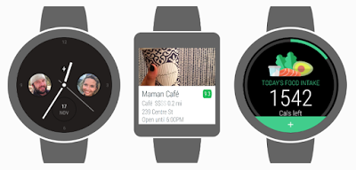

# 了解Wear 2.0即将推出的独立应用程序

原标题：Get a glimpse of Wear 2.0’s upcoming standalone apps  
链接：[https://android-developers.googleblog.com/2016/12/get-a-glimpse-of-wear-2-0s-upcoming-standalone-apps.html](https://android-developers.googleblog.com/2016/12/get-a-glimpse-of-wear-2-0s-upcoming-standalone-apps.html)  
作者：Kacey Fahey (Google Play营销项目经理)  
翻译：[arjinmc](https://github.com/arjinmc)  

即将推出的[Android Wear 2.0](https://developer.android.com/wear/preview/index.html)体验将引入独立应用程序，通过Wear设备将你的潜在用户群扩展到Android和iOS用户。用户将能够搜索，安装和使用应用程序，而无需离开其设备。了解其他开发者如何通过独立应用程序提高消息，旅行和本地以及健康与健身的用户体验。

  

## Glide

有一个手表应用程序进一步简化与[Glide](https://play.google.com/store/apps/details?id=com.glidetalk.glideapp&hl=en_GB)的视频消息。使用[Wear Complications API](https://developer.android.com/wear/preview/features/complications.html)，Glide现在可以直接从手表直播。通过点击表盘上的联系快捷键，你现在可以直接启动对话。这种体验为消息传递带来了速度和亲密感，使得基于手腕的通信更加便捷和轻松。

## Foursquare

世界各地的旅客使用[Foursquare](https://play.google.com/store/apps/dev?id=7953007503920441591&hl=en_GB)的Android Wear应用以发现隐藏的宝石，并在知道吃，喝和探索的最佳场所。随着他们即将推出的2.0应用程序，团队有一个全新的画布丰富的通知，为用户提供一个身临其境的Foursquare内容体验。

Foursquare软件工程师Kyle Fowler表示：“Android Wear 2.0应用程序的独立特性将大幅提升搜索性能和应用程序响应速度，让你花更少的时间凝视屏幕，更多时间探索周围的世界。”

## Lifesum 

[Lifesum](https://play.google.com/store/apps/details?id=com.sillens.shapeupclub&hl=en_GB)帮助用户做出更好的食物选择，改善锻炼并达到健康目标。即将到来的2.0体验补充了现有的Lifesum移动应用程序，并作为一个独立的应用程序，它将允许用户更容易跟踪全日的膳食和水。“所有这一切都是为了增加用户的访问权限，并以简单快捷的方式为用户提供服务，我们相信，跟踪膳食和用水的简化方式将使我们的用户更容易变得更加健康和快乐。”Lifesum的Android开发人员Joakim Hammer说.

关于最近发布的Android Wear开发者预览版4的最新版本和文档，请参阅[g.co/wearpreview](https://g.co/wearpreview)。