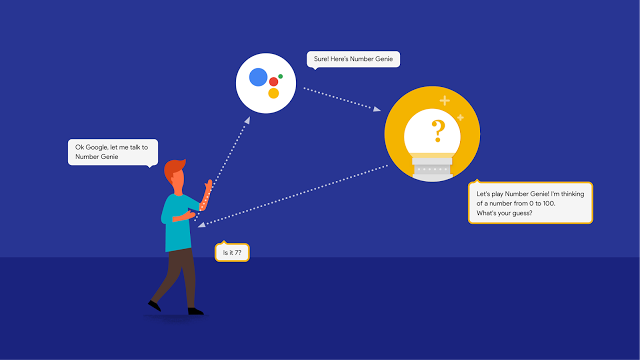

# 开始在Google上构建行为

原标题：Start building Actions on Google  
链接：[https://android-developers.googleblog.com/2016/12/start-building-actions-on-google.html](https://android-developers.googleblog.com/2016/12/start-building-actions-on-google.html)  
作者：Jason Douglas (Google行为行政总监)    
翻译：[arjinmc](https://github.com/arjinmc)  

Google助手[汇集了](https://blog.google/products/assistant/personal-google-just-you/)我们从知识图谱到自然语言处理已经建立多年的所有技术和智慧。要成为一个真正成功的助理，它应该能够在他们生活中的应用程序和服务之间连接用户。这使得建立一个生态系统，开发人员可以通过谷歌助手为用户带来各种独特的服务。

10月份，我们在Google助手的开发者平台上[预览了](https://www.youtube.com/watch?v=q4y0KOeXViI&feature=youtu.be&t=1h16m8s)Google行为。Google上的操作通过使你能够将服务提供给助手，进一步增强了助手的用户体验。从今天开始，你可以为Google Home构建对话操作，并[请求](https://assistant.google.com/developer/eap/)成为即将到来的平台功能的早期访问合作伙伴。

## Google主页的对话行为

对话行为让你可以让用户提供信息，服务和帮助。最好的部分？这实际上是一个对话 - 用户不需要启用一项技能或安装一个应用程序，他们可以要求与你的对话行动。现在，我们已经提供了两个可能的开发者示例，只要说“Ok Google，与Number Genie交谈”，或者尝试“Ok Google，与Eliza交谈”来了解经典的60年代AI练习。

  

你可以通过访问面向开发者的[Google行为](https://developers.google.com/actions?utm_campaign=product%20area_launch_actionsgoogle_120816&utm_source=gdev&utm_medium=blog)的网站来开始使用。为了帮助创建一个平滑，直接的开发体验，我们与[许多开发合作伙伴合作](https://developers.google.com/actions/tools/?utm_campaign=product%20area_launch_actionsgoogle_120816&utm_source=gdev&utm_medium=blog)，包括会话交互开发工具API.AI和Gupshup，分析工具DashBot和VoiceLabs以及咨询公司如Assist，Notify.IO，Witlingo和Spoken Layer 。我们还创建了一组[示例](https://developers.google.com/actions/samples/?utm_campaign=product%20area_launch_actionsgoogle_120816&utm_source=gdev&utm_medium=blog)和语音用户接口（VUI）[资源](https://developers.google.com/actions/design/)，或者你可以查看[早期访问合作伙伴](http://support.google.com/assistant/?p=3p_developers)在未来几周推出的集成。

[视频介绍](https://youtu.be/HNfE0uaKcfY)  
[Wayne Piekarski](https://google.com/+WaynePiekarski)介绍对话行为

## 即将推出：针对Pixel和Allo +购买和预订支持的行为

今天只是一个开始，我们很高兴看到你为Google助手构建的内容。随着时间的推移，我们将继续添加更多的平台功能，包括能够在像Pixel手机和Google Allo这样的各种助手平台上提供集成。我们还将支持购买和预订，以及跨垂直行业的更深入的助手集成。有兴趣使用这些即将发布的功能创建行为的开发者应[注册我们的早期访问合作伙伴计划](https://assistant.google.com/developer/eap/)，并帮助塑造平台的未来。

构建，探索并让我们知道你对Google行为的看法！在循环中说，一定要注册我们的[通讯](https://assistant.google.com/developer/)，加入我们的[Google+社区](https://g.co/actionsdev)，并使用[StackOverflow](https://stackoverflow.com/questions/tagged/actions-on-google)上的“actions-on-google”标签。