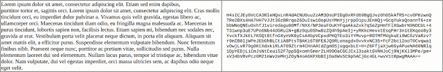

# 节省数据流量：将应用程序更新的大小减少65％

原标题：Saving Data: Reducing the size of App Updates by 65%   
链接：[https://android-developers.googleblog.com/2016/12/saving-data-reducing-the-size-of-app-updates-by-65-percent.html](https://android-developers.googleblog.com/2016/12/saving-data-reducing-the-size-of-app-updates-by-65-percent.html)    
作者：Andrew Hayden (Google Play软件工程师)  
翻译：[arjinmc](https://github.com/arjinmc)  

Android用户正在Google Play上下载数以百亿计的应用和游戏。我们也看到开发者经常更新他们的应用程序，以便为用户提供出色的内容，提高安全性并增强整体用户体验。需要大量的流量才能下载这些更新，而且我们知道用户关心他们的设备使用了多少数据流量。今年早些时候，我们宣布开始使用[bsdiff算法 （Colin Percival发明）](https://android-developers.blogspot.com/2016/07/improvements-for-smaller-app-downloads.html)。使用bsdiff，与完整的APK大小相比，我们可以将应用程序更新的大小平均减少47％。

今天，我们很高兴能够分享一种更进一步的新方法 - [逐个文件修补](https://github.com/andrewhayden/archive-patcher/blob/master/README.md)。 使用逐个文件修补的应用程序更新<strong>平均比完整应用程序小65％</strong>，在某些情况下，小于90％。

与我们以前的方法相比，节省的成本每天可以节约6PB的用户数据流量！

为了获取应用的新版本，Google Play会向你的设备发送一个修补程序，用于描述应用程序的旧版本和新版本之间的差异。

想象一下，你是一本即将出版的书的作者，并希望改变一个句子 - 告诉编辑更改哪个句子和改变什么，而不是发送一本全新的书更容易。以同样的方式，补丁比整个APK下载要小得多，速度也快得多。

<strong><u>文件修补程序中使用的技术</u></strong>

Android应用程序被封装为APK，这是具有特殊约定的ZIP文件。ZIP文件（和APK）中的大部分内容使用名为[Deflate](https://en.wikipedia.org/w/index.php?title=DEFLATE&oldid=735386036)的技术进行压缩。Deflate非常擅长压缩数据，但它有一个缺点：它使原始（未压缩）内容中的变化非常困难。即使是对原始内容的微小改变（如改变书中的一个词）也可以使压缩的压缩输出看起来完全不同。描述原始内容之间的差异很容易，但是描述压缩内容之间的差异是非常困难的，从而导致效率低下的补丁。

观察右侧的压缩文本从左侧未压缩文本中的单字母改变多少变化：

  

因此逐个文件基于检测未压缩数据中的变化。要生成一个补丁，我们首先在计算delta之前解压缩新旧文件（我们在这里仍然使用bsdiff）。然后要应用补丁，我们解压缩旧文件，将增量应用于未压缩的内容，然后重新压缩新文件。在此过程中，我们需要确保设备上的APK与Play商店中的完全匹配（字节为字节）（请参阅[APK签名架构v2](https://source.android.com/security/apksigning/v2.html)了解原因）。

当重新压缩新文件时，我们遇到了两个复杂问题。首先，Deflate有一些影响输出的设置; 而且我们不知道首先使用了哪些设置。其次，deflate有许多版本，我们需要知道你的设备版本是否合适。

幸运的是，在对Play商店中的应用程序进行分析之后，我们发现基于zlib（最流行的deflate库）的最新兼容版本的deflate几乎囊括了Play商店中几乎所有的收缩内容。另外，默认设置（level = 6）和最大压缩设置（level = 9）是我们在实践中遇到的唯一设置。

知道这一点，我们可以检测和重现原来的放气设置。这样可以解压缩数据，应用一个补丁，然后将数据重新压缩回原来上传的完全相同的字节。

但是，有一个权衡。设备需要额外的处理能力。在现代设备上（例如从2015年开始），每兆字节的再压缩可能会稍微超过一秒，而在较旧的或功率较低的设备上，压缩可能会更长一些。目前的分析表明，平均而言，如果补丁大小减半，那么应用补丁（对于逐个文件包括再压缩）花费的时间加倍。

目前，我们正在限制使用这种新的补丁技术来自动更新，即在后台进行更新，通常在晚上当你的手机插入电源，而你不太可能使用它。这可以确保用户在手动更新应用程序时，不必再等待更新才能完成更新。

逐个文件修补如何有效？

<strong><u>以下是已经使用逐个文件修补的应用程序更新示例：</u></strong>

应用 | 原始大小 | 上一个（BSDiff）修补程序大小（％vs原始）| 文件的文件修补程序大小（％vs原始）
--- | --- | --- | --- 
[Farm Heroes Super Saga](https://play.google.com/store/apps/details?id=com.king.farmheroessupersaga&hl=en) | 71.1 MB | 13.4 MB（-81％） | 8.0 MB（-89％）
[谷歌地图](https://play.google.com/store/apps/details?id=com.google.android.apps.maps) | 32.7 MB | 17.5 MB（-46％） | 9.6 MB（-71％）
[Gmail的](https://play.google.com/store/apps/details?id=com.google.android.gm) | 17.8 MB | 7.6 MB（-57％） | 7.3 MB（-59％）
[Google TTS(翻译)](https://play.google.com/store/apps/details?id=com.google.android.tts) | 18.9 MB | 17.2 MB（-9％） | 13.1 MB（-31％）
[Kindle](https://play.google.com/store/apps/details?id=com.amazon.kindle) | 52.4 MB | 19.1 MB（-64％） | 8.4 MB（-84％）
[Netflix](https://play.google.com/store/apps/details?id=com.netflix.mediaclient) | 16.2 MB | 7.7 MB（-52％） |  1.2 MB（-92％）

免责声明：如果你在手动按下“更新”时看到不同的补丁大小，那是因为我们目前没有使用逐文件进行交互式更新，只有在后台执行的那些文件。

<strong><u>节省数据流量并使我们的用户（和开发者）高兴</u></strong>

这些更改旨在确保我们的超过10亿Android用户社区尽可能少地使用常规应用程序更新数据。最好的事情是，作为开发者，你不需要做任何事情。你可以免费获得这些缩减到你的更新大小！

如果你想了解更多关于文件修补的信息，包括技术细节，请前往[Archive Patcher GitHub项目](https://github.com/andrewhayden/archive-patcher)，你可以在其中找到信息，包括源代码。是的，逐个文件修补是完全开源的！

作为一名开发者，如果你有兴趣继续缩小APK大小，请参阅以下有关[缩小APK大小的一般技巧](https://developer.android.com/topic/performance/reduce-apk-size.html?utm_campaign=android_discussion_filebyfile_120616&utm_source=anddev&utm_medium=blog)。