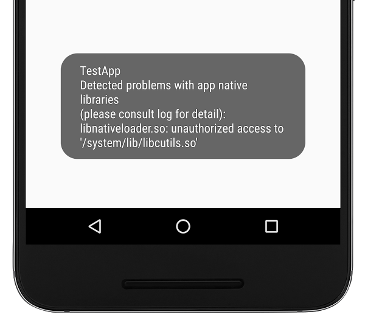

# 在Android N中限制使用私有C / C ++符号提高稳定性

原标题：Improving Stability with Private C/C++ Symbol Restrictions in Android N  
链接：[https://android-developers.googleblog.com/2016/06/improving-stability-with-private-cc.html](https://android-developers.googleblog.com/2016/06/improving-stability-with-private-cc.html)  
作者：Dimitry Ivanov 和 Elliott Hughes (软件工程师)  
翻译：[arjinmc](https://github.com/arjinmc)  

正如[Android N行为更改](https://developer.android.com/preview/behavior-changes.html#ndk)中所记录的那样，为了保护Android用户和应用程序免受无法预料的崩溃，Android N <strong>将限制您的C / C ++代码可以在运行时链接的库</strong>。因此，如果您的应用使用平台库中的任何私有符号，则需要将其更新为使用公共NDK API或包含其自己的库副本。一些库是公共的：NDK公开了libandroid，libc，libcamera2ndk，libdl，libGLES，libjnigraphics，liblog，libm，libmediandk，libOpenMAXAL，libOpenSLES，libstdc ++，libvulkan和libz作为NDK API的一部分。其他库是私有的，Android N仅允许访问平台HAL，系统守护程序等。如果您不确定您的应用是否使用私有库，您可以立即在N Developer Preview上检查它是否有警告。

我们正在进行此更改，因为当用户的应用在平台更新后停止工作时，这会让用户感到痛苦。无论他们责怪应用开发者还是平台，每个人都会失败。用户应该在更新中拥有一致的应用体验，开发者不必进行紧急应用更新来处理平台更改。因此，我们建议不要使用私有C / C ++符号。私有符号未作为所有Android设备必须通过的兼容性测试套件（CTS）的一部分进行测试。它们可能不存在，或者它们可能表现不同。这使得使用它们的应用程序更有可能在特定设备或未来版本上失败 - 正如许多开发者在Android 6.0 Marshmallow从OpenSSL切换到BoringSSL时发现的那样。

您可能会惊讶于NDK库列表中没有STL。NDK中包含的三个STL实现 - LLVM libc ++，GNU STL和libstlport - 旨在与您的应用程序捆绑在一起，可以通过静态链接到您的库，也可以作为单独的共享库包含在内。在过去，一些开发者假设他们不需要打包库，因为操作系统本身有一个副本。这个假设是不正确的：特定的STL实现可能会消失（就像在Marshmallow中删除的stlport的情况一样），可能永远不可用（如GNU STL的情况），或者它可能以ABI不兼容的方式改变（与LLVM libc ++的情况一样）。

为了减少这种转变对用户的影响，我们确定了一组图书馆，这些图书馆可以看到Google Play安装量最大的应用程序，并且我们可以在短期内支持（包括libandroid_runtime.so，libcutils） .so，libcrypto.so和libssl.so）。对于N中的遗留代码，我们将暂时支持这些库，以便为您提供更多的转换时间。请注意，我们不打算在任何未来的Android平台版本中继续提供此支持，因此如果您看到警告意味着您的代码在将来的版本中无法使用 - 请立即修复！

表1.如果您的应用程序链接到私有本机库，会发生什么。

Libraries | App's targetSdkVersion | Runtime access via dynamic linker | Impact, N Developer Preview | Impact, Final N Release | Impact, future platform version
--- | --- | --- | --- | --- | ---
NDK Public	| Any |	Accessible			
Private (graylist) | <=23 | Temporarily accessible | Warning / Toast | Warning | Error
Private (graylist) | >=24 | Restricted | Error | Error | Error
Private (all other) | Any |	Restricted | Error | Error | Error

## 将会看到什么行为

使用N预览版测试你的app。

###  N预览版行为

* 可以访问所有公共NDK库（<strong>libandroid，libc，libcamera2ndk，libdl，libGLES， libjnigraphics，liblog，libm，libmediandk，libOpenMAXAL，libOpenSLES，libstdc ++， libvulkan</strong>和<strong>libz</strong>）以及属于应用程序一部分的库。
* 对于所有其他库，您将在logcat中看到警告并在显示屏上看到Toast。仅当您的应用程序[targetSdkVersion](https://developer.android.com/guide/topics/manifest/uses-sdk-element.html)小于N时才会发生这种情况。如果您将清单更改为目标N，则加载将失败：Java的System.loadLibrary将抛出，而C / C ++的dlopen（3）将返回NULL。

  
<small>在开发者预览版上测试您的应用程序 - 如果您看到像这样的Toast，您的应用程序正在访问私有原生API。请尽快修复您的代码！</small>

### N最终发布行为

* 可以访问所有NDK库（<strong>libandroid，libc，libcamera2ndk，libdl，libGLES， libjnigraphics，liblog，libm，libmediandk，libOpenMAXAL，libOpenSLES，libstdc ++， libvulkan和libz</strong>）以及属于应用程序一部分的库。
* 对于临时可访问的库（例如libandroid_runtime.so，libcutils.so，libcrypto.so和libssl.so），您会在logcat中看到N之前所有API级别的警告，但是如果您更新应用程序，加载将失败所以它<i>targetSdkVersion</i>是N或更晚。
* 尝试加载任何其他库将在Android N的最终版本中失败，即使您的应用程序是针对pre-N平台版本。

### 未来的平台行为

* 在O中，将删除对临时可访问库的所有访问权限。因此，无论您targetSdkVersion之前是否O ，都应该计划更新您的应用 。如果您认为NDK API缺少某些功能，您将无法从暂时可访问的库转换，请在[这里](https://code.google.com/p/android/issues/entry?template=New%20NDK%20API%20request)处提交错误。

## 错误是什么样的？

以下是来自应用程序的一些示例logcat输出，该应用程序没有碰到其目标SDK版本（因此限制未完全实施，因为这只是开发者预览版）：

```code
03-21 17:07:51.502 31234 31234 W linker  : library "libandroid_runtime.so"
("/system/lib/libandroid_runtime.so") needed or dlopened by
"/data/app/com.popular-app.android-2/lib/arm/libapplib.so" is not accessible
for the namespace "classloader-namespace" - the access is temporarily granted
as a workaround for http://b/26394120
```
 
这告诉您，您的库“libapplib.so”引用了库“libandroid_runtime.so”，这是一个私有库。

当Android N发布时，或者如果您现在将目标SDK版本设置为N，如果您尝试使用Java中的System.loadLibrary，您将看到类似这样的内容：

```code
java.lang.UnsatisfiedLinkError: dlopen failed: library "libcutils.so"
("/system/lib/libcutils.so") needed or dlopened by "/system/lib/libnativeloader.so"
is not accessible for the namespace "classloader-namespace"
  at java.lang.Runtime.loadLibrary0(Runtime.java:977)
  at java.lang.System.loadLibrary(System.java:1602)
```

如果您使用C / C ++中的[dlopen（3）](http://man7.org/linux/man-pages/man3/dlopen.3.html)，您将获得NULL返回，而[dlerror（3）](http://man7.org/linux/man-pages/man3/dlerror.3.html)将返回相同的“dlopen failed ...”字符串，如上所示。

有关如何检查您的应用是否使用私有符号的详细信息，请参阅[developer.android.com上的常见问题解答](https://developer.android.com/preview/behavior-changes.html#ndk)。

