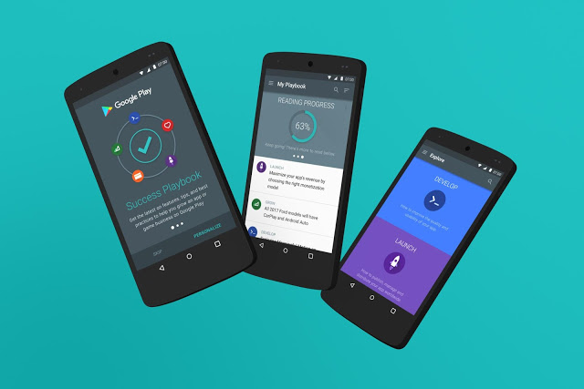

# 借助新的Playbook for Developers应用，在Google Play上拓展业务

原标题：Grow your business on Google Play with help from the new Playbook for Developers app  
链接：[https://android-developers.googleblog.com/2016/06/grow-your-business-on-google-play-with.html](https://android-developers.googleblog.com/2016/06/grow-your-business-on-google-play-with.html)  
作者：Dom Elliott (由Google Play团队)  
翻译：[arjinmc](https://github.com/arjinmc)  

今天，[Playbook for Developers](https://g.co/play/playbook-androiddevelopers-blog-launch)移动应用程序现在通常可用于Android设备。该应用可帮助您及时了解在Google Play上发展业务的功能和最佳时间。感谢我们所有的beta测试人员在过去六周内的反馈，帮助我们调整和优化应用程序以准备发布。

以下是您在Playbook for Developers应用中阅读和观看内容：

* 选择与您的商业兴趣相关的主题， 使用来自Google和网络专家的精选文章和视频来个性化<strong>My Playbook</strong>。
* <strong>浏览</strong> Google开发者产品的深入指南，其中的文章根据您的目标进行分组：开发，发布，参与，发展和赚取收益。
* 对项目采取措施 - 完成，分享，保存或解散 - 并在 以后阅读您<strong>保存</strong>的文章，包括离线（如果它们已在应用程序中编写）。需要数据连接才能从网络上阅读文章和视频。

  

该应用程序支持Android 5.0及更高版本。如果您使用的是旧版设备，请查看我们的电子书[Google Play上的应用成功秘诀](https://play.google.com/store/books/details?id=O2a5CgAAQBAJ)。我们将在应用中添加和更新内容，以帮助您保持最新状态并发展业务。[立即获取Playbook for Developers应用](https://g.co/play/playbook-androiddevelopers-blog-launch)，然后[向我们提供反馈](playbookfeedback@google.com)。该应用程序还提供以下语言版本：[Bahasa Indonesia](https://play.google.com/store/apps/details?id=com.google.android.apps.secrets&hl=id&utm_source=androiddevelopers&utm_medium=blog&utm_campaign=id)，[Deutsch](https://play.google.com/store/apps/details?id=com.google.android.apps.secrets&hl=de&&utm_source=androiddevelopers&utm_medium=blog&utm_campaign=de)， [español（Latinoamérica）](https://play.google.com/store/apps/details?id=com.google.android.apps.secrets&hl=es-419&&utm_source=androiddevelopers&utm_medium=blog&utm_campaign=es-419)，[le français](https://play.google.com/store/apps/details?id=com.google.android.apps.secrets&hl=fr&&utm_source=androiddevelopers&utm_medium=blog&utm_campaign=fr)，[português do Brasil](https://play.google.com/store/apps/details?id=com.google.android.apps.secrets&hl=pt-BR&&utm_source=androiddevelopers&utm_medium=blog&utm_campaign=pr-BR)，[tiếngViệt](https://play.google.com/store/apps/details?id=com.google.android.apps.secrets&hl=vi&&utm_source=androiddevelopers&utm_medium=blog&utm_campaign=vi)，[русский язык](https://play.google.com/store/apps/details?id=com.google.android.apps.secrets&hl=ru&&utm_source=androiddevelopers&utm_medium=blog&utm_campaign=ru)，[한국어](https://play.google.com/store/apps/details?id=com.google.android.apps.secrets&hl=ko&&utm_source=androiddevelopers&utm_medium=blog&utm_campaign=ko)， [中文（简体）](https://play.google.com/store/apps/details?id=com.google.android.apps.secrets&hl=zh-CN&&utm_source=androiddevelopers&utm_medium=blog&utm_campaign=zh-CN)，[中文（繁体）](https://play.google.com/store/apps/details?id=com.google.android.apps.secrets&hl=zh-TW&&utm_source=androiddevelopers&utm_medium=blog&utm_campaign=zh-TW)，以及[日本语](https://play.google.com/store/apps/details?id=com.google.android.apps.secrets&hl=ja&&utm_source=androiddevelopers&utm_medium=blog&utm_campaign=ja)。

这是我们为Google Play开发者发布的第二个应用。获取[Google Play开发者控制台应用](https://g.co/play/consoleapp)，以查看应用的效果统计信息和财务数据，获取有关应用状态和发布更改的通知，以及随时随地阅读和回复用户评论。