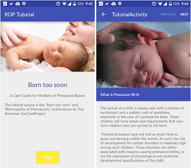
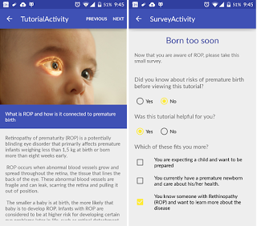
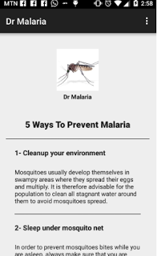
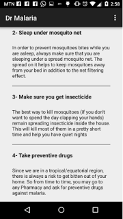
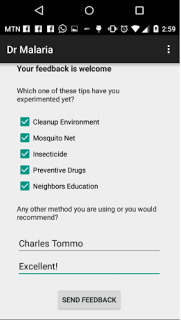

# 介绍Android Basics Nanodegree

原标题：Introducing the Android Basics Nanodegree  
链接：[https://android-developers.googleblog.com/2016/06/introducing-android-basics-nanodegree.html](https://android-developers.googleblog.com/2016/06/introducing-android-basics-nanodegree.html)  
作者：Shanea King-Roberson (首席项目经理) Twitter：@shaneakr Instagram：@theshanea
翻译：[arjinmc](https://github.com/arjinmc)  

[视频介绍](https://youtu.be/VpLE7n6PgvY)
 
你有一个应用程序的想法，但你不知道从哪里开始？全球有超过10亿台Android设备，为您提供了一种在适当的时间将您的想法传递给合适的人的方式。谷歌与Udacity合作，让每个人都可以访问和理解Android开发，因此无论您的背景如何，您都可以学习构建可改善周围人生活的应用程序。

[注册新的Android Basics Nanodegree](http://udacity.com/nd803)。这一系列课程和服务教您如何构建简单的Android应用程序 - 即使您很少或没有编程经验。看看我们学生构建的一些应用程序：

由学生Arpy Vanyan建立的应用程序“ROP教程”提高了人们对可能影响新生儿的可能致盲性早熟性视网膜病变眼病的认识。

  

用户Charles Tommo创建了一个名为“疟疾博士”的应用程序，教会人们预防疟疾的方法。

  

随着谷歌设计的[课程](https://www.udacity.com/course/ud837)，你可以学习技能，适用于解决现实世界的问题开发应用程序。您可以按照自己的进度学习使用[Android Studio](http://developer.android.com/tools/studio/index.html)（Google的Android应用程序开发官方工具）来设计应用程序用户界面并使用Java编程语言实现用户交互。

这些[课程](https://www.udacity.com/course/ud837)将逐步介绍如何为咖啡店建立订单，在避难所中跟踪宠物的应用程序，教授美国原住民Miwok部落词汇的应用程序，以及最近发生地震的应用程序在世界上。在课程结束时，您将拥有一整套应用程序，可与您的朋友和家人分享。

完成Android Basics Nanodegree后，您还有机会继续学习职业跟踪Android Nanodegree（适用于中级开发者）。完成Android Basics Nanodegree的前50名参与者有机会获得职业赛道Android Nanodegree的奖学金。有关其他详细信息和资格要求，请访问[udacity.com/legal/scholarship](http://udacity.com/legal/scholarship)。您现在拥有一个完整的学习途径，可以帮助您成为技术企业家，或者最重要的是，为您自己，您的社区乃至整个世界构建非常酷的Android应用程序。

所有的[独立课程](https://www.udacity.com/course/ud837)，使这项Nanodegree可以在[udacity.com/google](http://udacity.com/google)网络上免费提供。此外，Udacity还提供付费服务，包括访问教练，指导您的项目，帮助保持正常运作，职业咨询以及完成后收取的证书。

当您学习以下技能时，您将学习Java编程语言中的计算机科学概念。

* 构建应用用户界面
* 实现用户交互
* 将信息存储在数据库中
* 将数据从互联网中提取到您的应用中
* 识别并修复应用中的意外行为
* 本地化您的应用以支持其他语言

要注册Android Basics Nanodegree计划，请[单击此处](http://udacity.com/nd803)。

我们在课堂上见！