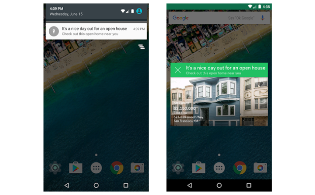
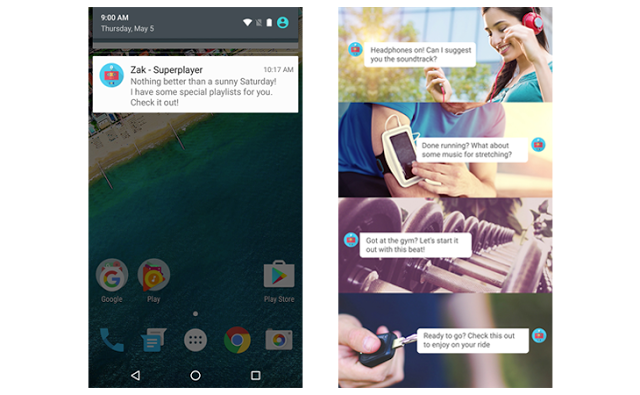

# 使用Google Awareness API创建智能，上下文相关的app

原标题：Create Intelligent, Context-Aware Apps with the Google Awareness APIs  
链接：[https://android-developers.googleblog.com/2016/06/create-intelligent-context-aware-apps.html](https://android-developers.googleblog.com/2016/06/create-intelligent-context-aware-apps.html)  
作者：Bhavik Singh (产品经理)  
翻译：[arjinmc](https://github.com/arjinmc)  

上个月，在Google I / O 2016上，我们发布了新的Google Awareness API，使您的应用能够使用快照和围栏智能地响应用户上下文，同时对系统资源的影响最小。

今天，我们很自豪地宣布，所有开发者都可以通过Google Play服务使用Google Awareness API。

  

使用7种不同类型的上下文 - 包括位置，天气，用户活动和附近的信标 - 您的应用可以更好地了解用户的当前情况，并使用此信息提供优化和定制的体验。

Awareness API提供了两种利用应用程序中的上下文信号的方法：

* <strong>快照API</strong>可以让你的应用程序轻松地请求有关用户的当前上下文信息。例如，“告诉我用户当前的位置和当前的天气状况”。
* <strong>护栏API</strong>可以让你的应用程序作出反应用户环境的变化-当它一组特定的条件相匹配。例如，“只要用户走路并插入耳机，就告诉我”。与Geofencing API类似，一旦注册了一个感知围栏，即使它没有运行，它也可以向您的应用发送回调。

作为单一，简化的表面，Awareness API以先前不可能的新方式组合最佳处理的上下文信号，提供更准确和富有洞察力的上下文线索，同时还管理系统资源以节省电池并最小化带宽。

我们与一些合作伙伴密切合作，他们已经找到了奇妙的方法将情境感知整合到他们的应用中：

  

[Trulia](https://play.google.com/store/apps/details?id=com.trulia.android&hl=en)是一个在线住宅房地产网站，使用我们的Fence API来建议开放式房屋。当天气完美且用户在他们感兴趣的房子附近走动时，Trulia发送通知提醒他们停下来。这种量身定制的通知可以帮助用户在最佳时间与开放式房屋互动。

  

另一方面，[SuperPlayer Music](https://play.google.com/store/apps/details?id=fm.superplayer.jukebot&hl=en)使用我们的Snapshot API和Fence API来推荐符合您心情的完美音乐。无论您是刚刚完成跑步并开始伸展，开始长途跋涉，还是只是去健身房，他们的助手都可以了解您的情况并为您推荐合适的播放列表。

通过我们初始化的信号和我们很棒的合作伙伴，我们刚刚开始使用Awareness API。通过开始使用[Google Awareness API开发者文档](https://developers.google.com/awareness/?utm_campaign=android_launch_awarenessapi_062716&utm_source=anddev&utm_medium=blog)，加入我们的应用程序，在您的应用程序中构建量身定制的体验，并通过观看我们的Google I / O会话了解更多信息。

[视频介绍](https://youtu.be/37ia7S4Lsv4)