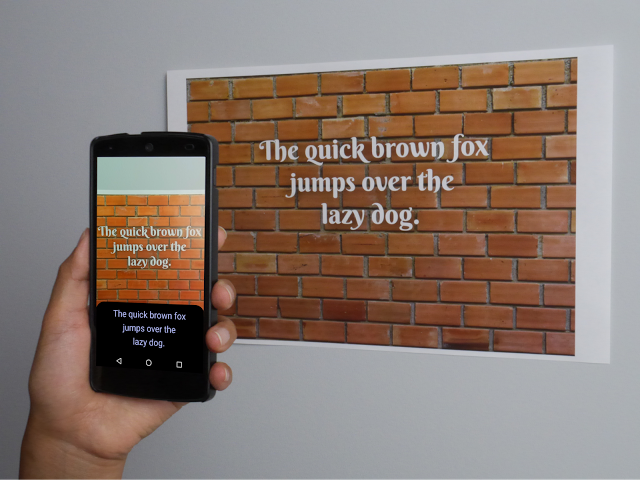

# Android Mobile Vision恢复操作并添加Text API

原标题：Android Mobile Vision restores operation and adds Text API  
链接：[https://android-developers.googleblog.com/2016/06/android-mobile-vision-text-api.html](https://android-developers.googleblog.com/2016/06/android-mobile-vision-text-api.html)  
作者：Michael Sipe (产品经理)  
翻译：[arjinmc](https://github.com/arjinmc)  

  

作为在照片和视频中查找对象的重要框架，Android设备的Mobile Vision操作在Google Play Services v9.2中得到恢复。

此新版Google Play服务修复了Google Play Services v.9.0中导致服务中断的下载问题。请参阅[发布说明](https://developers.google.com/vision/release-notes)了解详情。

我们也很高兴地宣布Text API，这是Android Mobile Vision的新组件。

Text API的光学字符识别技术在照片中读取拉丁字符文本（例如英语，西班牙语，德语，法语等）并返回文本以及组织结构（段落，行，单词）。移动应用现在可以：

* 整理包含文字的照片
* 自动化信用卡，收据和名片的繁琐数据输入
* 翻译文档（使用[Cloud Translate API(云翻译API)](https://cloud.google.com/translate/)）
* 跟踪真实物体，例如阅读地铁列车上的数字
* 提供辅助功能

如果您想快速入门，可以尝试我们的[codelab](https://g.co/codelabs/mobile-vision-ocr)，这将使Android开发者在一小时内阅读他们的应用程序的信息。

与Mobile Vision Face和Barcode组件一样，Text API在设备上运行，适用于实时应用程序。有关更多信息，请查看[Mobile Vision Developer站点](https://developers.google.com/vision/)。