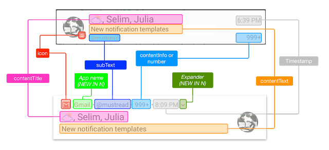
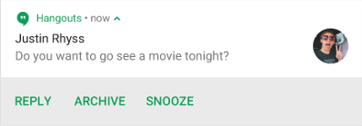
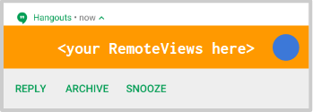
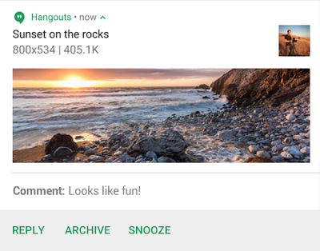
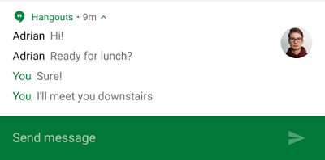
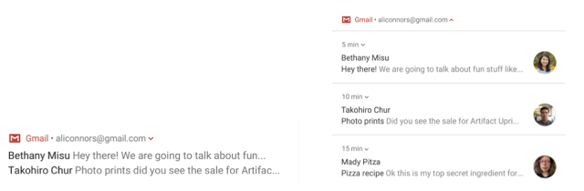

# Android N中的通知

原标题：Notifications in Android N  
链接：[https://android-developers.googleblog.com/2016/06/notifications-in-android-n.html](https://android-developers.googleblog.com/2016/06/notifications-in-android-n.html)  
作者：Ian Lake (开发者倡导者)  
翻译：[arjinmc](https://github.com/arjinmc)  

Android通知通常是Android应用和用户之间的不成则败的互动。为了提供更好的用户体验，Android N上的通知已收到可视刷新，改进了对自定义视图的支持，并以直接回复，新的[MessagingStyle](https://developer.android.com/reference/android/support/v4/app/NotificationCompat.MessagingStyle.html?utm_campaign=android_series_notificationsandroidnblog_060816&utm_source=anddev&utm_medium=blog)和捆绑的通知形式扩展了功能。

## 相同的通知，新面貌

第一个也是最明显的变化是通知的默认外观已经发生了重大变化。围绕通知传播的许多字段已折叠为新的标题行，应用程序的图标和名称将锚定通知。此更改确保标题，文本和大图标被赋予尽可能多的空间，因此，通知现在通常略大，更易于阅读。

  

给定单个标题行，有用的信息比以往任何时候都重要。<strong>当您定位Android N时，默认情况下将隐藏时间</strong> - 如果您有时间关键通知，例如消息传递应用程序，则可以重新启用它[setShowWhen(true)](https://developer.android.com/reference/android/support/v4/app/NotificationCompat.Builder.html?utm_campaign=android_series_notificationsandroidnblog_060816&utm_source=anddev&utm_medium=blog#setShowWhen(boolean))。此外，子文本现在取代内容信息和号码的角色：号码永远不会在Android N设备上显示，并且只有当您定位到以前版本的Android并且不包含子文本时才会显示内容信息。在所有情况下，请确保子文本相关且有用 - 例如，如果用户只有一个帐户，请不要添加帐户电子邮件地址作为您的子文本。

通知操作也已经过重新设计，现在位于通知下方的视觉分离栏中。

  

您会注意到新通知中没有图标; 而是在通知阴影的受约束空间中为标签本身提供更多空间。但是，仍然需要通知操作图标，并继续在旧版Android和Android Wear等设备上使用。

如果您一直在使用[NotificationCompat.Builder](https://developer.android.com/reference/android/support/v4/app/NotificationCompat.Builder.html?utm_campaign=android_series_notificationsandroidnblog_060816&utm_source=anddev&utm_medium=blog)标准样式构建通知，那么默认情况下您将获得新的外观，而无需更改代码。

## 更好地支持自定义视图

如果您是从自定义构建通知<i>RemoteViews</i>，那么适应任何新风格都具有挑战性。使用新标题，将行为，操作和大图标定位作为通知主文本+标题中的单独元素，我们引入了一个新的[DecoratedCustomViewStyle](https://developer.android.com/reference/android/app/Notification.DecoratedCustomViewStyle.html?utm_campaign=android_series_notificationsandroidnblog_060816&utm_source=anddev&utm_medium=blog)并[DecoratedMediaCustomViewStyle](https://developer.android.com/reference/android/app/Notification.DecoratedMediaCustomViewStyle.html?utm_campaign=android_series_notificationsandroidnblog_060816&utm_source=anddev&utm_medium=blog)提供所有这些元素，使您只关注内容部分用新[setCustomContentView()](https://developer.android.com/reference/android/app/Notification.Builder.html?utm_campaign=android_series_notificationsandroidnblog_060816&utm_source=anddev&utm_medium=blog#setCustomContentView(android.widget.RemoteViews))方法。

  

这也确保了未来的外观和感觉变化应该更容易适应，因为这些样式将与平台一起更新，而不需要在应用程序端进行代码更改。

## 直接回复

虽然通知操作已经能够发动<i>Activity</i>或做后台工作用<i>Service</i>或<i>BroadcastReceiver</i>，<strong>直接回复</strong>允许你建立直接接收文本输入的操作<strong>内嵌</strong>与通知操作。

  

直接回复使用相同的[RemoteInputAPI](https://developer.android.com/reference/android/support/v4/app/RemoteInput.html?utm_campaign=android_series_notificationsandroidnblog_060816&utm_source=anddev&utm_medium=blog)（最初为Android Wear引入）来标记[Action](https://developer.android.com/reference/android/support/v4/app/NotificationCompat.Action.html?utm_campaign=android_series_notificationsandroidnblog_060816&utm_source=anddev&utm_medium=blog)能够直接接收来自用户的输入。

它<i>RemoteInput</i>本身包含的信息，如用于以后检索输入的键和用户开始键入之前显示的提示文本。
```code
// Where should direct replies be put in the intent bundle (can be any string)
private static final String KEY_TEXT_REPLY = "key_text_reply";

// Create the RemoteInput specifying this key
String replyLabel = getString(R.string.reply_label);
RemoteInput remoteInput = new RemoteInput.Builder(KEY_TEXT_REPLY)
        .setLabel(replyLabel)
        .build();
```

一旦你构建了<i>RemoteInput</i>，它就可以通过恰当命名的[addRemoteInput()](https://developer.android.com/reference/android/support/v4/app/NotificationCompat.Action.Builder.html?utm_campaign=android_series_notificationsandroidnblog_060816&utm_source=anddev&utm_medium=blog#addRemoteInput(android.support.v4.app.RemoteInput))方法附加到你的Action上。您可以考虑调用[setAllowGeneratedReplies(true)](https://developer.android.com/reference/android/support/v4/app/NotificationCompat.Action.Builder.html?utm_campaign=android_series_notificationsandroidnblog_060816&utm_source=anddev&utm_medium=blog#setAllowGeneratedReplies(boolean))以启用[Android Wear 2.0](https://developer.android.com/wear/preview/index.html?utm_campaign=android_series_notificationsandroidnblog_060816&utm_source=anddev&utm_medium=blog)以在可用时生成[智能回复](https://developer.android.com/wear/preview/api-overview.html?utm_campaign=android_series_notificationsandroidnblog_060816&utm_source=anddev&utm_medium=blog#smart-replies)选项，并使用户更容易快速响应。

```code
// Add to your action, enabling Direct Reply for it
NotificationCompat.Action action =
    new NotificationCompat.Action.Builder(R.drawable.reply, replyLabel, pendingIntent)
        .addRemoteInput(remoteInput)
        .setAllowGeneratedReplies(true)
        .build();
```     

请记住，<i>pendingIntent</i>传入应该是Marshmallow的<i>Activity</i>的<i>Action</i>，较低版本设备不支持直接回复（因为您要解除锁定屏幕，启动<i>Activity</i>并关注输入字段以让用户键入他们的在Android N设备上应该是<i>Service</i>（如果你需要在单独的线程上工作）或<i>BroadcastReceiver</i>（在UI线程上运行），以便即使从锁定屏幕也可以在后台输入文本。（在系统设置中，有一个单独的用户控件可以启用/禁用来自锁定设备的直接回复。）

在提取文本输入<i>Service</i>/<i>BroadcastReceiver</i>然后可以用的帮助[RemoteInput.getResultsFromIntent()](https://developer.android.com/reference/android/support/v4/app/RemoteInput.html#getResultsFromIntent(android.content.Intent))方法：

```code
private CharSequence getMessageText(Intent intent) {
    Bundle remoteInput = RemoteInput.getResultsFromIntent(intent);
    if (remoteInput != null) {
        return remoteInput.getCharSequence(KEY_TEXT_REPLY);
    }
    return null;
 }
```

你处理文本后，<strong>必须更新通知</strong>通过调用[notify()](https://developer.android.com/reference/android/app/NotificationManager.html?utm_campaign=android_series_notificationsandroidnblog_060816&utm_source=anddev&utm_medium=blog#notify(int,%20android.app.Notification))与同<i>id</i>和<i>tag</i>（如果使用的话）。这是隐藏直接回复UI的触发器，应该用作向用户确认他们的回复是否被正确接收和处理的技术。

对于大多数模板，这应该涉及使用新[setRemoteInputHistory()](https://developer.android.com/reference/android/support/v4/app/NotificationCompat.Builder.html?utm_campaign=android_series_notificationsandroidnblog_060816&utm_source=anddev&utm_medium=blog#setRemoteInputHistory(java.lang.CharSequence[]))方法将回复附加到通知的底部。在主要内容更新之前，应将附加回复附加到历史记录中（例如其他人回复）。

  

但是，如果您正在构建消息传递应用程序并期待来回对话，则应使用[MessagingStyle](https://developer.android.com/reference/android/support/v4/app/NotificationCompat.MessagingStyle.html?utm_campaign=android_series_notificationsandroidnblog_060816&utm_source=anddev&utm_medium=blog)并附加其他消息。

## MessagingStyle

我们优化了显示正在进行的对话和使用新回复的直接回复的体验[MessagingStyle](https://developer.android.com/reference/android/support/v4/app/NotificationCompat.MessagingStyle.html?utm_campaign=android_series_notificationsandroidnblog_060816&utm_source=anddev&utm_medium=blog)。

  

此样式为通过该[addMessage()](https://developer.android.com/reference/android/support/v4/app/NotificationCompat.MessagingStyle.html?utm_campaign=android_series_notificationsandroidnblog_060816&utm_source=anddev&utm_medium=blog#addMessage(java.lang.CharSequence,%20long,%20java.lang.CharSequence))方法添加的多个消息提供内置格式。每条消息都支持传入文本本身，时间戳和消息的发送者（使其易于支持组对话）。

```code
builder.setStyle(new NotificationCompat.MessagingStyle("Me")
    .setConversationTitle("Team lunch")
    .addMessage("Hi", timestampMillis1, null) // Pass in null for user.
    .addMessage("What's up?", timestampMillis2, "Coworker")
    .addMessage("Not much", timestampMillis3, null)
    .addMessage("How about lunch?", timestampMillis4, "Coworker"));
```

您会注意到，这种风格具有一流的支持，可以专门表示来自用户的消息并填写其名称（在本例中为“Me”）并设置可选的会话标题。虽然这可以<i>BigTextStyle</i>通过使用此样式手动完成，但Android Wear 2.0用户将立即获得内联响应，而无需将其从扩展的通知视图中删除，从而无需构建完整的Wear应用程序即可实现无缝体验。

## 捆绑的通知

通过使用新的视觉设计，直接回复[MessagingStyle](https://developer.android.com/reference/android/support/v4/app/NotificationCompat.MessagingStyle.html?utm_campaign=android_series_notificationsandroidnblog_060816&utm_source=anddev&utm_medium=blog)以及[我们之前的所有最佳实践](https://www.youtube.com/watch?v=-iog_fmm6mE)构建出色的通知后，重要的是要考虑整体通知体验，特别是如果您发布多个通知（例如，每个正在进行一次对话或每个新的电子邮件主题）。

  

<strong>捆绑式通知</strong>提供了两全其美的优势：用户查看其他通知或希望同时对所有通知执行操作的单个摘要通知，以及扩展组以处理单个通知（包括使用操作和直接回复）的功能。

如果您为[Android Wear构建了堆叠通知](https://developer.android.com/training/wearables/notifications/stacks.html?utm_campaign=android_series_notificationsandroidnblog_060816&utm_source=anddev&utm_medium=blog)，则此处使用的API完全相同。只需添加[setGroup()](https://developer.android.com/reference/android/support/v4/app/NotificationCompat.Builder.html?utm_campaign=android_series_notificationsandroidnblog_060816&utm_source=anddev&utm_medium=blog#setGroup(java.lang.String))到每个通知中，即可将这些通知捆绑在一起。您不限于一个组，因此请适当地捆绑通知。对于电子邮件应用，您可以考虑为每个帐户使用一个捆绑包。

同样重要的是还要创建<strong>摘要通知</strong>。此摘要通知（表示为[setGroupSummary(true)](https://developer.android.com/reference/android/support/v4/app/NotificationCompat.Builder.html?utm_campaign=android_series_notificationsandroidnblog_060816&utm_source=anddev&utm_medium=blog#setGroupSummary(boolean))）是Marshmallow和较低设备上显示的唯一通知，应该（您猜对了）汇总所有单独的通知。是时候使用[InboxStyle](https://developer.android.com/reference/android/support/v4/app/NotificationCompat.InboxStyle.html?utm_campaign=android_series_notificationsandroidnblog_060816&utm_source=anddev&utm_medium=blog)，尽管使用它不是必需的。在Android N及更高版本的设备上，从摘要通知中提取一些信息（例如子文本，内容意图和删除意图）以生成捆绑通知的折叠通知，因此您应继续在所有API级别上生成摘要通知。

要改善Android N设备上的整体用户体验，在没有组的情况下发送<strong>4个或更多通知将导致自动捆绑这些通知</strong>。

## N代表通知

Android上的通知一直是渐进增强的一个领域。从Gingerbread时代的单击目标到可扩展的通知，操作，MediaStyle以及现在的直接回复和捆绑通知等功能，通知在Android上的整体用户体验中发挥着重要作用。

有许多新工具可供使用（并[NotificationCompat](https://developer.android.com/reference/android/support/v4/app/NotificationCompat.html?utm_campaign=android_series_notificationsandroidnblog_060816&utm_source=anddev&utm_medium=blog)有助于向后兼容），我很高兴看到你如何将它们用于#BuildBetterApps

关注[Android开发模式合集](https://plus.google.com/collection/sLR0p?utm_campaign=android_series_design_multiwindow_blog_051116&utm_source=anddev&utm_medium=blog)了解更多信息！

  