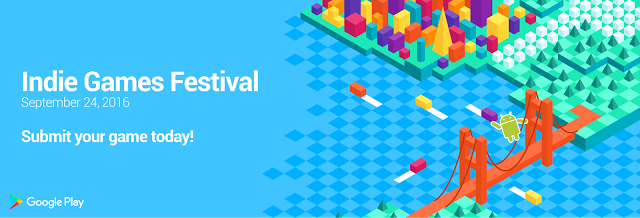

#  宣布9月24日在旧金山举行Google Play独立游戏节

原标题：Announcing the Google Play Indie Games Festival in San Francisco, Sept. 24  
链接：[https://android-developers.googleblog.com/2016/07/google-play-indie-games-festival.html](https://android-developers.googleblog.com/2016/07/google-play-indie-games-festival.html)  
作者：Jamil Moledina (Google Play游戏战略主管)  
翻译：[arjinmc](https://github.com/arjinmc)  

如果你是独立游戏开发者，你就会知道游戏是表达艺术，奇思妙想和喜悦的有力媒介。加入Google Play可以帮助您覆盖超过十亿用户并建立成功的全球业务。这就是我们最近推出的项目，比如[Indie Corner(独立角)](https://play.google.com/store/info/topic?id=topic_b000054_games_indie_corner_tp&e=-EnableAppDetailsPageRedesign)，以帮助更多玩家发现您的艺术作品。

为了进一步庆祝和展示独立游戏开发者的激情和创新，我们将于9月24日在旧金山的Terra画廊举办Google Play独立游戏节。

  

这是一个很好的机会，让您向公众展示您的独立游戏，增加您的网络，并竞争赢取丰厚的奖品，例如Tango设备，Google I / O 2017的免费门票以及Google广告系列支持。入场将是免费的，玩家将有机会参加比赛并投票选出他们的最爱。

如果你有兴趣展示你的游戏，我们现在[接受提交](https://docs.google.com/a/google.com/forms/d/e/1FAIpQLSduaM998L0WXm_4znsZjHX5-unZLBChNXHuCHbTlWuAcmMNmQ/viewform)到8月14日。我们将选择既有创意又有趣的高质量游戏。提交的文件对美国和加拿大的开发者开放，其中有15名或更少的全职员工。只有2016年1月1日当天或之后发布的游戏或者2016年12月31日之前发布的游戏才有资格获得。查看[完整规则](https://docs.google.com/a/google.com/forms/d/e/1FAIpQLSduaM998L0WXm_4znsZjHX5-unZLBChNXHuCHbTlWuAcmMNmQ/viewform)。

我们鼓励使用[Google VR SDK](https://developers.google.com/vr/android/)和[Tango平板电脑开发套件](https://store.google.com/product/tango_tablet_development_kit?srp=/product/project_tango_tablet_development_kit)的虚拟现实和增强现实游戏提交 。

8月底，我们将宣布将成为游戏节上的独立小组。

您可以[在这里](https://events.withgoogle.com/google-play-indie-game-festival/)了解更多有关该活动。我们迫不及待地想看看您与我们分享的创新和有趣体验！

