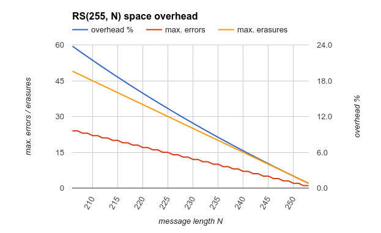
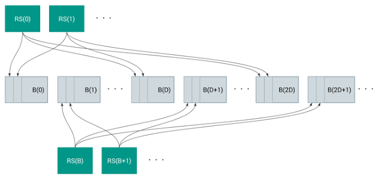

# 通过严格强制纠错的验证启动

原标题：Strictly Enforced Verified Boot with Error Correction  
链接：[https://android-developers.googleblog.com/2016/07/strictly-enforced-verified-boot-with.html](https://android-developers.googleblog.com/2016/07/strictly-enforced-verified-boot-with.html)  
作者：Sami Tolvanen (软件工程师)  
翻译：[arjinmc](https://github.com/arjinmc)  

## 概观
Android使用多层保护来保证用户的安全。其中一个层是[验证启动](https://source.android.com/security/verifiedboot/)，通过使用加密完整性检查来检测操作系统的更改，从而提高了安全性。自Marshmallow以来，Android[已警示系统完整性](https://g.co/ABH)，但从首次发布Android 7.0的设备开始，我们需要严格执行验证启动。这意味着具有损坏的启动映像或已验证分区的设备将无法启动或在用户同意的情况下以有限的容量启动。但是，这种严格的检查意味着以前不太可见的非恶意数据损坏现在可能开始更多地影响流程功能。

默认情况下，Android使用dm-verity内核驱动程序验证大型分区，该驱动程序将分区划分为4个KiB块，并在读取时根据签名的哈希树验证每个块。因此，当dm-verity处于强制模式时，检测到的单字节损坏将导致整个块变得不可访问，从而导致内核在验证的分区数据访问上将EIO错误返回给用户空间。

这篇文章描述了我们通过引入前向纠错（FEC）来提高dm-verity健壮性的工作，并解释了这如何使我们能够使操作系统更能抵抗数据损坏。这些改进适用于运行Android 7.0的任何设备，此帖子反映了我们在Nexus设备上提供的AOSP中的默认实施。

## 纠错码

使用前向纠错，我们可以通过运送使用纠错码生成的冗余编码数据来检测和纠正源数据中的错误。可以纠正的确切错误数取决于使用的代码和为编码数据分配的空间量。

[Reed-Solomon](https://en.wikipedia.org/wiki/Reed%E2%80%93Solomon_error_correction)是最常用的纠错码系列之一，并且在Linux内核中很容易获得，这使得它成为dm-verity的明显候选者。当 添加t编码符号时，这些代码可以纠正最多⌊t / 2⌋未知错误和最多 t个已知错误，也称为[删除](https://en.wikipedia.org/wiki/Erasure_code)。

典型的RS（255,223）代码为每223字节的源数据生成32字节的编码数据，可以在每个255字节块中纠正多达16个未知错误。但是，使用此代码会导致大约15％的空间开销，这对于存储有限的移动设备来说是不可接受的。我们可以通过牺牲纠错能力来减少空间开销。RS（255,253）代码只能纠正一个未知错误，但开销仅为0.8％。

  
<i>消息长度N</i>

另一个复杂因素是基于块的存储损坏通常发生在整个块中，有时跨越多个连续块。因为Reed-Solomon只能从相对较短的编码块中的有限数量的损坏字节中恢复，所以如果没有巨大的空间开销，天真的实现将不会非常有效。

## 从连续损坏的块中恢复

在我们 对Android 7.0的[dm-verity](https://git.kernel.org/cgit/linux/kernel/git/torvalds/linux.git/commit/?id=a739ff3f543afbb4a041c16cd0182c8e8d366e70)所做的更改中，我们使用了一种称为交错的技术，使我们不仅可以从丢失整个4 KiB源块，而且可以恢复多个连续块，同时显着减少所需的空间开销。与天真的实现相比，实现了可用的纠错能力。

有效的交织意味着将块中的每个字节映射到单独的Reed-Solomon码，每个代码覆盖相应的N个源块上的N个字节。一个简单的交织，其中每个代码覆盖N个块的连续序列已经使我们能够从最多（255-N）/ 2个块的损坏中恢复，对于RS（255,223）将意味着64 KiB，例。

更好的解决方案是通过在整个分区上扩展每个代码来最大化相同代码所覆盖的字节之间的距离，从而增加RS（255，N）代码可以在由分区组成的分区上处理的连续损坏块的最大数量。 T阻塞到⌈T / N⌉× （255 - N）/ 2。

  
<i>交错距离D和块大小B.</i>

交织的另一个好处是，当与dm-verity已经执行的完整性验证结合使用时，我们可以准确地确定每个代码中的错误位置。因为代码的每个字节都覆盖不同的源块 - 我们可以使用现有的dm-verity元数据验证每个块的完整性 - 我们知道哪些字节包含错误。能够精确定位擦除位置使我们能够有效地将误差校正性能提高到最多⌈T / N⌉× （255-N）个连续块。

对于具有524256个4 KiB块和RS（255,253）的~2 GiB分区，单个代码的字节之间的最大距离是2073个块。因为每个代码都可以从两个擦除中恢复，所以使用这种交错方法允许我们从多达4146个连续损坏的块（~16 MiB）中恢复。当然，如果编码数据本身被破坏或者我们丢失了任何单个代码覆盖的两个以上的块，我们就无法恢复了。

虽然纠错对于基于块的存储是可行的，但是交错确实具有使解码变慢的副作用，因为不是读取单个块，而是需要读取遍布分区的多个块以从错误中恢复。幸运的是，当与dm-verity和固态存储结合使用时，这不是一个大问题，因为我们只需要在块实际被破坏时求助于解码，这仍然是相当罕见的，并且随机访问读取相对较快即使我们必须纠正错误。

## 结论

严格执行验证的启动可以提高安全性，但也可以通过增加由于软件bug或硬件问题而可能在设备上发生的磁盘损坏的影响来降低可靠性。

我们为dm-verity开发的新纠错功能使设备可以在典型的2-3 GiB系统分区上的任何地方丢失高达16-24 MiB的连续块，仅占用0.8％的空间开销且无性能影响，除非检测到腐败。这提高了运行Android 7.0的设备的安全性和可靠性。