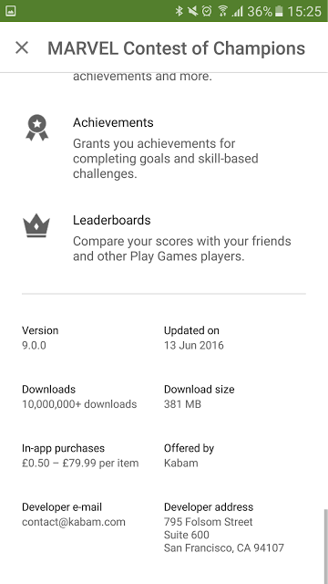
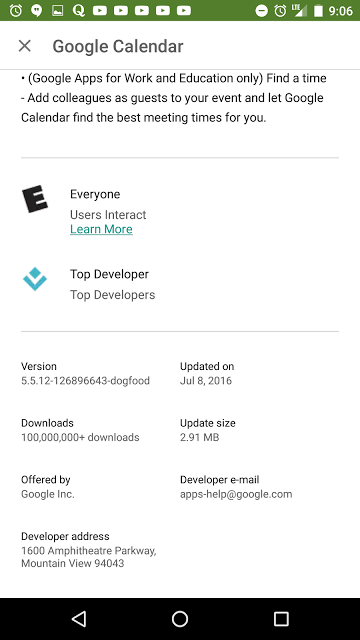

# Google Play上改进较小的应用的下载

原标题：Improvements for smaller app downloads on Google Play  
链接：[https://android-developers.googleblog.com/2016/07/improvements-for-smaller-app-downloads.html](https://android-developers.googleblog.com/2016/07/improvements-for-smaller-app-downloads.html)  
作者：Anthony Morris (SWE Google Play)和Andrew Hayden (软件工程师)  
翻译：[arjinmc](https://github.com/arjinmc)  

谷歌Play继续快速增长，因为去年Android用户在Google Play商店中安装了超过650亿个应用程序。我们还看到开发者更频繁地更新他们的应用程序，以推送出色的新内容，修补安全漏洞，并快速迭代用户反馈。

但是，许多用户对他们使用的数据量很敏感，特别是如果他们不在Wi-Fi上。Google Play正在投资改进，以减少需要为应用安装和更新传输的数据，同时使数据成本对用户更加透明。

请继续阅读以了解更新并了解有关优化APK大小的方法的一些提示。

## 新的Delta算法可减少应用更新的大小

对于来自Play商店的大约98％的应用更新，仅下载到APK文件的更改 （增量）并与现有文件合并，从而减少更新的大小。自2012年以来，Google Play已经使用了delta算法，我们最近推出了一个额外的delta算法[bsdiff （由Colin Percival创建）](http://www.daemonology.net/bsdiff/)，我们的实验表明，与之前的算法相比，我们的实验显示可以将delta大小减少多达50％或更多的APK。Bsdiff专门用于通过利用编译的本地代码在版本之间更改的特定方式来生成更有效的本地库增量。为了最有效，本地库应该以未压缩的方式存储（压缩会干扰delta算法）。

Chrome的一个例子：

补丁说明	| 以前的补丁大小	| Bsdiff大小
---|---|---
M46到M47主要更新 | 22.8 MB | 12.9 MB
M47次要更新 | 15.3 MB	 | 3.6 MB

与之前的delta算法相比，没有未压缩的本地库的应用程序平均可以看到大小减少5％。

## 将增量算法应用于APK扩展文件以进一步减少更新大小

APK扩展文件允许您在应用程序中包含最大2GB大小的其他大文件（例如高分辨率图形或媒体文件），这在游戏中尤其受欢迎。我们最近扩展了我们的增量和压缩算法以适用于除APK之外的这些APK扩展文件，将初始安装的下载大小减少了12％，平均更新了65％。APK扩展文件补丁使用[xdelta算法](http://xdelta.org/)。

## Play商店中更简洁的尺寸信息

除了减少下载大小的改进之外，我们还更清楚地显示了有关所用数据和Play商店中下载大小的信息。您现在可以在Play商店中查看实际的下载大小，而不是APK文件大小。如果您已有应用，则只会看到更新大小。这些变化现在正在推出。

1. Colin Percival，Naive可执行代码的差异，http://www.daemonology.net/bsdiff/,2003。[↩](https://android-developers.googleblog.com/2016/07/#fnref1)

  
<i>示例1：显示APK的新“下载大小”</i>

  
<i>示例2：显示APK的新“更新大小”</i>

## 减少下载大小的技巧

1.<strong>针对正确的大小测量进行优化</strong>：用户关心下载大小（即安装/更新应用程序时传输的字节数），并且他们关心磁盘大小（即应用程序在磁盘上占用多少空间）。重要的是要注意，这些都与原始APK文件大小不同，也不一定相关。  
Chrome示例：

大小 | 压缩的本地库 | 未压缩的本地库
---|---|---
APK大小 | 39MB | 52MB（+ 25％）
下载大小（安装）| 	29MB | 29MB（无变化）
下载大小（更新） | 29MB | 21MB（-29％）
磁盘大小 | 71MB | 52MB（-26％)

Chrome发现初始下载大小保持不变，因为未在APK中压缩本地库，而APK大小增加，因为Google Play已经对下载进行了压缩。他们还发现更新大小减小了，因为增量对未压缩文件更有效，并且磁盘大小减小，因为您不再需要本地库的压缩副本。但请注意，只有当APK的最低SDK版本为23（Marshmallow）或更高版本时，本地库才应解压缩。

2.<strong>减少APK大小</strong>：从APK中删除不必要的数据，如未使用的资源和代码。

3.<strong>优化APK的部分以使其更小</strong>：使用更高效的文件格式，例如使用WebP而不是JPEG，或使用Proguard删除未使用的代码。

[阅读更多关于减少APK大小](https://medium.com/google-developers/smallerapk-part-1-anatomy-of-an-apk-da83c25e7003#.jgy8wuni9)和观看I / O 2016年会议[“将你的应用程序放在均衡饮食上” 以向WojtekKaliciński学习，了解如何减小APK的大小](https://www.youtube.com/watch?v=xctGIB81D2w)。