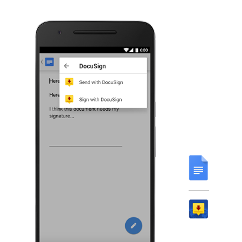
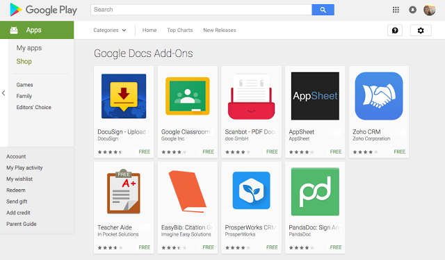

# 宣布Docs和Sheets的Android附加组件

原标题：Announcing Android add-ons for Docs and Sheets  
链接：[https://android-developers.googleblog.com/2016/07/announcing-android-add-ons-for-docs-and.html](https://android-developers.googleblog.com/2016/07/announcing-android-add-ons-for-docs-and.html)  
作者：[Saurabh Gupta](https://twitter.com/gluemesh) (Google Apps产品经理)  
翻译：[arjinmc](https://github.com/arjinmc)  

我们知道很多人认为您的移动设备是消费商业信息的主要工具，但如果您可以使用它来从任何地方完成更多的工作呢？我们很高兴为引入[Android附加组件Docs和Sheets](Android add-ons for Docs and Sheets)，这是一种新的方式 - 无论是准备从电话签署电子签名合同，还是在平板电脑上提取CRM数据在等待早晨咖啡时快速分析，Android附加组件可以帮助您完成更多工作。

## 无论您身在何处，都可以使用自己喜爱的第三方应用完成更多工作

我们与八个集成合作伙伴合作，他们为Docs和Sheets创建了无缝集成。以下是其中几个的预览：

* <strong>DocuSign</strong> - 从文档或表格中触发或完成签名过程，并将执行的文档保存到云端硬盘。在[这里](http://docusign.com/blog/docusign-now-enabled-with-google-docs-android-add-ons)阅读更多。

  
<small>DocuSign可让您轻松地从Google文档创建签名信封</small>

* <strong>ProsperWorks</strong> - 直接从您的设备导入您的CRM数据，以在表格上创建和更新高级仪表板，报告和图表。在[这里](http://www.prosperworks.com/blog/prosperworks-customer-report-builder-add-on-for-google-sheets-goes-mobile/)阅读更多。
* <strong>AppSheet</strong> - 立即从Sheets中的数据直接创建功能强大的移动应用程序 - 无需编码。在[这里](http://blog.appsheet.com/create-an-app-with-google-sheets-in-your-phone)阅读更多。
* <strong>Scanbot</strong> - 使用内置OCR扫描您的业务文档，并将其内容作为可编辑文本插入到文档中。在[这里](https://medium.com/@Scanbot/scanbot-integration-with-google-docs-475f59af14e5#.ncbdiexut)阅读更多。

您可以在我们的[Google Play集合](https://play.google.com/store/apps/collection/promotion_30022a0_appsall_addons_docssheets)中找到这些附加组件以及更多内容，包括[PandaDoc](https://www.pandadoc.com/blog/PandaDoc-available-for-Google-Docs-App?utm_source=goog&utm_medium=blog&utm_campaign=promo&utm_content=goog-blog-promo)，[ZohoCRM](http://www.zoho.com/crm/blog/introducing-zoho-crm-mobile-add-on-for-google-sheets.html)，[Teacher Aide](https://play.google.com/store/apps/details?id=com.apps.ips.TeacherAideDemo2)，[EasyBib](http://www.easybib.com/guides/introducing-our-easybib-google-docs-mobile-integration/)和Classroom，以及直接从[Docs](https://play.google.com/store/apps/details?id=com.google.android.apps.docs.editors.docs)或[Sheets](https://play.google.com/store/apps/details?id=com.google.android.apps.docs.editors.sheets)中的附加菜单中找到。

  

今天试试看，看看你能做什么。

致所有开发者：立即尝试开发者预览版！

从上面可以看出，Android附加组件提供了一个很好的机会来构建创新的集成，并覆盖全球的Docs和Sheets用户。它们基本上是与服务器端的[Google Apps脚本](http://developers.google.com/apps-script?utm_campaign=android_discussion_googledocs_072816&utm_source=anddev&utm_medium=blog)项目相关联的Android应用，允许他们使用标准的Apps脚本技术访问和操作Google文档或表格中的数据。查看[我们的文档](https://developers.google.com/apps-script/add-ons/mobile?utm_campaign=android_discussion_googledocs_072816&utm_source=anddev&utm_medium=blog)，其中包括[用户界面指南](https://developers.google.com/apps-script/add-ons/mobile/mobile-style?utm_campaign=android_discussion_googledocs_072816&utm_source=anddev&utm_medium=blog)以及[示例代码](https://developers.google.com/apps-script/add-ons/mobile/?utm_campaign=android_discussion_googledocs_072816&utm_source=anddev&utm_medium=blog#see_what_you_can_make)，以帮助您入门。我们还使您可以轻松地使用Apps脚本编辑器发布您的应用程序。

Android附加组件现已作为开发者预览版提供。我们期待看到您的构建！