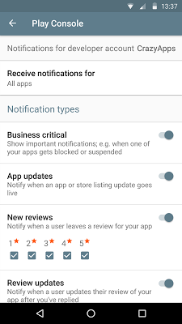
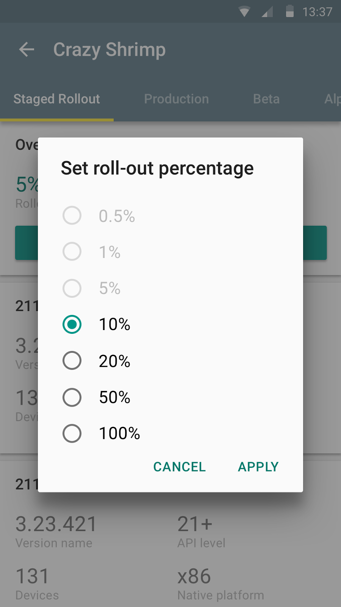

# Google Play开发者控制台应用新功能预览和体验

原标题：New features for reviews and experiments in Google Play Developer Console app  
链接：[https://android-developers.googleblog.com/2016/08/new-features-for-reviews-and-experiments.html](https://android-developers.googleblog.com/2016/08/new-features-for-reviews-and-experiments.html)  
作者：Kobi Glick (Google Play团队)  
翻译：[arjinmc](https://github.com/arjinmc) 

借助Google Play开发者控制台发布的超过100万个应用，我们知道自信发布，获取用户，了解这些应用以及管理业务至关重要。无论是针对关键性能问题还是对负面评价做出回应，在你需要的时间和地点检查你的应用程序都是无价的。

5月份推出的[Google Play开发者控制台应用程序](https://play.google.com/store/apps/details?id=com.google.android.apps.playconsole&hl=en)已经帮助成千上万的开发者随时随地了解重要的业务更新。

我们很高兴地向你介绍今天推出的新功能：

<strong>接收有关新评论的通知</strong>

  

<strong>使用过滤器来查找你想要的评论</strong>

  

<strong>查看和应用商品详情体验结果</strong>

  

<strong>增加分阶段发布的百分比或暂停分阶段发布</strong>

  

在Google Play下载[开发者控制台应用](https://play.google.com/store/apps/details?id=com.google.android.apps.playconsole)，无论身在何处，都可以在应用和游戏上保持最佳状态！另外，还可以让[Playbook for Developers应用](https://g.co/play/playbook-androiddevblogposts-evergreen)保持最新状态，提供更多功能和最佳实践，帮助你在Google Play上成功发展业务。