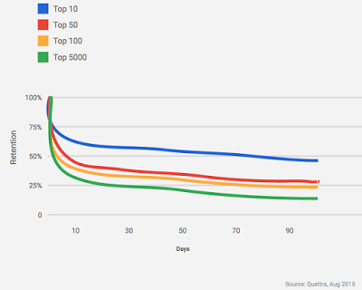
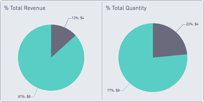
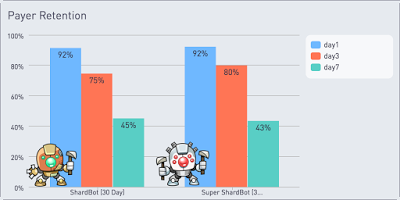
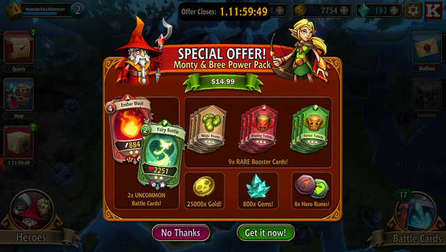
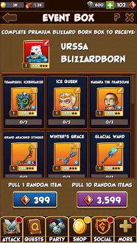
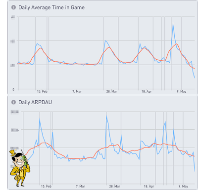

# 5个可帮助你提高游戏即服务获利能力的技巧

原标题：5 Tips to help you improve game-as-a-service monetization  
链接：[https://android-developers.googleblog.com/2016/08/5-tips-to-help-you-improve-game-as-a-service-monetization.html](https://android-developers.googleblog.com/2016/08/5-tips-to-help-you-improve-game-as-a-service-monetization.html)    
作者：Moonlit Wang (谷歌玩游戏合作伙伴开发经理) 和 Tammy Levy (Kongregateyy移动产品总监)  
翻译：[arjinmc](https://github.com/arjinmc) 

在当今移动游戏即服务的世界中，玩家的终生价值更加复杂，收入现在是许多微交易的总和，而不是传统游戏机的单一购买。

当然，你不需要一个复杂的统计模型来理解玩家投入游戏的时间越多，他们花的钱越多，他们的LTV就越大。但是，作为一名手机游戏开发者，你如何设计和改进货币化？以下是5个技巧，可帮助你提高游戏即服务的获利能力，以手机游戏发行商[Kongregate](https://play.google.com/store/apps/dev?id=7580247376460930437&hl=en_GB)提供的最佳实践为例：

## 1. 跟踪与LTV有强烈正相关的玩家行为指标

* <strong>D1，D7，D30</strong>保留表示一个休闲玩家可以转换成一个忠实的粉丝。
* <strong>会话的长度和频率</strong>衡量用户的参与度以及游戏的乐趣程度。
* 重要的里程碑<strong>完成率</strong>可以衡量和确定流失。
* <strong>买方和重复的买方转换</strong>，代表你最有价值的用户群。

## 2. 优化长期参与和取悦你最好的玩家

保留率是衡量伟大游戏和平庸游戏的第一个指标。整个用户生命周期中保留率较高的游戏，始终保持较好的货币化。保留是王道，更重要的是<strong>长期保留应该优先考虑</strong>。因此，在设计游戏时，要创造一个精致而引人入胜的体验，让你最忠诚的粉丝满意。

  
[这个图表显示了顶级游戏/应用随时间的保留]

* 在考虑长期留存的情况下，着眼于实现强大的D30，而且 <strong>还要超越前30天</strong>。通过评估以下比率来衡量长期保留率：D30到D60，D30到D90和D30到D180。比率越高，游戏的长期粘性越大，这会增加你的LTV。
* 玩家愿意花费每小时“乐趣”的固定金额，因此在设计游戏时要考虑更新内容，<strong>让游戏内容丰富而有趣，让玩家在高水平游戏并在游戏中度过最多时间</strong>，不要关闭你的玩家或阻碍他们的游戏进程。
* [使用Google Play游戏服务 - 漏斗报告](http://android-developers.blogspot.com/2016/01/new-features-to-better-understand.html)来帮助你<strong>跟踪游戏中不同的里程碑完成率，以便确定丢弃点并减少流失</strong>。

## 3. 通过有针对性的报价增加买家转换

首次购买者转换是最重要的，因为玩家<strong>流失率在首次购买后显着下降</strong>，但不管消费金额如何，都保持相对平稳。此外，过去的购买行为是未来购买的最佳预测指标。在[开发者控制台](https://developer.android.com/distribute/users/user-acquisition.html)中直接找到你首次和重复的买家转化率。

* 使用A / B测试来<strong>查找将最大化你的总收入的价格。不同的人对不同的产品有不同的支付意愿</strong>，不同的产品在价格和数量上的权衡是不同的，所以不要盲目降低价格。
* <strong>定制你的游戏体验，以及在应用程序内购买提供</strong>基于玩家的预测概率使用花费[玩家资料API](https://developers.google.com/games/services/android/stats)，它预测玩家流失和花费。

例如，在[Kongregate](https://play.google.com/store/apps/developer?id=Kongregate&hl=en_GB&e=-EnableAppDetailsPageRedesign)的[Spellstone](https://play.google.com/store/apps/details?id=com.kongregate.mobile.spellstone.google&hl=en_GB) 游戏中，测试了两个定价点，名为“碎片机器人”（Shard Bot），该机制每天为玩家提供30天的“碎片”（高价货币），这表明玩家<strong>倾向更高价格包</strong>。第一包Shard Bot价格为4美元，授予玩家5个日常碎片，第二个包含Super Shard Bot的价格为8美元，授予玩家10个日常碎片。

  
[两个星期的测试结果显示偏好更昂贵的包，这也产生了更多的收入]

Kongregate决定保留更高价位的Super Shard Bot，尽管这两款产品的<strong>保留率非常相似</strong>：

  

## 4. 除了要实现什么货币化功能之外，还要考虑为什么，何时以及如何这样做

* 为什么： “买方意图”是最重要的。<strong>任何带有价格标签的物品都应该能够提升玩家在游戏中的体验</strong>。例如，一个新的地图，一个新的力量，一些令人兴奋的事情和额外的免费体验。不要让玩家选择只购买物品，因为快乐的用户意味着更多的时间用于游戏，这将带来更高的收入。在教程期间通过赠送一些免费的高级商品和货币来教育用户，让用户首先体验到利益。
* 何时：<strong>时间根据用户何时需要提供</strong>。如果你的IAP在超时后继续玩游戏，那么当计时器结束时，你应该表明它的正确性。如果你的IAP是提供优质设备的话，那么当用户提供他们的角色的时候就应该表现出来。报价应该与内容相关，这样内容应该迎合玩​​家目前的状态和游戏需求。

特别是，开始礼包或新买家促销活动需要适时。玩家需要了解所有项目的价值和重要性，然后才能看到推广活动。如果过早出现，玩家将不会感到不得不购买。如果出现太晚，报价将不够引人注目。开始礼包应该在安装后的3到5次会话中出现，具体取决于你的游戏。此外，限制其可用性3至5天将敦促玩家作出更快的购买决定。

例如，[BattleHand](https://play.google.com/store/apps/details?id=com.kongregate.mobile.battlehand.google&hl=en&e=-EnableAppDetailsPageRedesign)的初级包装在第四阶段左右出现，可供选择的时间为36小时，包含以下物品以帮助玩家在游戏的各个方面：

* 强大的卡片，在战斗中立即生效
* 高难度的升级材料来升级你的卡组
* 大量的软货币可用于游戏的所有领域
* 大量的硬通货，玩家可以购买高档商品
* 稀有的英雄升级材料

  
[[Battle Hands](https://play.google.com/store/apps/details?id=com.kongregate.mobile.battlehand.google&hl=en&e=-EnableAppDetailsPageRedesign)中的示例入门者套装]

由于促销力度超过50％的玩家选择入门包，而不是常规的宝石产品：

  

* 如何：在游戏中实现优质内容和商品的方法有很多，例如通电，角色，设备，地图，提示，章节等。最具影响力的两个货币化设计是：

<strong>Gacha</strong> - 有很多方法来设计，呈现和平衡Gacha，但关键是有随机奖励，这使得你可以出售玩家想要的非常强大的物品，而不必为每次购买收取非常高的价格。

  
[[Raid Brigade’s boxes](https://play.google.com/store/apps/details?id=com.kongregate.mobile.raidbrigade.google&hl=en_GB)随机奖励示例]

<strong>LiveOps</strong> - 有限的时间内容在一个正常的节奏也将创造真正引人注目的机会，让玩家进一步参与游戏和投资游戏。例如，[冒险资本家（Adventure Capitalist）](https://android-developers.googleblog.com/2016/08/LiveOps%20-%20Limited%20time%20content%20on%20a%20regular%20cadence%20will%20also%20create%20really%20compelling%20opportunities%20for%20the%20players%20to%20both%20engage%20further%20with%20the%20game%20and%20invest%20in%20the%20game.%20For%20instance,%20Adventure%20Capitalist%20has%20been%20releasing%20regular%20limited%20themed%20time%20events%20with%20their%20spin%20on%20the%20permanent%20content,%20their%20own%20progression,%20achievements%20and%20IAP%20promotions.)定期发布有限的主题时间活动，其内容包括永久性内容，自身发展，成就和IAP促销活动。

  
[[Adventure Capitalist](https://play.google.com/store/apps/details?id=com.kongregate.mobile.adventurecapitalist.google&hl=en_GB&e=-EnableAppDetailsPageRedesign)的示例定时事件]

通过这一举措，游戏在活动期间的参与度和收入均有所增加，而不会影响非活动期：

  
[定时事件在不降低基线平均水平的情况下大幅增加参与度和收入]

## 5.考虑当地价格和定价模式

就像不同的人有不同的支付意愿，<strong>不同的市场有不同的购买力</strong>。

* 测试每个主要市场的当地消费者的价格意义。不要只是应用保护伞折扣，找到最大限度地提高总收入的价格点。
* <strong>考虑魅力定价，但记住它并不是无处不在</strong>。 例如，在美国，价格总是以$ x.99结尾，但在使用四舍五入数字的日本和韩国情况并非如此。按照[当地标准定价](https://support.google.com/googleplay/android-developer/answer/6334373?hl=en&ref_topic=6075663)，向你关心的客户发出信号，并根据他们的想法设计游戏。Google Developer Console现在会为你自动应用各种货币的本地定价协定。

[查看游戏开发商Divmob的Android开发者故事](http://android-developers.blogspot.co.uk/2016/06/android-developer-story-vietnamese.html)，简单地通过采用低于美元的定价策略来改善游戏的货币化。另外，[了解更多关于构建数十亿的最佳实践](https://play.google.com/store/books/details/Google_Inc_The_Building_for_Billions_Playbook_for?id=cJEjDAAAQBAJ&e=-EnableAppDetailsPageRedesign)，以获得更多关于货币化的技巧。

[获取适用于开发者的Playbook应用](https://play.google.com/store/apps/details?id=com.google.android.apps.secrets)，并随时掌握更多功能和最佳实践，帮助你在Google Play上成功发展业务。