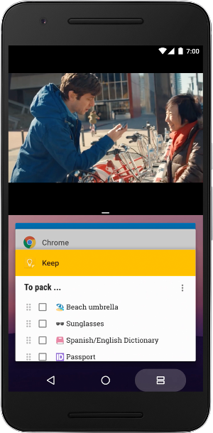

# 采取Android 7.0 Nougat的最后包装

原标题：Taking the final wrapper off of Android 7.0 Nougat  
链接：[https://android-developers.googleblog.com/2016/08/taking-final-wrapper-off-of-nougat.html](https://android-developers.googleblog.com/2016/08/taking-final-wrapper-off-of-nougat.html)  
作者：Dave Burke (工程副总裁)  
翻译：[arjinmc](https://github.com/arjinmc) 

如今，安卓7.0 Nougat将开始[推出](https://android.googleblog.com/2016/08/android-70-nougat-more-powerful-os-made.html)到用户，从Nexus设备。同时，我们正在将Android 7.0源代码推向Android开放源代码项目（AOSP），将这一新版Android的公共可用性扩展到更广泛的生态系统。

过去几个月来，我们一直在与你们一起工作，以获得你们对此版本的反馈，同时确保你们的应用程序已准备好供在Nougat设备上运行的用户使用。

## Nougat里面有什么

Android Nougat反映了来自世界各地的数千名粉丝和开发者的投入。Android Nougat中有250多个主要功能，包括[Android中的VR模式](https://developers.google.com/vr/?utm_campaign=android_launch_android7.0nougat_082216&utm_source=anddev&utm_medium=blog)。我们已经在Nougat的Android堆栈的各个层次上工作 - 从操作系统读取传感器数据到如何将像素发送到显示器 - 使其专门为提供高质量的移动VR体验而构建。

此外，Nougat带来了一些新功能，帮助使Android更强大，更高效，更安全。它引入了一个全新的[JIT / AOT编译器](https://developer.android.com/about/versions/nougat/android-7.0.html?utm_campaign=android_launch_android7.0nougat_082216&utm_source=anddev&utm_medium=blog#jit_aot?utm_source=anddev&utm_medium=blog)来提高软件性能，使应用程序安装更快，占用更少的存储空间。它还为[Vulkan](https://developer.android.com/ndk/guides/graphics/index.html?utm_campaign=android_launch_android7.0nougat_082216&utm_source=anddev&utm_medium=blog)增加了平台支持，Vulkan是一款低性能，跨平台的高性能3D图形API。[多窗口支持](http://developer.android.com/guide/topics/ui/multi-window.html?utm_source=anddev&utm_medium=blog)允许用户同时运行两个应用程序，[直接回复](http://developer.android.com/guide/topics/ui/notifiers/notifications.html?utm_campaign=android_launch_android7.0nougat_082216&utm_source=anddev&utm_medium=blog#direct?utm_source=anddev&utm_medium=blog)，以便用户可以直接回复通知，而无需打开应用程序。与往常一样，安卓系统采用强大的安全和加密层来保护你的私人数据，因此Nougat带来了基于文件的加密，无缝更新和[直接启动](https://developer.android.com/training/articles/direct-boot.html?utm_source=anddev&utm_medium=blog)等新功能。

你可以在这里找到所有的[Nougat开发者资源](https://developer.android.com/about/versions/nougat/index.html?utm_source=anddev&utm_medium=blog)，包括行为变化的细节以及你可以在应用程序中使用的新功能。一个什么样的新的开发者概述，请点击[这里](https://developer.android.com/about/versions/nougat/android-7.0.html?utm_source=anddev&utm_medium=blog)，你可以在[这里](https://www.android.com/versions/nougat-7-0/)探索Nougat的所有新用户的功能。

  
Android Nougat中的多窗口模式

## 下一波用户

从今天开始，在接下来的几周内，Nexus 6，Nexus 5X，Nexus 6P，Nexus 9，Nexus Player，Pixel C和通用移动4G（Android One）将通过无线软件升级到Android 7.0 Nougat。参加[Android Beta计划](https://www.google.com/android/beta)的设备也将收到此最终版本。

我们的运营Android Nougat的合作伙伴提供了许多设备，包括即将推出的[LG V20](http://www.lgnewsroom.com/2016/08/new-lg-v20-to-be-worlds-first-phone-to-launch-with-android-7-0-nougat/)，它将成为第一款与Android Nougat一起发布的新款智能手机。

随着所有这些新设备开始运行Nougat，现在是时候发布你的应用更新到Google Play。我们建议针对并理想地针对API 24进行编译。如果你仍在测试最后一分钟的更改，那么采用[Google Play的beta测试功能](https://developer.android.com/distribute/engage/beta.html?utm_campaign=android_launch_npreview_061516&utm_source=anddev&utm_medium=blog)来获取来自少数用户的早期反馈意见是一个很好的策略，包括使用Android 7.0牛轧糖 - 然后在你向所有用户发布更新的应用程序时进行分阶段发布。

## Nougat的下一个是什么？

我们将在接下来的几个季度内将Nougat转化为新的定期维护计划。事实上，我们已经开始了第一个Nougat维护版本的开发工作，这将带来持续的改进和打磨，并且我们计划在今年秋季将这个版本作为开发者预览。敬请关注！

我们将尽快结束针对Developer Preview构建的开放错误，但请保留反馈意见！如果你仍然看到你在预览跟踪器中[提交的问题(https://source.android.com/source/report-bugs.html)，请 在AOSP问题跟踪器中针对Android 7.0 提出新问题。

感谢你们参与我们今年早些时候分享的预览，目的是让所有人都有机会让Android的下一个版本变得更强大。你持续的反馈对于最终版本的形成是非常有益的，不仅仅针对用户，还针对整个Android生态系统。