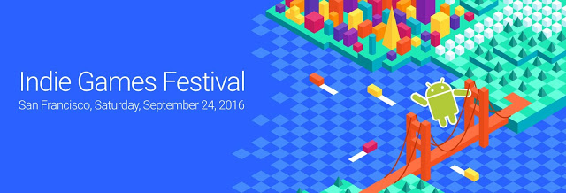

# 宣布9月24日在旧金山Google Play独立游戏节参展商开放注册参加

原标题：Announcing Open Registration and Exhibitors for Google Play Indie Games Festival in San Francisco, Sept. 24  
链接：[https://android-developers.googleblog.com/2016/08/announcing-open-registration-and-exhibitors-for-google-play-indie-games-festival-in-san-francisco.html](https://android-developers.googleblog.com/2016/08/announcing-open-registration-and-exhibitors-for-google-play-indie-games-festival-in-san-francisco.html)  
作者：Jamil Moledina (Google Play游戏战略主管)  
翻译：[arjinmc](https://github.com/arjinmc) 

为庆祝最新创新独立游戏的艺术，我们将于9月24日在旧金山举办首个北美[Google Play独立游戏节](https://events.withgoogle.com/google-play-indie-game-festival/)。在节日期间，Android的粉丝和玩家将有机会试玩来自美国和加拿大的一些最具创新的开发者的新的和未发行的独立游戏，以及投票给他们最喜欢的。

[注册](https://events.withgoogle.com/google-play-indie-game-festival/registrations/new/)现在开放，活动是免费的，供大家享用。

  

我们也很高兴地宣布选择参加展览和比赛的比赛。从200多个意见中，我们精心挑选了30个游戏，向参会者提供最有趣和最有吸引力的体验。粉丝将有机会玩各种独立游戏或尚未公开。

看看[这里](https://events.withgoogle.com/google-play-indie-game-festival/exhibiting-games/)和下面选择的游戏的完整列表。

* [A Matter of Murder](https://play.google.com/store/apps/details?id=com.WorthingAndMoncrieff.AMatterOfMurder&hl=en&e=-EnableAppDetailsPageRedesign)
* [Antihero](http://antihero-game.com/)(即将推出)
* [AR Zombie](http://alzubaralabs.com/mobile/)(即将推出)
* [Armajet](https://superbitmachine.com/armajet/)(即将推出)
* [Armor Blitz](https://play.google.com/store/apps/details?id=com.Gaudium.ArmoredBlitz&e=-EnableAppDetailsPageRedesign)(即将推出)
* [Bit Bit Blocks](http://www.bitbitblocks.com/)(即将推出)
* [1979 Revolution: Black Friday](http://inkstories.com/1979revolutiongame/#quotesandtrailer)(即将推出)
* [Coffee Pot Terrarium](http://www.brothersflint.com/)(即将推出)
* [Crayola® Worlds for Tango](https://www.youtube.com/watch?v=HMsjlJ387ek)(即将推出)
* [Dog Sled Saga](http://www.dogsledsaga.com/)(即将推出)
* [Endless Mine](https://play.google.com/store/apps/details?id=com.SkirmishEntertainment.EndlessMine&e=-EnableAppDetailsPageRedesign)
* [Futurable 1. Summer City](http://aibrain.com/products/futurable/)(即将推出)
* [Gunhouse](https://necrosoftgames.com/gunhouse/)(即将推出)
* [HoloGrid: Monster Battle](http://www.hologridmonsterbattle.com/)(即将推出)
* [Hovercraft: Takedown](https://play.google.com/store/apps/details?id=com.highscorehero.takedown&hl=en&e=-EnableAppDetailsPageRedesign)
* [HOVR](https://www.youtube.com/watch?v=Oc6ypM7YTgo)(即将推出)
* [Maruta 279](http://busansanai.com/)(即将推出)
* [Norman's Night In: The Cave](http://www.bactriangames.com/)(即将推出)
* [Numeris](https://play.google.com/store/apps/details?id=com.CrosProduct.numeris&e=-EnableAppDetailsPageRedesign)
* [Orbit - Playing with Gravity](https://play.google.com/store/apps/details?id=com.ChetanSurpur.Orbit&hl=en&e=-EnableAppDetailsPageRedesign)
* [Parallyzed](https://play.google.com/apps/testing/com.doublecoconut.parallyzed)
* [Psychic](http://psychic-game.com/)(即将推出)
* [Riptide GP: Renegade](https://play.google.com/store/apps/details?id=com.vectorunit.silver.googleplay&e=-EnableAppsDetailsPageRedesignLoggedOut)
* [Roofbot](https://play.google.com/apps/testing/com.doublecoconut.roofbot)
* [Sand Stories](https://192a547e04619b9aff459fce7ec301366dddc6fc.googledrive.com/host/0B51nfvXlU4BzZV9KQms1X01Ub00/index.html)(即将推出) 
* [SmashWars VR: Drone Racing](https://play.google.com/store/apps/details?id=com.faunaface.smashwars.cardboard&e=-EnableAppDetailsPageRedesign)
* [ThreeSwipes](https://play.google.com/store/apps/details?id=com.RobotoGames.threeswipes&e=-EnableAppDetailsPageRedesign)
* [Rainmaker: Ultimate Trading](https://play.google.com/store/apps/details?id=com.nostopsign.rainmaker&e=-EnableAppDetailsPageRedesign)
* [Zombie Rollerz](https://www.youtube.com/watch?v=fFWFdwkwisM&feature=youtu.be)(即将推出)

粉丝们还将有机会在节日期间为自己喜爱的游戏投票，以及来自Google Play和游戏行业的权威评委小组。他们包括：

独立基金联合创始人Ron Carmel; Goo世界的共同创造者
* Google Play业务开发经理Hyunse Chang
* Nix Hydra联合创始人兼首席执行官Lina Chen
* Spry Fox首席执行官David Edery
* Google Play印度合作伙伴经理Maria Essig
* Google首席游戏设计师Noah Falstein
* Funplus的首席战略官Dan Fiden
* Kongregate首席执行官Emily Greer
* Google的Daydream＆Project Tango制作人，节目经理Alex Lee
* Jordan Maron，Gamer和独立的YouTuber“CaptainSparklez”

我们也很高兴地宣布，资深的游戏设计师和教授Richard Lemarchand将成为这次活动的主持人。他曾担任Crystal Dynamics和Naughty Dog的首席设计师，现在是南加州大学电影艺术学院，互动媒体和游戏部副教授和助理教授。

获奖的开发者将获得诸如Google Cloud积分，NVIDIA SHIELD Android TV和K1平板电脑，Razer Forge电视包等奖项，以表彰他们的努力。

加入我们这个激动人心与其他游戏粉丝联系的机会，获得灵感，并庆祝独立游戏的艺术。在[活动网站](https://events.withgoogle.com/google-play-indie-game-festival/about/)上了解更多关于活动的信息。