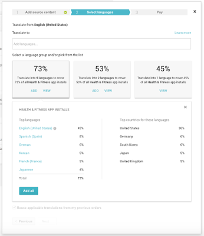

# 在Google Play上全球化你的应用

原标题：Expand Your Global Reach on Google Play With New Language and Country Analytics  
链接：[https://android-developers.googleblog.com/2016/08/expand-your-global-reach-on-google-play.html](https://android-developers.googleblog.com/2016/08/expand-your-global-reach-on-google-play.html)  
作者：Rahim Nathwani (翻译服务产品经理)  
翻译：[arjinmc](https://github.com/arjinmc) 

借助全球190个国家/地区的用户，Google Play为你的应用和游戏提供真正的全球受众。本地化是与不同地区人们联系最为有效的方式之一，因此我们在今年早些时候推出了应用程序内购买和通用应用程序广告系列的翻译支持。通过开发者控制台提供超过30种语言翻译选项，我们更新了我们的翻译服务，帮助你选择最相关的语言，使其快速而轻松地入门。

随着新语言和国家分析的推出，你可以访问Google Play上的应用安装分析，其中包括：

* 关于顶级语言和安装应用程序的国家/地区的信息，细分到你的应用程序类别的级别
* 来自这些语言的用户的安装的百分比
* 进一步的信息，以帮助通知这些国家的市场计划

  

为了让订购翻译更容易，我们只需单击一下即可显示可添加到订单中的语言包。

要开始使用，请从[Google Play开发者控制台](https://play.google.com/apps/publish/)的<strong>商品列表</strong>页面选择Manage translations -> Purchase translations。