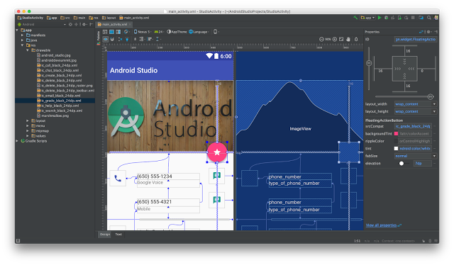
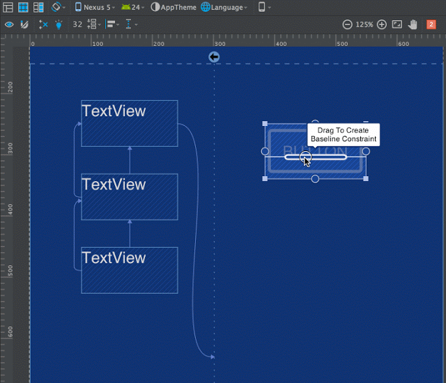
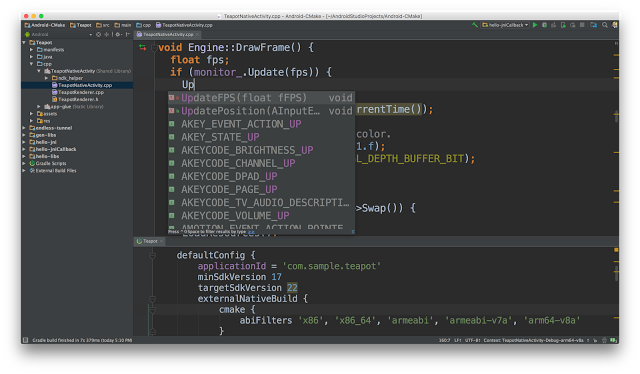
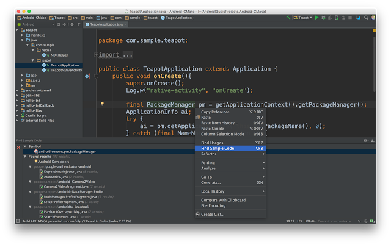
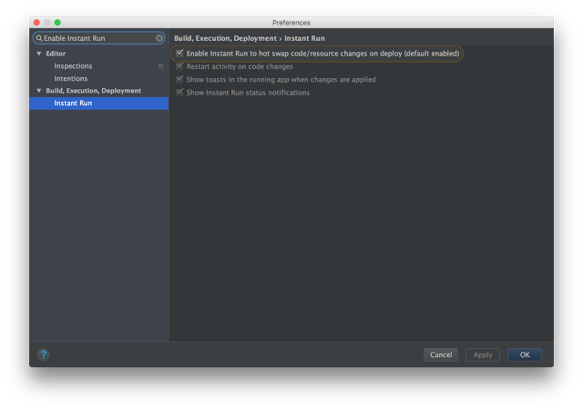
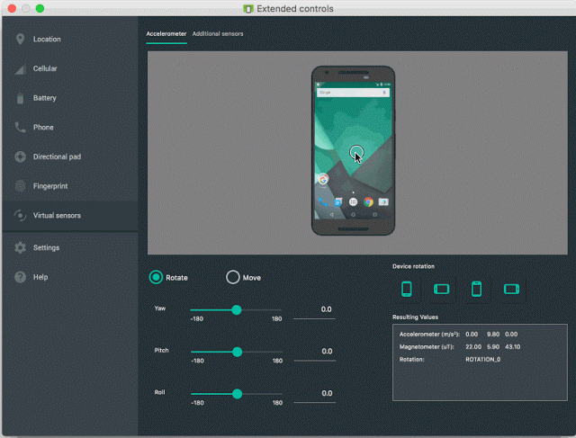
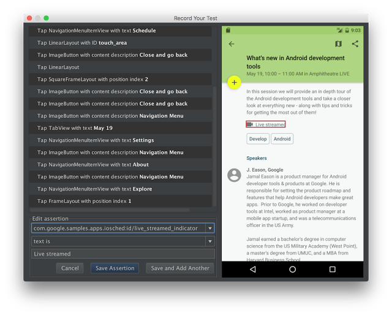
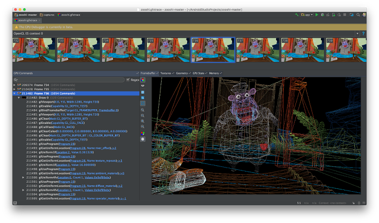

# Android Studio 2.2

原标题：Android Studio 2.2  
链接：[https://android-developers.googleblog.com/2016/09/android-studio-2-2.html](https://android-developers.googleblog.com/2016/09/android-studio-2-2.html)  
作者：[Jamal Eason](https://www.google.com/+JamalEason) （Android产品经理)  
翻译：[arjinmc](https://github.com/arjinmc)  

Android Studio 2.2可以在今天[下载](https://developer.android.com/studio/index.html?utm_campaign=android%20studio_launch_2.2_091916&utm_source=anddev&utm_medium=blog)。在Google I / O 2016预览版中，Android Studio 2.2是全球数百万Android开发人员使用的IDE的最新版本。

包装增强，这个版本有三个主要的主题：速度，智能和Android平台的支持。使用新的布局编辑器等功能进行更快速的开发，这使得快速直观地创建应用程序用户界面成为可能。使用我们新的APK分析器，增强的布局检查器，扩展的代码分析，IntelliJ's 2016.1.3功能以及更多功能进行更智能的开发。最后，作为Android应用程序开发的官方IDE，Android Studio 2.2包含对Android 7.0 Nougat中所有最新开发者功能的支持，如[代码对比](https://developer.android.com/studio/intro/index.html?utm_campaign=android%20studio_launch_2.2_091916&utm_source=anddev&utm_medium=blog#code_completion)，以帮助你添加Android平台功能，如[多窗口支持](https://developer.android.com/about/versions/nougat/android-7.0.html?utm_campaign=android%20studio_launch_2.2_091916&utm_source=anddev&utm_medium=blog#multi-window_support)，[快速设置API](https://developer.android.com/about/versions/nougat/android-7.0.html?utm_campaign=android%20studio_launch_2.2_091916&utm_source=anddev&utm_medium=blog#tile_api)或重新设计[通知](https://developer.android.com/about/versions/nougat/android-7.0.html?utm_campaign=android%20studio_launch_2.2_091916&utm_source=anddev&utm_medium=blog#notification_enhancements)，当然，内置的[Android模拟器](https://developer.android.com/studio/run/emulator.html?utm_campaign=android%20studio_launch_2.2_091916&utm_source=anddev&utm_medium=blog) 全部测试出来

在此版本中，我们将Android框架和IDE一起演变为创建Constraint Layout。这个功能强大的新布局管理器可以帮助你在平面和流线型层次结构中设计大而复杂的布局。该<i>ConstraintLayout</i>集成到你的应用程序就像一个标准的Android支持库，并建于新布局编辑器并行。

Android Studio 2.2在开发过程的每个主要阶段都包含20多个新功能：设计，开发，构建和测试。从设计新的用户界面ConstraintLayout到用Android NDK开发C ++代码，用最新的Jack编译器构建，为你的应用程序创建Espresso测试用例，Android Studio 2.2是你不想错过的更新。以下是一些主要亮点的更多细节：

## 设计

* <strong>布局编辑器</strong>：使用新的用户界面设计器可以更轻松地创建Android应用程序用户界面。使用新的蓝图模式快速构建应用程序UI的结构，并使用新的属性面板调整每个窗口小部件的可视化属性。[了解更多](https://developer.android.com/studio/write/layout-editor.html?utm_campaign=android%20studio_launch_2.2_091916&utm_source=anddev&utm_medium=blog)。

  
布局编辑器

* <strong>Constraint Layout</strong>： 这个新的布局是一个灵活的布局管理器为你的应用程序，允许你创建动态的用户界面，无需嵌套多个布局。它一直向后兼容Android API级别9（姜饼）。ConstraintLayout最适合Android Studio 2.2中的新布局编辑器。[了解更多](https://developer.android.com/training/constraint-layout/index.html?utm_campaign=android%20studio_launch_2.2_091916&utm_source=anddev&utm_medium=blog)。

  
ConstraintLayout

## 开发

* <strong>改进的C++支持</strong>：你现在可以使用[CMake或ndk-build](https://developer.android.com/studio/projects/add-native-code.html?utm_campaign=android%20studio_launch_2.2_091916&utm_source=anddev&utm_medium=blog)从Gradle编译你的C++项目。将项目从CMake构建系统移植到Android Studio现在是无缝的。你还可以在Android Studio的新项目向导中找到C++支持，以及对C++编辑和调试体验的一些错误修复。[了解更多](https://developer.android.com/studio/projects/add-native-code.html?utm_campaign=android%20studio_launch_2.2_091916&utm_source=anddev&utm_medium=blog)。

  
C++代码编辑和CMake支持

* <strong>示例浏览器</strong>： 使用Android Studio 2.2，引用[Android示例代码](http://developer.android.com/samples/index.html?utm_campaign=android%20studio_launch_2.2_091916&utm_source=anddev&utm_medium=blog)变得更加容易。在代码编辑器窗口中，在Google Android示例代码中查找你的应用程序代码，以帮助开始你的应用程序开发。[了解更多](https://developer.android.com/studio/intro/index.html#sample-code)。

  
示例代码菜单

## 构建

* <strong>即时运行改进</strong>：在Android Studio 2.0中引入的 即时运行是我们长期投入的主要内容，旨在使Android开发速度更快，更轻量。自发布以来，它已经显着改善了许多开发者的编辑，构建和运行迭代周期。在这个版本中，我们对即时运行进行了许多稳定性和可靠性的改进。如果你以前禁用了即时运行功能，我们鼓励你重新启用该功能，并让我们知道你是否遇到了更多问题。（Settings → Build, Execution, Deployment → Instant Run[Windows / Linux]，Preferences → Build, Execution, Deployment → Instant Run [OS X]）。有关我们所做的修复的详细信息，请参阅[Android Studio 2.2发布说明](https://developer.android.com/studio/releases/index.html?utm_campaign=android%20studio_launch_2.2_091916&utm_source=anddev&utm_medium=blog)。

  
启用即时运行

* <strong>APK分析器</strong>：轻松检查APK的内容，以了解每个组件的尺寸贡献。这个功能在调试[多重](https://developer.android.com/studio/build/multidex.html?utm_campaign=android%20studio_launch_2.2_091916&utm_source=anddev&utm_medium=blog)dex的问题时很有用。另外，通过APK分析器，你可以比较APK的两个版本。[了解更多](https://developer.android.com/studio/build/apk-analyzer.html?utm_campaign=android%20studio_launch_2.2_091916&utm_source=anddev&utm_medium=blog)。

  
APK分析器

* <strong>构建缓存（实验）</strong>：我们正在继续我们的投入，通过引入新的实验构建缓存来提高构建速度，这将有助于减少完整和增量构建时间。只需添加<i>android.enableBuildCache=true</i>到你的 gradle.properties文件。[了解更多](http://tools.android.com/tech-docs/build-cache)。

  
构建缓存设置

## 测试

* <strong>Android模拟器中的虚拟传感器</strong>： Android模拟器现在包含一组新的虚拟传感器控件。使用新的UI控件，你现在可以测试[Android传感器](https://developer.android.com/guide/topics/sensors/sensors_overview.html?utm_campaign=android%20studio_launch_2.2_091916&utm_source=anddev&utm_medium=blog)，如加速度计，环境温度，磁力计等等。[了解更多](https://developer.android.com/studio/run/emulator.html?utm_campaign=android%20studio_launch_2.2_091916&utm_source=anddev&utm_medium=blog#extended)。

  
Android模拟器虚拟传感器

* <strong>Espresso测试记录器（测试版）</strong>： Espresso测试记录器可让你轻松创建UI测试，方法是记录与你的应用程序的交互; 然后输出你的[UI测试代码](https://developer.android.com/topic/libraries/testing-support-library/index.html?utm_campaign=android%20studio_launch_2.2_091916&utm_source=anddev&utm_medium=blog#Espresso)。你记录你与设备的交互，并添加断言来验证你的应用的特定快照中的UI元素。Espresso测试记录器将记录下来并自动生成相应的UI测试。你可以在本地，持续集成服务器上或使用Android版Firebase测试实验室运行测试。了解更多。
* <strong>Espresso测试记录器（测试版）</strong>： Espresso测试记录器可让你轻松创建UI测试，方法是记录与你的应用程序的交互; 然后输出你的[UI测试代码](https://developer.android.com/topic/libraries/testing-support-library/index.html?utm_campaign=android%20studio_launch_2.2_091916&utm_source=anddev&utm_medium=blog#Espresso)。你记录你与设备的交互，并添加断言来验证你的应用的特定快照中的UI元素。Espresso测试记录器将记录下来并自动生成相应的UI测试。你可以在本地，持续集成服务器上或使用[Android版Firebase测试实验室](https://developer.android.com/training/testing/unit-testing/instrumented-unit-tests.html?utm_campaign=android%20studio_launch_2.2_091916&utm_source=anddev&utm_medium=blog#run-ctl)运行测试。[了解更多](https://developer.android.com/studio/test/espresso-test-recorder.html)。

  
Espresso测试记录器

* <strong>GPU调试器（测试版）</strong>： GPU调试器现在处于测试阶段。你现在可以在你的Android设备上捕获一系列OpenGL ES命令，然后从Android Studio中进行重放以进行分析。你还可以完全检查任何给定的OpenGL ES命令的GPU状态，以更好地理解和调试你的图形输出。[了解更多](https://developer.android.com/studio/debug/am-gpu-debugger.html?utm_campaign=android%20studio_launch_2.2_091916&utm_source=anddev&utm_medium=blog)。

  
GPU调试器

回顾一下，Android Studio 2.2包含以下主要功能：

### 设计
* [布局编辑器](https://developer.android.com/studio/write/layout-editor.html?utm_campaign=android%20studio_launch_2.2_091916&utm_source=anddev&utm_medium=blog)
* [Constraint Layout](https://developer.android.com/training/constraint-layout/index.html?utm_campaign=android%20studio_launch_2.2_091916&utm_source=anddev&utm_medium=blog)
* [布局检查器](http://tools.android.com/tech-docs/layout-inspector)（实验）
* [向量资源Studio中的PSD文件支持](https://developer.android.com/studio/write/vector-asset-studio.html?utm_campaign=android%20studio_launch_2.2_091916&utm_source=anddev&utm_medium=blog)

### 开发
* [Firebase插件](https://developer.android.com/studio/write/firebase.html)
* [更新了Code Analysis＆Lint检查](https://developer.android.com/studio/write/lint.html?utm_campaign=android%20studio_launch_2.2_091916&utm_source=anddev&utm_medium=blog)
* [增强辅助使用支持](https://developer.android.com/studio/intro/accessibility.html?utm_campaign=android%20studio_launch_2.2_091916&utm_source=anddev&utm_medium=blog)
* [改进的C++支持编辑和调试](https://developer.android.com/studio/debug/index.html?utm_campaign=android%20studio_launch_2.2_091916&utm_source=anddev&utm_medium=blog)
* [IntelliJ 2016.1.3平台更新](https://confluence.jetbrains.com/display/IDEADEV/IntelliJ+IDEA+2016.1.3+Release+Notes)
* [示例浏览器](https://developer.android.com/studio/intro/index.html#sample-code)
* 改进的字体呈现

### 构建
* [Jack编译器的改进](https://developer.android.com/guide/platform/j8-jack.html?utm_campaign=android%20studio_launch_2.2_091916&utm_source=anddev&utm_medium=blog#configuration)
* [Java 8语言支持](https://developer.android.com/guide/platform/j8-jack.html?utm_campaign=android%20studio_launch_2.2_091916&utm_source=anddev&utm_medium=blog)
* [C++ ndk-build或CMake](https://developer.android.com/studio/projects/add-native-code.html?utm_campaign=android%20studio_launch_2.2_091916&utm_source=anddev&utm_medium=blog)
* [合并的Manifest查看器](http://android-developers.blogspot.com/2016/05/android-studio-22-preview-new-ui.html)
* [构建缓存](http://tools.android.com/tech-docs/build-cache)（实验）
* OpenJDK支持
* 即时运行改进

### 测试
* [Espresso测试记录器](https://developer.android.com/studio/test/espresso-test-recorder.html?utm_campaign=android%20studio_launch_2.2_091916&utm_source=anddev&utm_medium=blog)（测试版）
* [APK分析器](https://developer.android.com/studio/build/apk-analyzer.html?utm_campaign=android%20studio_launch_2.2_091916&utm_source=anddev&utm_medium=blog)
* [GPU调试器](https://developer.android.com/studio/debug/am-gpu-debugger.html?utm_campaign=android%20studio_launch_2.2_091916&utm_source=anddev&utm_medium=blog)（测试版）
* [Android模拟器中的虚拟传感器](https://developer.android.com/studio/run/emulator.html?utm_campaign=android%20studio_launch_2.2_091916&utm_source=anddev&utm_medium=blog#extended)

了解有关Android Studio 2.2的更多信息，通过查看[发布说明](https://developer.android.com/studio/releases/index.html?utm_campaign=android%20studio_launch_2.2_091916&utm_source=anddev&utm_medium=blog)和[预览博客文章](http://android-developers.blogspot.com/2016/05/android-studio-22-preview-new-ui.html)。

## 入门

### 下载

如果你使用的是以前版本的Android Studio，则可以从导航菜单（Help → Check for Update [Windows / Linux]，Android Studio → Check for Updates[OS X]）来检查稳定频道上的更新。你也可以从官方[下载页面](https://developer.android.com/studio/index.html?utm_campaign=android%20studio_launch_2.2_091916&utm_source=anddev&utm_medium=blog)下载Android Studio 2.2 。要利用所有的新功能和Android Studio中的改进，你也应该更新Android Gradle插件版本2.2.0到当前的应用项目。

## 下一个版本

我们要感谢Android Developer社区的所有人，感谢你们在此版本中的工作。我们感谢你们的贡献，激发了此版本中新功能的持续反馈，以及你在canary和测试版本中积极使用的归档bug。我们都想让Android Studio 2.2成为我们最好的版本，除了许多新功能之外，还有许多稳定性和性能修正。对于我们的下一个版本，寻找更多; 我们要努力解决反馈问题，并不断提高现有功能的质量和稳定性，使你的工作效率更高。

我们感谢你所喜欢的任何反馈，你希望看到的问题或功能。请在我们的[Google+](https://plus.google.com/103342515830390186255)信息页或[Twitter](http://www.twitter.com/androidstudio)上与我们联系 - Android Studio开发小组。

[视频介绍](https://youtu.be/NbHsi3-uR8E)
Android Studio 2.2有什么新功能