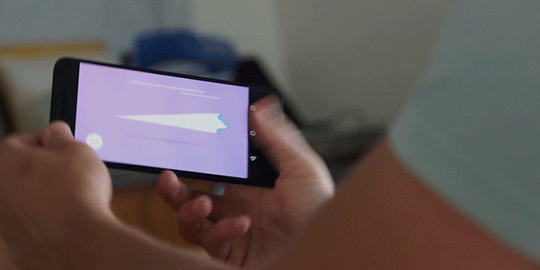

# 使用Android扩展Web技术

原标题：Extending Web Technology with Android  
链接：[https://android-developers.googleblog.com/2016/09/extending-web-technology-with-android.html](https://android-developers.googleblog.com/2016/09/extending-web-technology-with-android.html)  
作者：Active Theory （嘉宾：开发者)  
翻译：[arjinmc](https://github.com/arjinmc)  

纸飞机开始是一个简单的想法 - “如果你可以扔纸飞机从一个屏幕到另一个屏幕”？

我们这个概念的核心就是把世界各地的人们聚集在一起，利用网络的力量 - 彼此即时联系。现代网络技术，特别是JavaScript和WebGL，为每个屏幕上的体验提供动力。

[纸飞机](https://play.google.com/store/apps/details?id=net.activetheory.paperplanes)最初是在Google I / O 2016上展出的，在主题演讲前连接了30分钟的与会者和外部观众。为了在2016年国际和平日上的公开发布，我们创建了一项也在[Google Play](https://play.google.com/store/apps/details?id=net.activetheory.paperplanes)上推出的[Android实验](https://www.androidexperiments.com/experiment/paper-planes)，通过原生的Android Nougat功能来增强现有的网络技术，比如在世界其他地方捕捉到飞机的丰富通知。

## 介绍

用户创建和折叠自己的飞机，同时添加一个预先填充他们的位置的邮票。一个简单的投掷手势启动飞机进入虚拟世界。访问桌面网站的用户会看到他们的飞机飞入屏幕。

  

之后，用户可以查看并查看他们的飞机在世界各地的位置。飞机上的每张邮票都像护照一样，而3D地球则突出显示了飞行路线和行驶距离。

除了制造自己的飞机之外，用户还可以像手中的网一样将手机作为手势，以便抓住从别处抛出的飞机，捏住打开的飞机，揭示飞机到达的地点。然后，他们可以添加自己的邮票，并把它扔回飞机群。

## WebView

我们开发了纸飞机，使用最新的网络技术，从Google I / O的舞台上的50英尺屏幕到桌面和移动设备。

## WebGL

从程式化的低聚地球到植绒飞机，WebGL被用来渲染为体验提供动力的3D元素。我们编写了自定义的GLSL着色器来点亮地球和变形目标，以在用户捏合打开或关闭时为纸张设置动画。

  

## WebSockets

当一个用户“抛出”一个飞机时，一个消息通过websockets被发送到后端服务器，在那里它被中继到所有台式计算机，以显示飞机起飞。

  

## WebWorkers

使用WebWorkers跨多个线程计算平面植绒模拟，WebWorkers计算每个平面的位置，并将该信息传递回WebGL呈现的主线程。

  

为了创造跨平台的卓越体验，我们使用原生Android代码扩展了网络。这使我们能够利用Android中Chromium的深度集成，使用已经存在的网页代码创建应用程序的视图层，同时与操作系统进行更深层次的整合，例如丰富的通知和后台服务。

如果你有兴趣了解更多关于如何桥接WebView和Java代码的信息， 请参阅[本GitHub仓库作为教程](https://github.com/activetheory/Paper-Planes-Android-Experiment)。

## 通知

Firebase云消息传递（FCM）用于向Android应用发送推送通知。当用户的飞机被其他人抓住并投掷时，通过FCM向飞机创建者的设备发送一个显示有多少城市和里程已经旅行的通知。管理外发通知，以确保它们不会被频繁发送到设备。

## 后台服务

我们实施了一项后台服务，每天运行一次，根据本地存储进行检查，以确定用户上次访问该应用的时间。如果用户在两周内没有访问，应用程序会发送一个通知邀请用户重新进入应用程序以创建一个新的平面。

## 通信网络

我们的应用程序在Google云端平台上的服务器网络上运行。我们使用内置的地理编码标头来获取邮票的大致地理位置，并使用Socket.IO来通过WebSockets连接所有设备。

用户连接到离他们最近的服务器，这些服务器将消息中继到单个主服务器以及查看该区域体验的任何台式计算机。

## 向前进

这种方法对我们来说工作得非常好，使得跨平台和形式因素的平滑和迷人的体验，连接来自世界各地的人们。利用本地功能扩展网络已被证明是提供高质量体验的有效途径。你可以在[Android实验](https://www.androidexperiments.com/experiment/paper-planes)网站上了解更多信息。