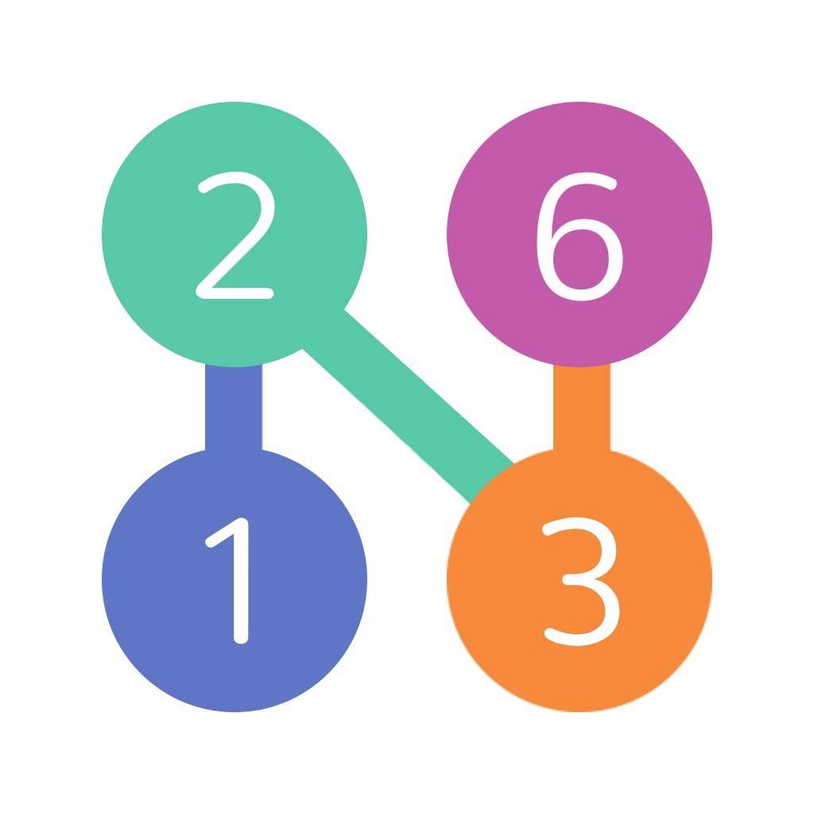
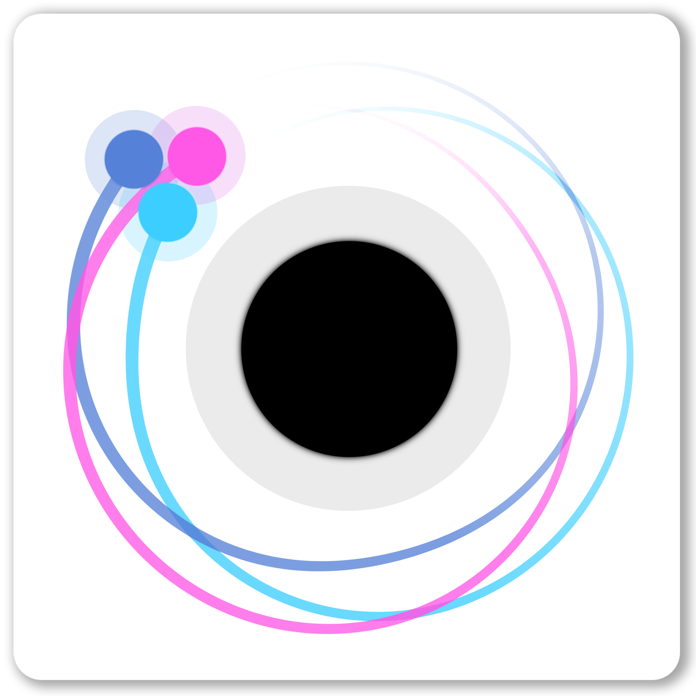
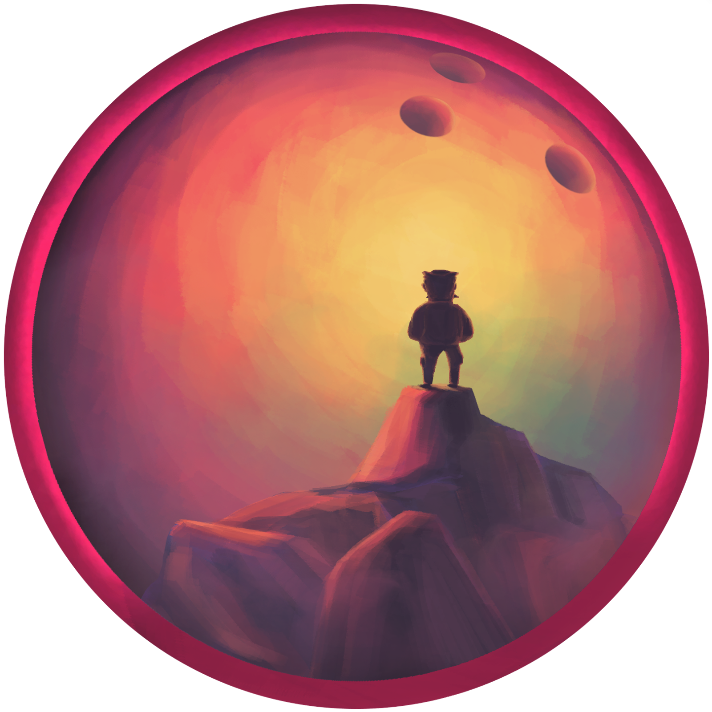
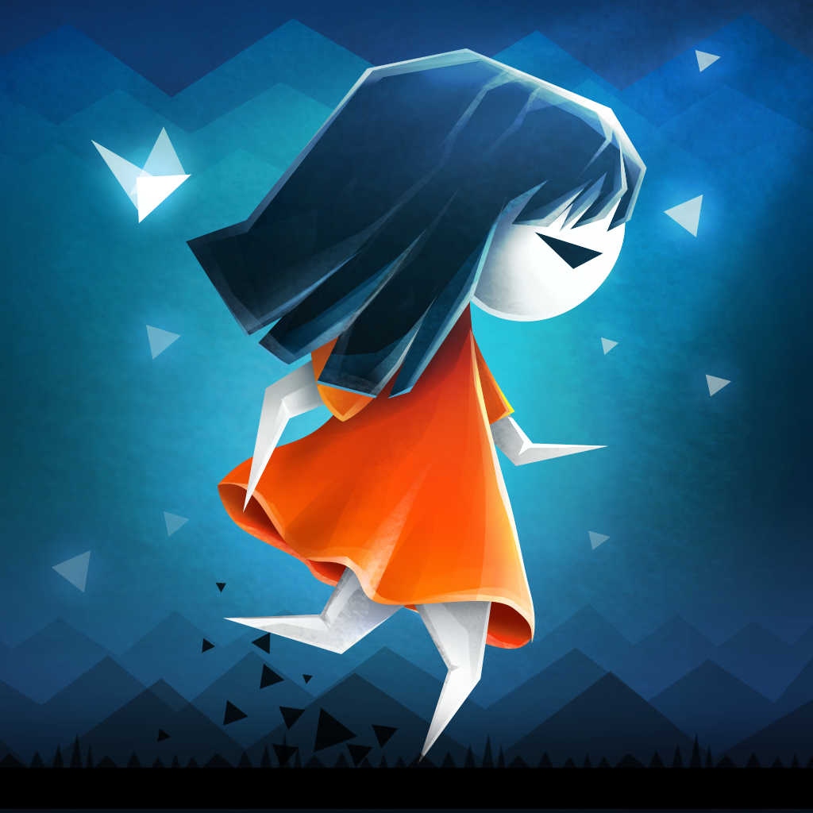
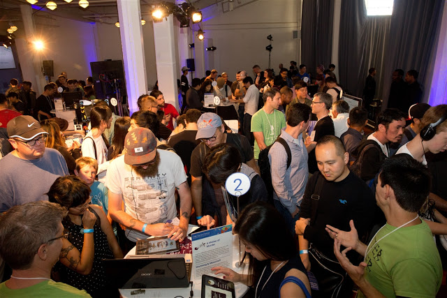

# 宣布在旧金山举办的Google Play独立游戏节的获奖者; 独立游戏比赛即将到来欧洲

原标题：Announcing the winners of the Google Play Indie Games Festival in San Francisco; Indie Games Contest coming soon to Europe  
链接：[https://android-developers.googleblog.com/2016/09/announcing-the-winners-of-the-google-play-indie-games-festival.html](https://android-developers.googleblog.com/2016/09/announcing-the-winners-of-the-google-play-indie-games-festival.html)  
作者：Jamil Moledina (Google Play游戏战略主管)  
翻译：[arjinmc](https://github.com/arjinmc)  

上周六，我们在北美举办了首个[Google Play独立游戏节](https://events.withgoogle.com/google-play-indie-game-festival/exhibiting-games/)，在那里我们展示了30个令人赞叹的游戏，庆祝激情，创新和独立艺术。在经过粉丝投票和现场演讲后，我们认可了七位入围者和三位获奖者。

  

## 获奖名单：

  
[bit bit blocks](https://play.google.com/store/apps/details?id=com.BitBitInteractive.BitBitBlocks&hl=en)  
由Greg Batha演示  
bit bit blocks是一个可爱的和动感十足的竞争益智游戏。在单个屏幕上与朋友一起玩，或在单人模式下挑战自己。头对头的益智随时随地玩。

 
[Numbo Jumbo](https://play.google.com/store/apps/details?id=com.numbo.jumbo&hl=en)  
由Kaveh Daryabeygi，Wombo Combo演示  
Numbo Jumbo是一款适用于iOS和Android的休闲手机益智游戏。玩家组号加起来：例如，[3，5，8]的作品，因为3 + 5 = 8。

  
[Orbit - Playing with Gravity](https://play.google.com/store/apps/details?id=com.ChetanSurpur.Orbit&hl=en)  
由Highkey Games的Chetan Surpur＆Eric Rahman演示  
ORBIT将重力模拟器放在益智游戏的核心。用手指轻推行星，并试图让它们绕着黑洞进入轨道。ORBIT还具有一个沙箱，你可以在其中创建自己的Universe，控制时间并使用重力进行绘制。

## 入围名单：

  
[Antihero](http://antihero-game.com/) [2016年晚些时候来临]  
由Tim Conkling演示  
Antihero是一个“快节奏的战略游戏（奥利弗）扭”。在一个燃着光的，腐败的城市中经营一个盗贼行会。招募海胆，雇佣暴徒，窃取一切 - 并贿赂，勒索，暗杀你的反对派。用于台式机，平板电脑和电话的单人和跨平台多人游戏。

  
[Armajet](https://superbitmachine.com/armajet/) [2016年晚些时候来临]  
超级位机,Nicola Geretti＆Alexander Krivicich演示  
Armajet是一款免费的多人射击游戏，可以在快节奏的喷气飞机战斗中互相攻击玩家。Armajet是针对平板电脑和智能手机的面向观众的竞争游戏而设计的一流的手机游戏。玩家在现代舞台射手竞争，这是容易学习，但很难掌握。

  
[Norman's Night In: The Cave](http://www.bactriangames.com/) [2016年晚些时候来临]   
Bactrian Games的Nick Iorfino＆Alex Reed演示  
Norman's Night是一个二维拼图游戏，讲述了诺曼的故事以及他命中落入洞穴世界的故事。在测试驾驶最新款3c Bowling Ball的同时，诺曼发现自己失去了除了他租借的一个篮球之外的东西，还有一种奇怪的感觉，那就是他应该在那里。

  
[Parallyzed](https://play.google.com/store/apps/details?id=com.doublecoconut.parallyzed&hl=en)
David Fox和Double Coconut演示
Parallyzed是一个独特的游戏大气冒险平台游戏，设置在一个黑暗和迷人的梦幻。你演奏了两个姐妹，他们被分成不同的维度。红与蓝有着不同的属性与才能，深层次的联系，随时有交换身体的能力。

决赛入围者提名者和获奖者还获得了一系列奖项，包括Google I / O 2017门票，探戈开发套件，Google Cloud信用卡，NVIDIA Android TV＆K1平板电脑和Razer Forge电视套餐。

## 独立游戏比赛来到欧洲

我们正在继续努力，帮助独立游戏开发者蓬勃发展，为全世界的粉丝们提供创新和有趣的游戏。今天，我们宣布了针对欧洲国家的开发者的独立游戏比赛（即将推出的具体国家名单！）。对于独立游戏开发者来说，这是一个很好的机会，可以帮助你向行业专家展示你的艺术作品，并拓展你的业务和全球玩家群体。[在这里注册](https://events.withgoogle.com/indie-games-contest-europe/)保证你不会过错过更新的细节。

正如我们在节日期间分享的一样，看看Google Play多年来如何演变，是非常值得的。现在我们每个月的用户数量已经超过了10亿，而且每个人都有自己的东西。从虚拟现实到家庭独立游戏，像你这样的开发者不断通过美丽的艺术游戏激发，激发和创新。

  
