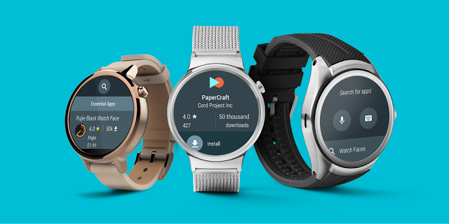
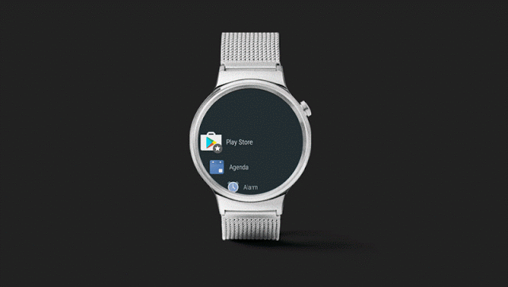
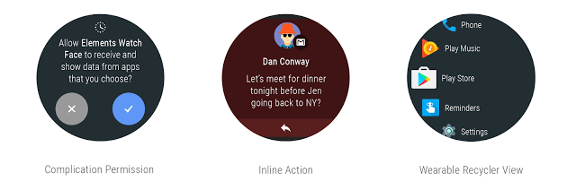
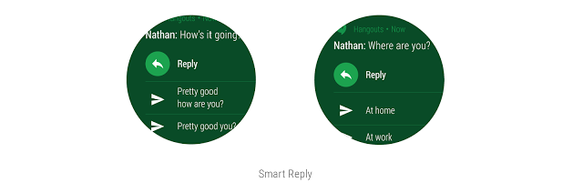

# Android Wear 2.0开发者预览版3：Play商店和更多

原标题：Android Wear 2.0 Developer Preview 3: Play Store and More  
链接：[https://android-developers.googleblog.com/2016/09/android-wear-2-0-developer-preview-3-play-store-and-more.html](https://android-developers.googleblog.com/2016/09/android-wear-2-0-developer-preview-3-play-store-and-more.html)  
作者：[Hoi Lam](https://twitter.com/hoitab) (开发者倡导者)  
翻译：[arjinmc](https://github.com/arjinmc)  

  

今天，我们推出了[Android Wear 2.0](https://g.co/wearpreview)的第三个开发人员预览版，并增加了一项新增功能：Android Wear上的Google Play。Play商店应用程序使用户可以直接在手表上查找和安装应用程序，帮助像你这样的开发者接触到更多的用户。

## Play商店功能

借助适用于Android Wear的Play商店，用户可以在主页视图中浏览推荐的应用程序，并使用语音，键盘，手写和推荐的查询搜索应用程序，以便他们可以更轻松地查找应用程序。用户可以在多个帐户之间切换，成为[Alpha和Beta测试](https://support.google.com/googleplay/android-developer/answer/3131213?hl=en)的一部分，并在手表的“我的应用程序”视图中更新或卸载应用程序，以便他们更轻松地管理应用程序。也许最酷的功能：如果用户想要在他们的手表上的应用程序，而不是他们的手机上，他们可以只安装手表应用程序。事实上，在Android Wear 2.0中，手机应用程序不再是必需的。你现在可以制作并发布仅限观看的应用，供用户在Google Play上被发现。

  

为什是在手表商店？

我们向像你这样的的开发者询问你最想从Android Wear中获得什么，并告诉我们你希望让用户更容易发现应用。因此，我们与用户一起研究，以找出他们的预期，并希望发现应用程序 - 他们一再寻找，并要求在手表本身发现应用程序的方式。随着手机和网络上应用程序发现的改进，手表上的Play商店可帮助用户在需要的地方找到应用程序。

## 发布你的应用程序

要使你的应用适用于Android Wear的Play商店，请[按照以下步骤操作](https://developer.android.com/wear/preview/features/app-distribution.html?utm_campaign=android_discussion_wearpreview_092916&utm_source=anddev&utm_medium=blog#publish)。你需要确保你的Android Wear 2.0应用将minSdkVersion设置为24或更高版本，使用[运行时权限模型](https://developer.android.com/training/articles/wear-permissions.html?utm_campaign=android_discussion_wearpreview_092916&utm_source=anddev&utm_medium=blog)，并使用Play开发者控制台通过多APK进行上传。如果你的应用支持Android Wear 1.0，那么[开发者指南](https://developer.android.com/wear/preview/features/standalone-apps.html?utm_campaign=android_discussion_wearpreview_092916&utm_source=anddev&utm_medium=blog)也涵盖了Gradle中产品风格的使用。

## 下载新的Android Wear相关应用程序

要设置开发者预览版3，你需要在手机上安装测试版Android Wear应用，将手表安装到最新的预览版，然后使用手机应用将Google帐户添加到手表。[下载和使用设备测试](https://developer.android.com/wear/preview/downloads.html?utm_campaign=android_discussion_wearpreview_092916&utm_source=anddev&utm_medium=blog)中详细介绍了这些步骤。如果你没有手表进行测试，也可以使用仿真器。

## 开发者预览版3中的其他补充

  

开发者预览版3还包括：

* <strong>并发改进</strong>：从开发者预览版3开始，在表盘可以接收复杂数据之前，表盘开发者将需要[请求RECEIVE_COMPLICATION_DATA许可](https://developer.android.com/wear/preview/features/complications.html?utm_campaign=android_discussion_wearpreview_092916&utm_source=anddev&utm_medium=blog#permissions-for-complication-data)。我们已经加入<i>ComplicationHelperActivity</i>，使这更容易。此外，表盘开发者现在可以[设置默认复杂功能](https://developer.android.com/wear/preview/features/complications.html?utm_campaign=android_discussion_wearpreview_092916&utm_source=anddev&utm_medium=blog#default-providers)，包括不需要特殊许可（例如电池电量和步数）的系统数据复杂度的选择，以及将表盘白名单的数据提供商。最后，有一些行为变化与<i>ComplicationData1</i>）帮助更好地区分[导致“空数据”的各种情况](https://developer.android.com/wear/preview/behavior-changes.html?utm_campaign=android_discussion_wearpreview_092916&utm_source=anddev&utm_medium=blog#empty)，2）,通过为[不支持的字段返回默认值](https://developer.android.com/wear/preview/behavior-changes.html?utm_campaign=android_discussion_wearpreview_092916&utm_source=anddev&utm_medium=blog#invalid-fields)来简化开发 通过并发类型而不是抛出运行时异常。
* <strong>新的[WearableRecyclerView](https://developer.android.com/wear/preview/features/wearable-recycler-view.html?utm_campaign=android_discussion_wearpreview_092916&utm_source=anddev&utm_medium=blog)</strong>： 这个新的UI组件可以帮助开发者显示和处理垂直的项目列表，同时优化圆形显示。
* <strong>[内联通知行动](https://developer.android.com/wear/preview/features/notifications.html?utm_campaign=android_discussion_wearpreview_092916&utm_source=anddev&utm_medium=blog#inline)</strong>：新的API可以轻松地从流中对通知进行操作。开发人员可以通过调用[setHintDisplayActionInline](https://developer.android.com/reference/android/support/v4/app/NotificationCompat.Action.WearableExtender.html#setHintDisplayActionInline(boolean))以下内容来指定在通知底部内联显示哪些操作：

```code
NotificationCompat.Action replyAction =
    new NotificationCompat.Action.Builder(R.drawable.ic_message_white_24dp,
            "Reply", replyPendingIntent)
            .addRemoteInput(remoteInput)
            .extend(new NotificationCompat.Action.WearableExtender()
                    .setHintDisplayActionInline(true))
            .build(); 
```
             
* <strong>[智能回复](https://developer.android.com/wear/preview/features/notifications.html?utm_campaign=android_discussion_wearpreview_092916&utm_source=anddev&utm_medium=blog#messaging)</strong>： Android Wear现在会为[MessagingStyle](https://developer.android.com/reference/android/support/v4/app/NotificationCompat.MessagingStyle.html?utm_campaign=android_discussion_wearpreview_092916&utm_source=anddev&utm_medium=blog)通知生成智能回复回复 。智能回复响应由完全在机器学习模型使用<i>MessagingStyle</i>通知提供的上下文 生成，并且没有数据被上传到云以生成响应。
* <strong>还有更多</strong>：请阅读Android Wear开发人员预览版本[说明](https://developer.android.com/wear/preview/support.html?utm_campaign=android_discussion_wearpreview_092916&utm_source=anddev&utm_medium=blog#dp3)中有关更改的完整列表。

  

## 时间线
我们从开发者社区获得了大量关于Android Wear 2.0的大量反馈，谢谢！我们决定在2017年初继续预览计划，届时第一批手表将获得Android Wear 2.0。请通过[提交bug](https://g.co/wearpreviewbug)或在我们的[Android Wear开发者](https://plus.google.com/communities/113381227473021565406)社区发帖来保留反馈，敬请关注Android Wear开发者预览版4。