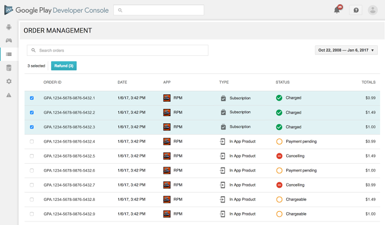

# 从Google Play开发者控制台管理付费订单和付款设置

原标题：Manage paid orders and payments settings from the Google Play Developer Console  
链接：[https://android-developers.googleblog.com/2017/01/manage-paid-orders-and-payments.html](https://android-developers.googleblog.com/2017/01/manage-paid-orders-and-payments.html)  
作者：Suzanne van Tienen (Google Play产品经理)  
翻译：[arjinmc](https://github.com/arjinmc)  

今天，我们正在根据我们从社区听到的反馈，为已经付费应用，应用内购买或订阅的开发者简化和改善商家体验。

首先，我们正在将订单管理从Google Payments Center转移到Google Play开发者控制台，并添加了一些改进的功能。其次，付款设置现在可以从开发者控制台访问，并继续在payments.google.com上可用。新功能具有适当的访问控制设置，因此您可以确保用户只能访问所需的工具。

  
Google Play开发者控制台中的新订单管理标签  

你可以在以前在Google Payments Center中进行的开发者控制台中执行相同的任务。我们也做了一些改进：

* <strong>批量退款</strong>：你现在可以选择多个订单同时退款，而不是单独发放。
* <strong>订阅取消</strong>：你现在可以直接从订单管理标签中退订和撤销订阅（不需要单独的用户界面）。
* <strong>权限</strong>：我们已经向开发者控制台添加了一个名为“管理订单”的新用户访问权限。此权限将允许用户查找订单，发出退款并取消订阅。这些用户的其他功能将是只读的，财务报告将被隐藏（只有具有“查看财务报告”的用户可以查看财务数据）。从开发者控制台访问时，付款设置仅限于帐户所有者。

## 订单管理迁移到开发者控制台 

[订单管理](https://play.google.com/apps/publish/#OrderManagementPlace)现在可以在开发者控制台中使用。从1月23日起，订单管理将停止在付款中心。用户权限不会从付款中心自动结转，所以作为帐户所有者，你需要将所有需要访问退款的用户和任何其他订单管理功能添加到开发者控制台帐户，并通过新的“管理订单”权限1月22日他们继续进入。 

你可以在开发者控制台帐户中添加新用户的方法如下：

1. 登录[Google Payments Center](https://payments.google.com/)并查看所有现有用户。
2. [登录你的开发者控制台](https://play.google.com/apps/publish)，并为开发人员控制台中需要访问订单管理的所有用户添加以下一项或两项权限。

    1. 查看财务报告：获得访问和查看财务报告的权利。
    2. 管理订单：提供查看和退款订单的权利，但不查看总计财务统计信息或下载销售和付款报告。
3. 让用户了解[订单管理](https://play.google.com/apps/publish/#OrderManagementPlace)的新位置。
