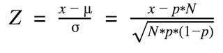
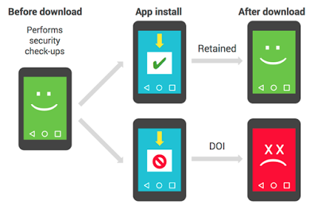

# 发现恶意软件时，沉默比雄辩更权威

原标题：Silence speaks louder than words when finding malware  
链接：[https://android-developers.googleblog.com/2017/01/findingmalware.html](https://android-developers.googleblog.com/2017/01/findingmalware.html)  
作者：Megan Ruthven (软件工程师)  
翻译：[arjinmc](https://github.com/arjinmc)  

<strong>在Android安全性方面，我们不断致力于更好地了解如何使Android设备更加顺畅，安全地运行。Google Play所有设备上包含的一种安全解决方案是[验证应用](https://support.google.com/accounts/answer/2812853?hl=en)。验证应用程序检查你的设备上是否存在潜在有害应用程序（PHAs）。如果找到PHA，验证应用程序会向用户发出警告并使其能够卸载该应用程序。</strong>

但是，有时，设备会使用Verify应用程序停止检查。这可能是因为非安全相关的原因，如购买新的手机，或者这可能意味着更多的事情正在进行。当设备停止检查与验证应用程序，它被认为是死或不安全（DOI）。一个具有足够高的DOI设备下载量的应用程序被认为是DOI应用程序。我们使用DOI指标以及其他安全系统来帮助确定应用程序是否是PHA来保护Android用户。另外，当我们发现漏洞时，我们使用我们的[安全更新系统](https://source.android.com/security/bulletin/)来修补Android设备。

这篇博客文章探讨了Android Security团队的研究，以确定设备停止工作并防止将来发生的安全相关原因。

## 举报DOI应用程式
<strong>为了更深入地了解此问题，Android Security团队将应用安装尝试和DOI设备相关联，以找到危害设备的应用程序，以保护用户。</strong>

考虑到这些因素，我们将重点放在“保留”上。如果在应用程序下载后继续执行定期验证应用程序安全检查，则设备被视为保留。如果没有，它被认为是潜在的死亡或不安全（DOI）。应用的保留率是在一天内下载该应用的所有保留设备的百分比。由于保留是设备健康的重要指标，我们致力于最大限度地提高生态系统的保留率。

因此，我们使用一个应用程序DOI评分起，它假定所有应用程序都应具有类似的设备保留率。如果应用程序的保留率是低于平均水平的几个标准差，则DOI评分器将其标记。计算平均值的标准偏差数量的常用方法称为Z分数。Z分数的方程如下。

* N =下载应用程序的设备数量
* x =下载应用程序的保留设备数量。
* p =下载任何应用程序的设备的概率将被保留。

  

在这种情况下，我们将应用程序的保留率的Z分数称为DOI分数。DOI评分器表明，如果Z得分远小于-3.7，则应用程序具有统计学上显着的较低保留率。这意味着如果零假设是真实的，那么Z分数的大小几乎不到0.01％的几率。在这种情况下，零假设意味着应用程序与较低的保留率意外相关，与应用程序的功能无关。

<strong>这允许极端应用程序（保留率低，下载量大）渗透到DOI列表的顶部。从那里，我们将DOI分数与其他信息相结合，以确定是否将该应用程序分类为PHA。然后，我们使用Verification应用程序删除现有的应用程序安装，并阻止将来安装该应用程序。</strong>

常规和DOI应用程序在同一设备上下载的区别。  
  
 
## 在野外的结果

<strong>其中，DOI评分标记了三个知名的恶意软件家族中的许多应用程序 - [Hummingbad](http://blog.checkpoint.com/2016/07/01/from-hummingbad-to-worse-new-in-depth-details-and-analysis-of-the-hummingbad-andriod-malware-campaign/)，[Ghost Push](http://venturebeat.com/2015/09/18/cheetah-mobile-ghost-push-android-virus-infects-600k-users-a-day-with-unwanted-apps/)和[Gooligan](http://blog.checkpoint.com/2016/11/30/1-million-google-accounts-breached-gooligan/)。尽管它们的行为方式不一样，但是由于DOI评分器可以将Android体验降级到不可忽略的用户数量的重新设置或放弃设备的程度，所以这三个恶意软件系列中的DOI评分器标记了超过25,000个应用。这种方法为我们提供了另一种观察方式来发现PHA，并在他们受欢迎之前阻止它们。没有DOI评分器，许多这些应用程序将免除对手动审查的额外审查。</strong>

DOI评分器和所有Android的反恶意软件工作是保护Android用户和开发者的多层次之一。有关Android的安全性和透明度工作的概述，请查看[我们的页面](https://www.android.com/security/overview/)。