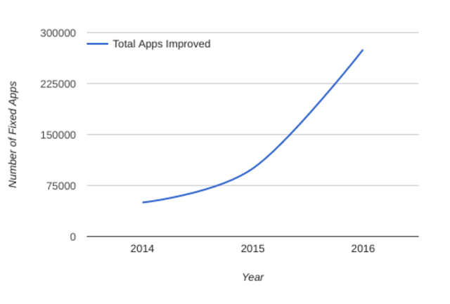

# 应用程序安全性改进：回顾2016年

原标题：App Security Improvements: Looking back at 2016  
链接：[https://android-developers.googleblog.com/2017/01/app-security-improvements-looking-back.html](https://android-developers.googleblog.com/2017/01/app-security-improvements-looking-back.html)  
作者：Rahul Mishra （Android安全项目经理）  
翻译：[arjinmc](https://github.com/arjinmc)  

2016年4月，Android Security团队介绍了Google Play应用安全改进（ASI）计划如何帮助开发者[解决了100,000个应用程序中的安全问题](http://android-developers.blogspot.com/2016/04/enhancing-app-security-on-google-play.html)。此后，我们已经发现并通知了开发者11个新的安全问题，并为开发人员提供了更新应用程序的资源和指导。因此，超过9万个开发人员已经更新了超过275,000个应用程序！

  

ASI现在通知开发人员26个潜在的安全问题。为了使此过程更加透明，我们引入了[一个新页面](https://developer.android.com/google/play/asi.html)，开发者可以在这里找到有关所有这些安全问题的信息。此页面包含帮助中心，说明和其他支持联系人的文章的链接。开发者可以使用此页面作为资源来了解新问题并跟踪所有过去的问题。

确保查看我们的新[安全Android开发者](https://developer.android.com/topic/security/index.html)页面，其中突出了最新的安全文章，[安全最佳实践文档](https://developer.android.com/training/best-security.html)和[安全性检查表](https://developer.android.com/distribute/essentials/quality/core.html#sc)。这些资源都旨在提高您对一般安全性概念的理解，并提供可帮助你解决应用特定问题的示例。

## 如何帮助：
有关反馈或问题，请通过[Google Play开发者帮助中心](https://support.google.com/googleplay/android-developer/contact/publishing)与我们联系。
要报告应用程序中的潜在安全问题，请发送电子邮件至[security+asi@android.com](http://security+asi@android.com/)。