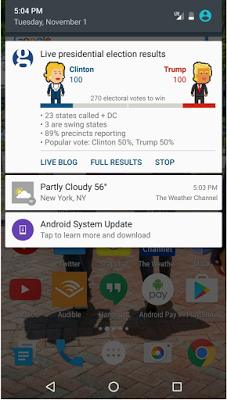

# 在重大活动期间吸引用户：Guardian如何使用创新通知

原标题：Engaging users during major events: How The Guardian used innovative notifications  
链接：[https://android-developers.googleblog.com/2017/01/engaging-users-during-major-events-how.html](https://android-developers.googleblog.com/2017/01/engaging-users-during-major-events-how.html)  
作者：Tamzin Taylor (Google Play合作伙伴开发)  
翻译：[arjinmc](https://github.com/arjinmc)  

主要的体育，文化，政治活动提供了一个重新吸引用户的机会，如果你能找到一种相关而独特的方式来为他们提供信息。例如，在最近的美国大选期间，通过在Android 7.0 Nougat中使用新的通知功能，“[The Guardian](https://play.google.com/store/apps/details?id=com.guardian)（卫报）”能够大大增加其移动应用的用户参与度。虽然通知本身并不新鲜，但Guardian使用创新技术和设计元素，为用户提供了关于选举结果的丰富实时更新。

## Guardian如何通过通知创新
选择加入的用户在选举晚上获得了一个持续更新的锁定屏幕上通知的用户。通知使用候选人的头像和进度条将信息带入生活。

  

该通知显示了最新的选举选票数量和状态，并表明了哪些秋千国家被称为，以及两位主要候选人之间的民众选票的崩溃。

“有能力在屏幕上不断更新通知，使我们能够在整个选举夜间让我们的用户参与”。- 来自The Guardian的Rob Phillips

另一个重要的特点是可以通过链接到详细信息和分析来通知用户主要更新。为了做到这一点，Guardian允许新闻编辑部队推出重大事件的通知，例如通过了270票。

“我们的编辑部可以让我们的读者在实时知道什么时候出现了一个严重的里程碑，我们能够当晚的过程中，提供101个独特的通知。清晰的菜单选项担任主要驱动我们的新闻作为新闻的展开，这意味着我们的读者可以让我们的读者与我们的内容相关，当他们是最容易接受的”。- 来自The Guardian的Rob Phillips

## 结果和后续步骤
参与结果令人印象深刻：

* 170K的用户注册了警报，122K用户与警报进行交互
* 平均互动次数约为620K，或每用户5.1
* 看到通知的74％的用户正在浏览主要的实时博客
* 看到通知的25％的用户通过了我们的全部结果内容

最后，也许最令人印象深刻的统计数字是，通过宣传活动更新（通过通知）导致了选举周内每日安装量增加了103％。

“通过为用户提供快速轻松检查信息的能力，突出重点，引导人们到何处找到更多信息，我们可以为读者提供价值，帮助他们随时随地了解事件。毕竟，这就是我们作为新闻公司做的事情，我们很高兴 Android N的新功能让我们这样做“- 来自The Guardian的Rob Phillips

在使用[Android N功能实时通知](http://android-developers.blogspot.com/2016/06/notifications-in-android-n.html)的成功背后，The Guardian计划使用体育内容测试相同的方法，并探索如何更广泛地应用于其他重大活动，如奥斯卡和超级大碗。
