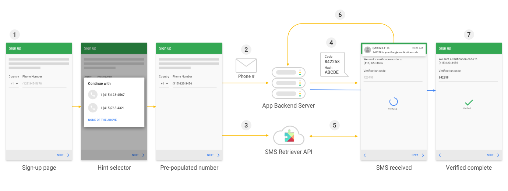
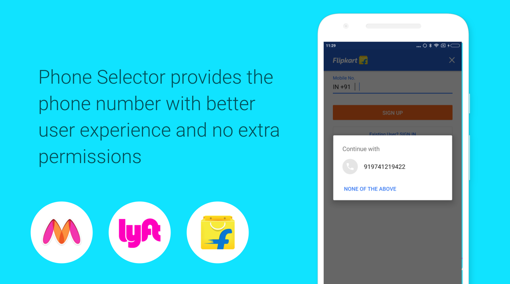
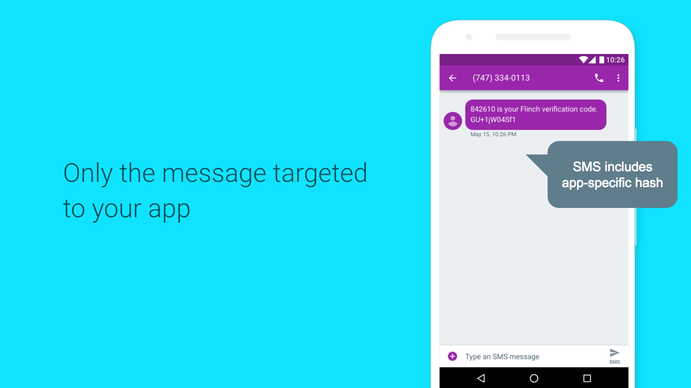

# 有效的电话号码验证

原标题：Effective phone number verification  
链接：[https://android-developers.googleblog.com/2017/10/effective-phone-number-verification.html](https://android-developers.googleblog.com/2017/10/effective-phone-number-verification.html)  
作者：Steven Soneff (身份产品经理)  
翻译：[arjinmc](https://github.com/arjinmc)  

要构建使用电话号码的应用程序，通常至关重要的是验证用户是否拥有一个号码。从UX的角度来说，这样做可能很棘手，尤其是在了解不同区域设置中的电话号码格式时，还要提供一种不麻烦或使用侵入式设备权限的验证机制，例如阅读用户的所有短信。

有许多库可以高效地预先构建手机验证，例如[Firebase Phone Auth(Firebase手机认证)](https://firebase.google.com/docs/auth/)，但如果你是高级开发者，并且需要自行构建此功能，Google Play Services有两个新的API可帮助你获取用户的电话号码并进行验证它通过短信无设备权限：<strong>电话选择器</strong>和<strong>短信检索</strong>。像[Flipkart](https://play.google.com/store/apps/details?id=com.flipkart.android)这样的应用程序在使用这些方法的电话号码注册流程中成功率提高了12％。

在这里看到在你的服务器使用这些服务的[步骤](https://developers.google.com/identity/sms-retriever/overview)：

   

在这篇文章中，我们将展示你需要为用户提供电话号码选择器的代码，然后使用SMS Retriever API从服务器请求验证码，Android设备将自动接收并解析从用户输入。

<strong>注意</strong>：开始之前，你需要构建并测试这是一个具有可接收短信和运行Google Play服务10.2.x及更高版本的电话号码的设备。

## 使用电话选择器获取号码

第一步是让用户从你的应用程序中启动短信验证。你的应用程序可能会提示用户输入电话号码，你可以使用电话选择器使其更容易，使用以下代码：

```java
// Construct a request for phone numbers and show the picker
private void requestHint() {
    HintRequest hintRequest = new HintRequest.Builder()
           .setPhoneNumberIdentifierSupported(true)
           .build();

    PendingIntent intent = Auth.CredentialsApi.getHintPickerIntent(
            apiClient, hintRequest);
    startIntentSenderForResult(intent.getIntentSender(),
            RESOLVE_HINT, null, 0, 0, 0);
}
```

HintRequest构建器告诉Play Services需要一个电话号码标识符。然后，它用于创建和启动一个intent，这将向用户显示Play Service对话框，允许用户选择要与应用分享的电话号码。此API不需要任何权限，并显示手机或Google帐户可用于用户选择的号码。

   

当用户选择电话号码时，将以运行最新版本的Play Services的设备以[E164格式](https://en.wikipedia.org/wiki/E.164)在onActivityResult返回应用程序。请注意，在某些情况下，根据你的手机，你可能无法获得电话号码，因此请务必检查凭证是否为非空值。如果你没有号码，则需要为用户提供一种手动输入的方式。

```java
// Obtain the phone number from the result
@Override
public void onActivityResult(int requestCode, int resultCode, Intent data) {
  super.onActivityResult(requestCode, resultCode, data);
  if (requestCode == RESOLVE_HINT) {
      if (resultCode == RESULT_OK) {
          Credential credential = data.getParcelableExtra(Credential.EXTRA_KEY);
          // credential.getId(); <-- E.164 format phone number on 10.2.+ devices
      }
  }
}
```
  
此时你将有一个电话号码字符串给你的用户。虽然这很有用，但你可能想要验证用户是否拥有此特定号码，例如允许他们与其他用户发送或检索邮件，或者使用此号码标识他们自己。

## 使用SMS验证API验证号码

验证电话号码所有权的一种简单方法是通过向该号码发送短信，其中包含一次性验证码，并将其输入到你的应用中。SMS验证API使你能够让应用程序侦听一个可以自动解析代码的传入短信。

要开始使用，你的应用使用<i>SmsRetrieverClient</i>像以下代码： 

```java
SmsRetrieverClient client = SmsRetriever.getClient(this /* context */);

Task<Void> task = client.startSmsRetriever();

task.addOnSuccessListener(new OnSuccessListener<Void>() {
  @Override
  public void onSuccess(Void aVoid) {
    // successfully started an SMS Retriever for one SMS message
  }
});

task.addOnFailureListener(new OnFailureListener() {
  @Override
  public void onFailure(@NonNull Exception e) {
  });
);
``` 
  
这很简单 - 你得到一个SMS Retriever客户端，然后为它开始一个任务。任务有一个成功监听器以及一个失败的覆盖。启动SMS Retriever后，你可以将用户的电话号码发送到服务器，并启动生成消息并将其发送到该号码的工作流程。

该消息需要以特定的方式构建。消息必须符合SMS消息，因此不能超过140个字节。它需要从一个特定的前缀开始：'<＃>'或两个连续的零宽度空格字符（U + 200B）。有关 详细信息，请参阅[文档](https://developers.google.com/identity/sms-retriever/verify)。它必须以标识你的应用的11个字符的哈希结尾，如下所述。

例：

```code
<#> Use 123456 as your verification code in Example App!

FA+9qCX9VSu
```

   

一次验证码可以是任何字符串：你可以简单地生成一个随机数。消息需要以根据[这里](https://developers.google.com/identity/sms-retriever/verify#computing_your_apps_hash_string)的过程确定的哈希结束。Google Play服务将使用此散列来确定验证消息的应用程序。你只需要为你的应用程序包和签名证书生成一次哈希值：它不会更改，不应由客户端应用程序提供。

然后，你的服务器可以使用现有的SMS基础架构或服务将消息发送到手机。收到此邮件后，Google Play服务会广播包含邮件文字的intent。以下是代码：

```java
public class MySMSBroadcastReceiver extends BroadcastReceiver {

  @Override
  public void onReceive(Context context, Intent intent) {
    if (SmsRetriever.SMS_RETRIEVED_ACTION.equals(intent.getAction())) {
      Bundle extras = intent.getExtras();
      Status status = (Status) extras.get(SmsRetriever.EXTRA_STATUS);

      switch(status.getStatusCode()) {
        case CommonStatusCodes.SUCCESS:
          String message = (String) extras.get(SmsRetriever.EXTRA_SMS_MESSAGE);
          break;
        case CommonStatusCodes.TIMEOUT:
          break;
      }
    }
  }
}
```
  
在广播接者的onReceive中，你可以获得附加功能，并从中拉出状态。如果状态指示消息已成功接收，则可以从附加信息中拉出消息。从这里你可以解析验证码并将其发送回服务器以确认电话号码所有权。

有关更多信息，请查看完整的[文档](https://developers.google.com/identity/sms-retriever/)和今年的[Google I / O会谈](https://www.youtube.com/watch?v=MUULwaxqFLI)。

## 早期使用者的评价

我们早期使用此API的合作伙伴喜欢它。以下是他们的一些评价：

[Twilio](https://www.twilio.com/blog/2017/05/twilio-verification-sdk-android-app-sms-permissions-phone-verification-has-never-been-easier.html)观察并发现Android SMS验证从未如此简单。

“如果你是开发者使用手机号码注册和识别用户帐户，那么你应该使用Android的Twilio验证SDK，以最快的方式解决提供顺利，安全和轻松的登录流程的问题“。 - <i>Twilio的产品负责人Simon Thorpe</i>

[Authy](https://authy.com/blog/authy-for-android-app-is-now-easier-to-use-and-safer-too/)喜欢这些API可以与现有的SMS基础设施协同工作，而不需要进行许多更改。

“将电话选择器+短信检索器添加到Authy 2FA应用程序中为用户提供了神奇的UX，同时保留了我们的应用程序所需的高安全性。 - Authy工程部主管Serge Kruppa

[Telesign](https://www.telesign.com/blog/post/telesign-app-verify-now-offers-autosms-mode-with-even-lower-friction-during-android-user-verification/)通过相同的后端框架观察到更好的UX，更高的安全性和更高的转换率。

“这种具有较低摩擦力的验证模式的一个显着优点是，客户可能会看到用户注册和注册情况下的转化率提高。

增强的安全性也是一个好处，因为Google Play服务只能根据消息内的应用程序散列，向目标应用程序提供对SMS消息的访问。“ - Priyesh Jain（作者）


