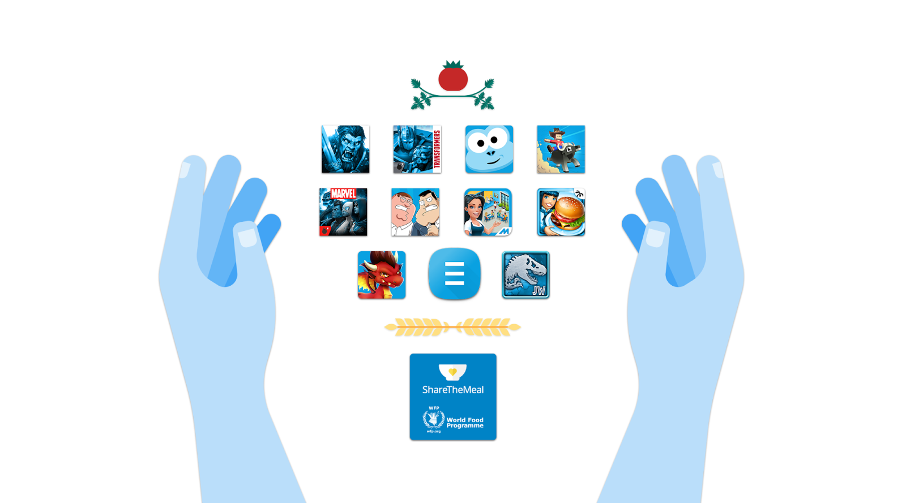

# 在Google Play上用你最喜欢的应用和游戏抗战全球的饥饿

原标题：Fight global hunger with your favorite apps and games on Google Play  
链接：[https://android-developers.googleblog.com/2017/10/fight-global-hunger-with-your-favorite.html](https://android-developers.googleblog.com/2017/10/fight-global-hunger-with-your-favorite.html)  
作者：Maxim Mai (Google Play合作伙伴开发经理)  
翻译：[arjinmc](https://github.com/arjinmc)  

编者标注：根据关键字[转载](https://www.blog.google/products/google-play/fight-global-hunger-your-favorite-apps-and-games-google-play/)。如果你是有兴趣在你的标题中支持募款事宜的开发者，或者你有社交影响应用程式，[请告诉我们](https://docs.google.com/forms/d/e/1FAIpQLSfskgW0bO9NCrBl0etV1ERElAF_KJuKHr4MXr3Y0XnVfJnlUA/viewform)

  

我们种植足够的食物为地球上的每个人提供食物。然而，有8.15亿人 - 九分之一 - 还是每天都在空腹睡觉。

10月16日，来自世界各地的人们聚集在一起参加[世界粮食日](http://www.wfp.org/WorldFoodDay)，旨在提高对饥饿者的认识和行动，倡导为所有人提供粮食安全和营养饮食。

为了筹集资金和意识，Google Play已经与12个流行的应用程序和游戏相结合，在北美和拉丁美洲创建了可用于[反饥饿的应用程序和游戏](https://play.google.com/store/apps/topic?id=campaign_editorial_worldfoodday17_ep&e=-EnableAppDetailsPageRedesign)。

从现在开始至10月21日，Google Play的“应用程序和游戏反饥饿运动”系列中的指定应用程序内购物收入的100％将被捐赠给美国世界粮食计划署。

美国[世界粮食计划](http://www1.wfp.org/)署美国支持联合国世界粮食计划署（饥饿的主要机构）的使命，动员美国的个人，立法者和企业，推动全球消除饥饿的行动，为世界各地有需要的家庭提供食物。

  

这些是12款全球领先的应用和游戏，参与了Google Play上的这一特别筹款活动：

[ShareTheMeal–Help children](https://play.google.com/store/apps/details?id=org.sharethemeal.app)

[Peak–Brain Games & Training](https://play.google.com/store/apps/details?id=com.brainbow.peak.app)

[Dragon City](https://play.google.com/store/apps/details?id=es.socialpoint.DragonCity&e=-EnableAppDetailsPageRedesign)

[Cooking Fever](https://play.google.com/store/apps/details?id=com.nordcurrent.canteenhd&e=-EnableAppDetailsPageRedesign)

[Animation Throwdown: TQFC](https://play.google.com/store/apps/details?id=com.kongregate.mobile.throwdown.google&e=-EnableAppDetailsPageRedesign)

[Legendary: Game of Heroes](https://play.google.com/store/apps/details?id=com.n3twork.legendary&e=-EnableAppDetailsPageRedesign)

[My Cafe: Recipes & Stories - World Cooking Game](https://play.google.com/store/apps/details?id=com.melesta.coffeeshop&e=-EnableAppDetailsPageRedesign)

[TRANSFORMERS: Forged to Fight](https://play.google.com/store/apps/details?id=com.kabam.bigrobot&e=-EnableAppDetailsPageRedesign)

[Rodeo Stampede: Sky Zoo Safari](https://play.google.com/store/apps/details?id=com.yodo1.rodeo.safari&e=-EnableAppDetailsPageRedesign)

[Jurassic World™: The Game](https://play.google.com/store/apps/details?id=com.ludia.jurassicworld&e=-EnableAppDetailsPageRedesign)

[MARVEL Contest of Champions](https://play.google.com/store/apps/details?id=com.kabam.marvelbattle&e=-EnableAppDetailsPageRedesign)

[Sling Kong](https://play.google.com/store/apps/details?id=com.protostar.sling&e=-EnableAppDetailsPageRedesign)

感谢所有用户和开发人员支持世界粮食日。