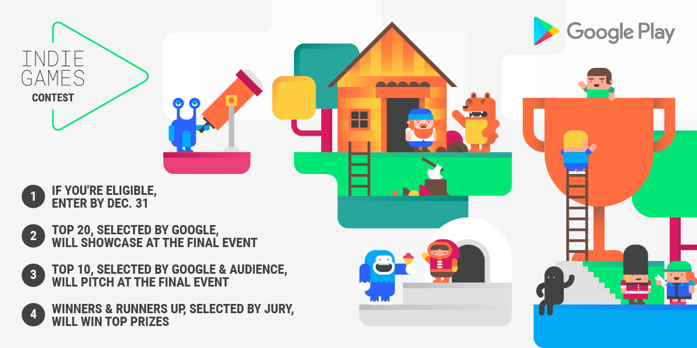

# Google Play独立游戏大赛回到了欧洲。现在加入

原标题：Google Play's Indie Games Contest is back in Europe. Enter now  
链接：[https://android-developers.googleblog.com/2017/10/the-google-play-indie-games-contest-is.html](https://android-developers.googleblog.com/2017/10/the-google-play-indie-games-contest-is.html)  
作者：Adriana Puchianu (Google Play开发者营销)  
翻译：[arjinmc](https://github.com/arjinmc)  

继[去年的成功](https://events.withgoogle.com/indie-games-contest-europe/)之后，今天我们宣布在欧洲举办第二届<strong>[Google Play独立游戏大赛](https://events.withgoogle.com/preview/indie-games-contest-2017/#content)</strong>，扩大到更多的国家和更大的奖项。比赛奖励你的激情，创意和创新，并提供支持，帮助你将游戏带给更多人。

[视频介绍](https://youtu.be/pBK4_wrgres)

## 决赛入围者和获奖者的奖品

* 去伦敦的旅行在萨奇画廊展示你的游戏
* 付费数字营销活动价值高达100,000欧元
* 高达50,000欧元的影响力活动
* Google Play上的高级展示位置
* 推广Android和Google Play营销渠道
* Google I / O 2018的门票和其他顶级行业活动
* 最新的Google硬件
* 最好的Unity游戏的特别奖

## 如何进入比赛

如果你位于28个符合条件的国家/地区之一，拥有30名或以下全职员工，并于2017年1月1日之后在Google Play上发布新游戏，你现在可以[参加比赛](https://events.withgoogle.com/indie-games-contest-2017/)。如果你计划很快发布新游戏，你还可以通过提交私人测试版进入。查看所有详细[条款和细则](https://events.withgoogle.com/indie-games-contest-2017/terms-conditions/#content)。提交截止于2017年12月31日。

  

最多20名决赛入围者将于2018年2月13日在伦敦萨奇画廊的公开赛中展示他们的比赛。在活动中，前10名将由活动参加者和Google Play团队选出。然后，前十名将会向行业专家陪审团提名，将从中选出最终的获胜者和选手。

## 来参加最后的活动

任何人都可以注册参加2018年2月13日在伦敦萨奇美术馆举办的[最终展示活动](https://events.withgoogle.com/indie-games-contest-2017/final-event/#content)

## 现在进入

现在就访问比赛网站[了解更多信息，并进入独立游戏大赛](https://events.withgoogle.com/indie-games-contest-2017/registrations/new/)。	