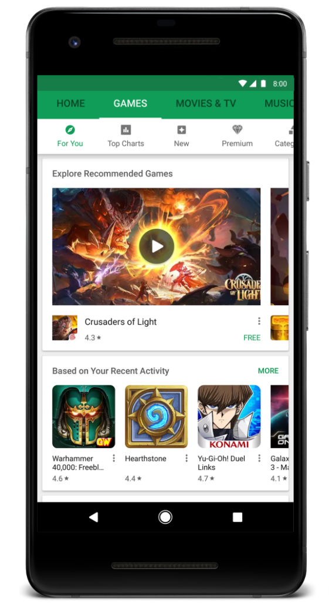
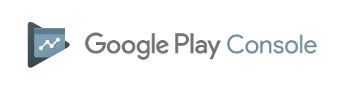
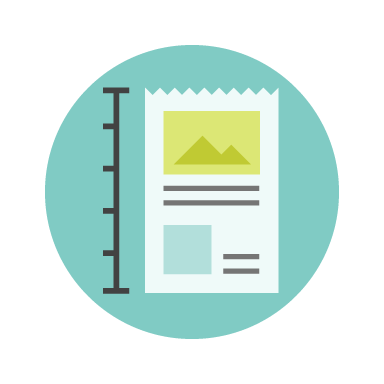

# Playtime 2017：通过新的Play Console功能在Google Play上取得成功并拓展业务

原标题：Playtime 2017: Find success on Google Play and grow your business with new Play Console features  
链接：[https://android-developers.googleblog.com/2017/10/playtime-2017-find-success-on-google.html](https://android-developers.googleblog.com/2017/10/playtime-2017-find-success-on-google.html)  
作者：Vineet Buch （Google Play 应用和游戏产品管理总监）  
翻译：[arjinmc](https://github.com/arjinmc)  

[视频介绍](https://youtu.be/B_OY_WwZUos)  

今天，我们在柏林和旧金山举办了一系列背对背活动的全球Playtime系列赛。在接下来的一个月中，我们将听到来自世界各地许多应用程序和游戏开发商的信息。对于Google Play的开发者来说，这是一个惊人的2017年，全球每月有超过80亿次新的安装。

为了帮助你继续利用此机会，我们宣布在Google Play上进行创新，并在Play Console中宣传新功能。[在Medium关注我们](http://medium.com/googleplaydev)，演讲者将发布他们的策略，最佳实践和示例，以帮助你实现业务目标。随着Google Play持续快速增长，我们希望帮助人们了解我们的业务。这就是为什么我们也会发布2017年的[2017Play状态报告](http://services.google.com/fh/files/misc/state_of_play_report_2017.pdf)，这些报告将每年更新一次，以帮助你了解我们的进展情况，以及我们如何帮助开发者取得成功。

  

Google Play上的应用和游戏可让你的设备贴近生活，无论是[手机和平板电脑，穿戴设备，电视，白日梦还是Chromebook，如新的Google Pixelbook](https://www.blog.google/topics/hardware/the-best-hardware-software-and-ai-together/)。让人们更容易发现并重新吸引Play商店的精彩内容。

## 认识最好

我们投资于策展和社论，展示我们所喜爱的最高质量的应用程序和游戏。该[改版的编辑选择](https://play.google.com/store/apps/topic?id=editors_choice)现在在17个国家直播和Android卓越新近迎来[新的应用程序和游戏](https://android-developers.googleblog.com/2017/10/android-excellence-congratulations-to.html)。我们还继续庆祝和支持独立游戏，最近宣布[在旧金山独立游戏节的获奖者](https://android-developers.googleblog.com/2017/09/announcing-winners-from-indie-games.html)，并[在欧洲开设第二届独立游戏竞赛提名](https://events.withgoogle.com/indie-games-contest-2017/)。

## 发现伟大的游戏

  
Google Play的新游戏体验

我们推出了一个[改进的游戏主页](https://play.google.com/store/apps/category/GAME)，预告片和游戏截图，两个新的浏览目录即将推出，“新”（即将到来和热门游戏）和“额外费用”（付费游戏）。

## 超越安装

我们正在提醒你尝试最近安装的游戏，并在Play Store上扩展我们成功的“实时操作”横幅，告诉你有关你在设备上的流行游戏中的主要的游戏中的事件。我们也很高兴将[Android Instant Apps(免安装应用)](https://g.co/instantapps)与商店列表中的“[立即尝试](https://play.google.com/store/apps/collection/promotion_3002d0f_instantapps_featuredapps)”按钮集成。只需点击一下，人们就可以直接进入应用程序体验，而无需安装。

  

Google Play Console可以在应用的生命周期的每一个步骤中提供帮助你和你的团队成员的工具。使用Play Console提高应用质量，自信地管理版本，并提高业务绩效。

## 专注于品质

  

在2011年I / O期间引入了Android vitals，已经有65％的顶级开发者使用仪表板来了解其应用程序的性能。我们增加了[五个新的Android vitals](https://support.google.com/googleplay/android-developer/answer/7385505)，并增加了设备[覆盖范围](https://developer.android.com/topic/performance/vitals/index.html)，以帮助你解决有关电池消耗，崩溃和渲染时间的问题。Google Play的搜索和发现算法更受青睐。

我们[正在改进预发布报告](https://support.google.com/googleplay/android-developer/answer/7002270)，并为所有开发者提供无需选择的功能。当你上传Alpha或Beta版APK时，我们将自动在物理流行的设备上安装和测试你的应用程序，由Firebase测试实验室提供支持。该报告将告诉你有关崩溃，显示问题，安全漏洞以及现在遇到的性能问题。

当你安装新的应用程序时，你希望打开并正常执行。为确保从Google Play安装应用和游戏的人员有积极的经验，开发者受益于受信任的生态系统的一部分，我们正在推出一项政策，以禁止在大多数设备上持续展示破坏的体验的应用，例如崩溃，关闭，冻结或异常运作。[在政策中心了解更多](https://play.google.com/about/spam-min-functionality/min-functionality/)。

## 放心发布

  

Beta测试可让受信任的用户尝试你的应用程序或游戏，然后进行生产，以便你可以迭代你的想法并收集反馈。你现在可以将[alpha和beta测试](https://support.google.com/googleplay/android-developer/answer/3131213)定位到特定国家/地区。这样，你可以在你即将推出的国家/地区进行beta测试，而其他国家/地区的用户则会收到你的制作应用程序。我们会尽快将定位到的国家优先推出。

我们还对[设备目录](https://support.google.com/googleplay/android-developer/answer/7353455)进行了改进。超过66％的顶级开发者正在使用目录，以确保他们在最广泛的设备上提供出色的用户体验。你现在可以保存设备搜索，并查看特定设备不支持你的应用的原因。浏览设备目录并查看服务条款以开始使用。

## 增加你的订阅业务

  

在I / O 2017年，我们宣布了Play用户数和订阅业务收入在前一年翻了一番。我们通过[Play Billing Library](https://developer.android.com/google/play/billing/billing_library.html)和即将推出的[新测试工具](https://developer.android.com/google/play/billing/billing_testing.html)，更轻松地设置和管理你的订阅服务，以简化测试流程以获得成功和不成功的付款。

我们正在帮助你获取并保留更多订阅者。你可以提供至少提前3天的短期免费试用版，我们现在将在应用程序级别执行一次免费试用，以减少滥用的可能性。有人取消订阅后，你可以选择接收通知，并让人们更轻松地恢复取消订阅。现在，通常可以使用帐户保留功能，当我们让用户修复续订付款问题时，你可以阻止访问你的服务。最后，从2018年1月起，我们也更新了保留12个月以上订阅者的[交易费用](https://support.google.com/googleplay/android-developer/answer/112622)。

## 宣布Google Play安全奖励计划

在Google，我们长期以来一直与安全研究界保持密切的关系。今天，我们推出了[Google Play安全奖励计划](https://security.googleblog.com/2017/10/introducing-google-play-security-reward.html)，以激励安全研究到流行的Android应用程序，包括Google自己的应用程序。该程序将帮助我们找到漏洞，并通过安全建议通知开发者如何解决这些漏洞。我们希望通过[其他奖励计划](https://www.google.com/about/appsecurity/programs-home/)带来成功，我们邀请开发者和研究界与我们共同积极改善Google Play生态系统的安全性。

### 保持最新的Google Play新闻和提示

  
[选择加入Google Play的电子邮件](https://g.co/play/monthlynews)

  
[在Twitter上关注@GooglePlayDev](https://twitter.com/googleplaydev)

  
[Google Play Apps＆Games on Medium](https://medium.com/googleplaydev)

  
[LinkedIn上的Google Play Apps＆Games](http://www.linkedin.com/company/googleplaydev)