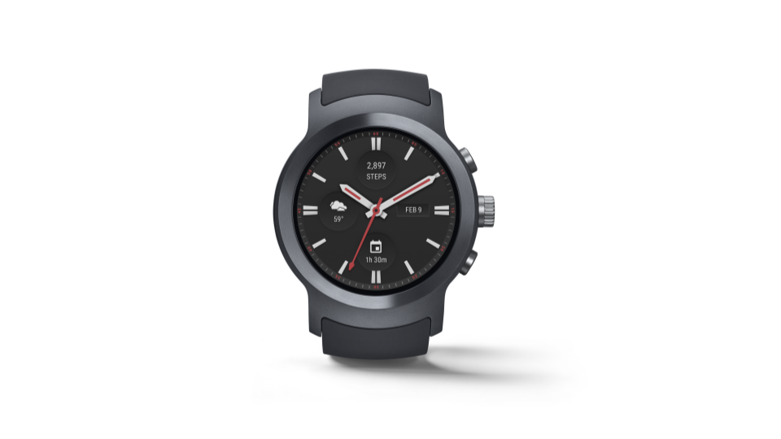
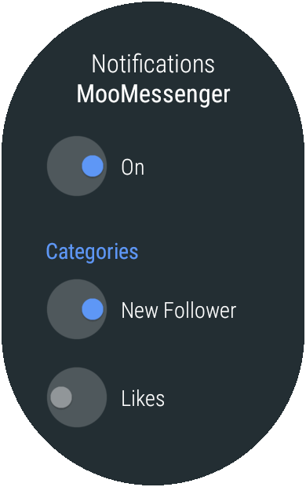

# Android Wear Beta

原标题：Android Wear Beta  
链接：[https://android-developers.googleblog.com/2017/10/android-wear-beta.html](https://android-developers.googleblog.com/2017/10/android-wear-beta.html)  
作者：Hoi Lam (Android Wear首席开发者倡导者)  
翻译：[arjinmc](https://github.com/arjinmc)  

   
<small>LG手表运动</small>

今天，我们推出了下一次Android Wear更新的测试版。正如我们在Google I / O中提到的，这主要是对API 26的技术升级，增强了后台限制和通知通道。LG Watch Sport用户可以访问[此网页](https://www.google.com/android/beta)进行注册，工厂图片将自动下载到你注册的手表中。由于这是一个测试版，请务必在注册之前查看[已知问题](https://developer.android.com/wear/releases/index.html)。如果你没有观看测试，可以使用Android模拟器。对于使用[Android Wear for China(中国大陆版)](https://developer.android.com/training/wearables/apps/creating-app-china.html)的开发者，也可以使用更新的仿真器映像。

## 通知渠道

在此更新中，用户可以通过[通知渠道](https://developer.android.com/guide/topics/ui/notifiers/notifications.html#ManageChannels)通过应用选择他们收到的通知类型。这给用户提供了细微的控制权，而不是忽略来自应用程序的所有通知。对于Android Wear应用程序本地生成的通知，用户将能够自己定制他们想要查看的通知通道。有关详细信息，请参阅[Wear通知示例](https://github.com/googlesamples/android-WearNotifications)。对于从手机桥接的通知，电话通知频道设置将决定手表上显示的内容。

   

```java
if (Build.VERSION.SDK_INT >= Build.VERSION_CODES.O) {
    mNotificationManager.createNotificationChannel(
        NotificationChannel("1001", "New Follower",
            NotificationManager.IMPORTANCE_DEFAULT))

    mNotificationManager.createNotificationChannel(
        NotificationChannel("1002", "Likes",
            NotificationManager.IMPORTANCE_LOW))
}
```
            
## 后台限制

对[后台服务](https://developer.android.com/about/versions/oreo/background.html)的限制有所增加。开发者应该假设服务无法再在后台运行，没有可见的通知。此外，后台位置更新频率将会降低。 应采用节省电池的最佳做法，例如使用[JobScheduler](https://developer.android.com/reference/android/app/job/JobScheduler.html)，以确保你的应用程序具有电池效能，并能够在可能的情况下执行后台任务。

## 请给我们你的反馈意见

我们预计这是在最终发行版之前的唯一测试版。感谢你的反馈。请通过[Android Wear问题跟踪器](https://issuetracker.google.com/issues/new?component=192711&template=840908)提交你发现的任何错误。提交的时间越早，我们可以在最终版本中包含修复的可能性越高。