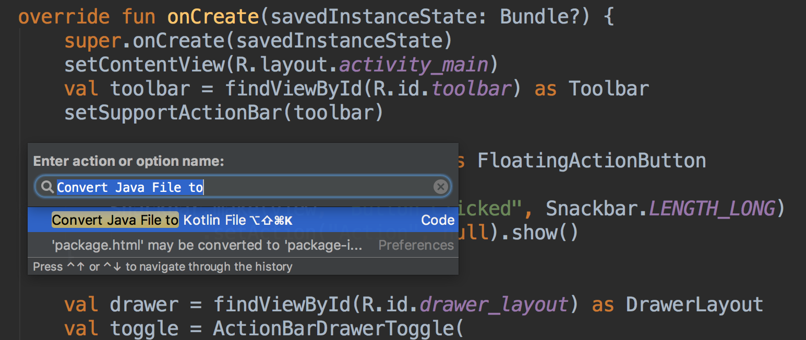
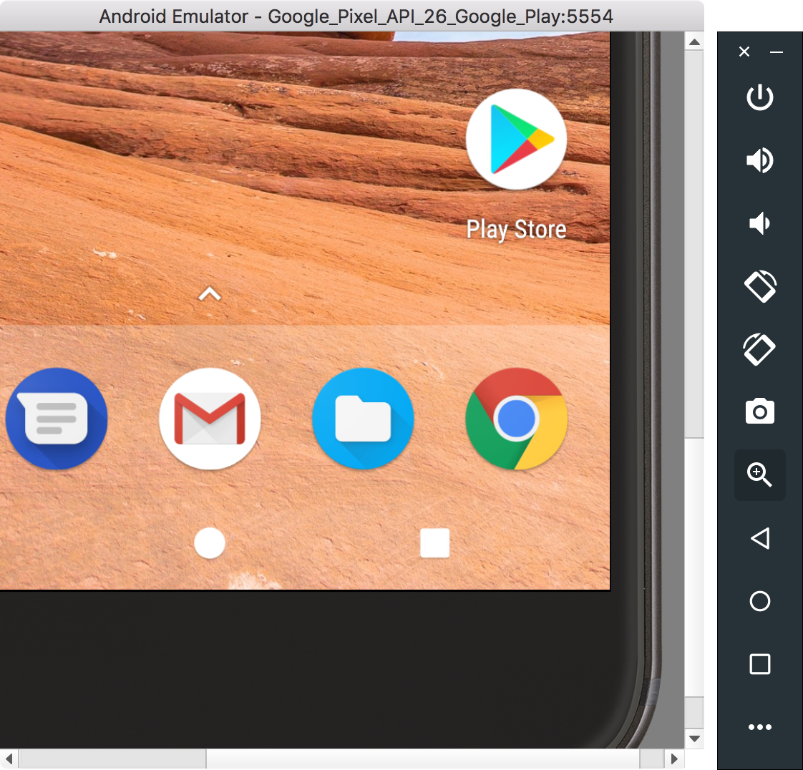
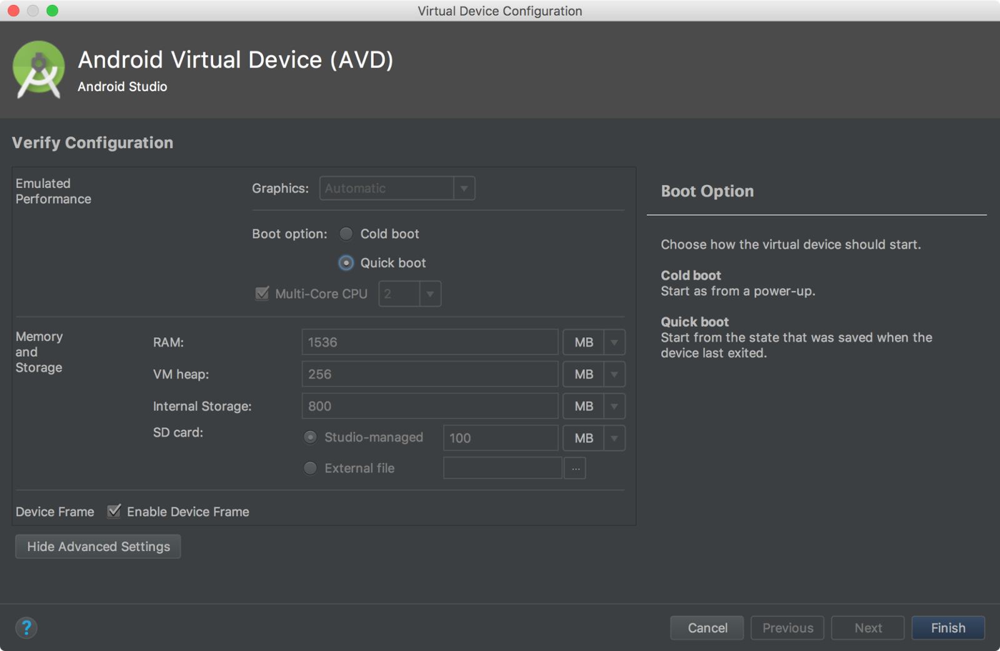
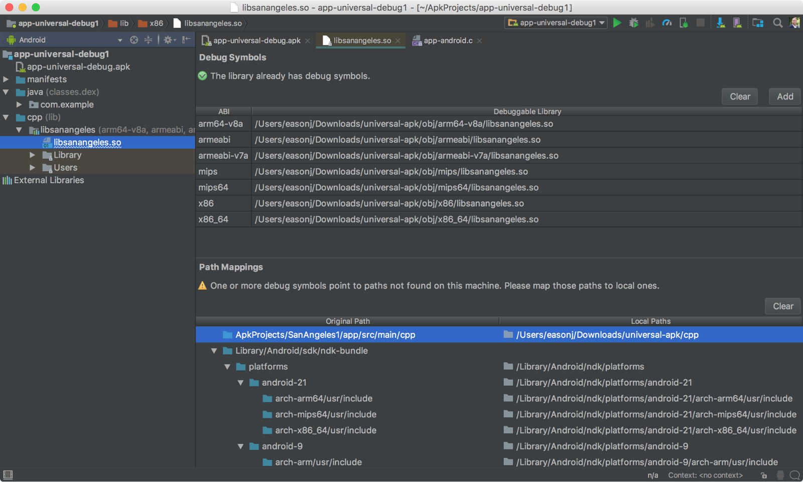
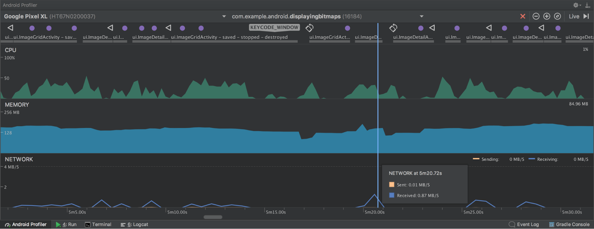
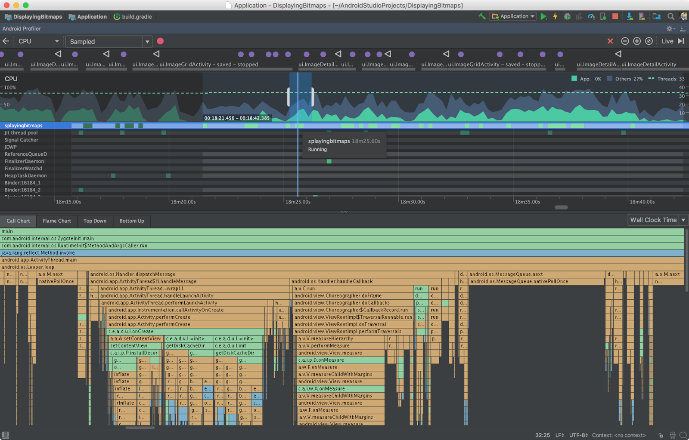
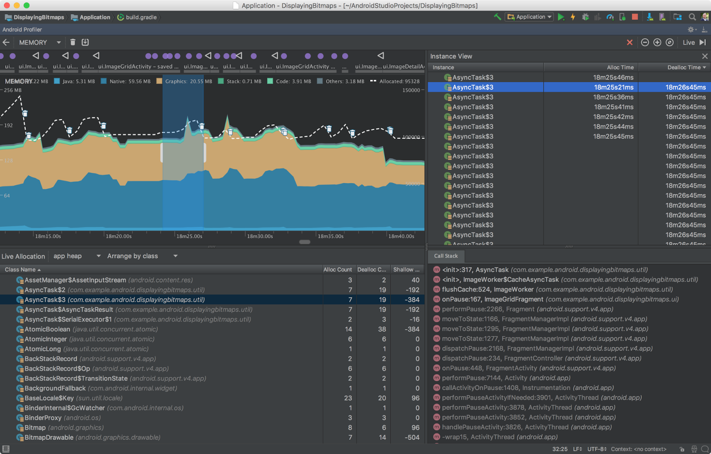
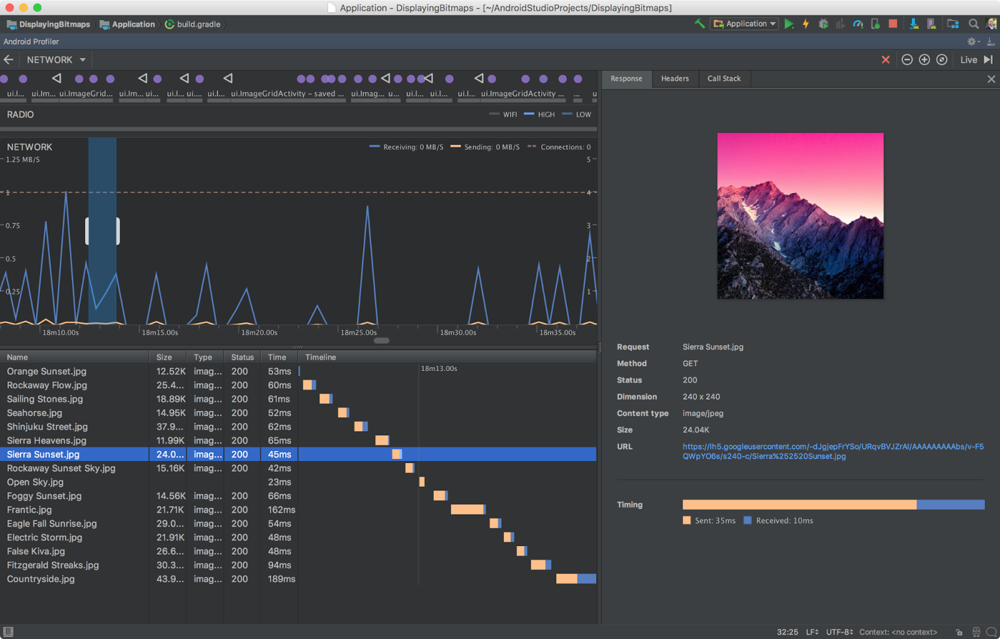

# Android Studio 3.0

原标题：Android Studio 3.0  
链接：[https://android-developers.googleblog.com/2017/10/android-studio-30.html](https://android-developers.googleblog.com/2017/10/android-studio-30.html)  
作者：Jamal Eason (Android产品经理)  
翻译：[arjinmc](https://github.com/arjinmc)  

Android Studio 3.0可以立即下载。在Google I / O 2017上宣布，Android Studio 3.0是一个大型更新，专注于加速Android上的应用开发。

Android Studio的这个版本包含了许多新的更新，但是你不希望遗失的三个主要的功能区域，包括：一套新的应用程序分析工具，用于快速诊断性能问题，支持Kotlin编程语言，以及新的工具和向导工具，以加速你在最新的Android Oreo API上的开发。

我们还投入了大量时间来改善Android Studio的许多领域的稳定性和性能。感谢你在预览版本的Android Studio 3.0中的反馈！如果你正在寻求高稳定性，希望为Android Oreo构建高品质应用程序，使用Kotlin语言开发，或使用最新的Android应用程序性能工具，那么你应该今天下载Android Studio 3.0。

请查看下面由主流程组的开发人员介绍Android Studio 3.0中的新功能列表。

[视频介绍](https://youtu.be/0n9sBgds-Hs)
Android Studio 3.0的新功能

## 开发

* <strong>Kotlin编程语言</strong> - 如[Google I / O 2017](https://android-developers.googleblog.com/2017/05/android-announces-support-for-kotlin.html)所宣布，[Kotlin](https://kotlinlang.org/)编程语言现在已被官方支持用于Android开发。Kotlin是一种表现力和简洁的语言，可以与现有的Android语言和运行时互操作，这意味着你可以根据需要在应用中使用尽可能少的语言。Kotlin是Google Play上许多受欢迎的Android应用程式使用的现成语言版本。

此版本的Android Studio是IDE中第一个将Kotlin语言支持捆绑的里程碑。许多你最喜欢的功能（如代码完成和语法突出显示）在本版本中都可以正常工作，我们将继续改进即将发布的剩余编辑器功能。你可以选择使用<strong>Code</strong> → <strong>Convert Java File to Kotlin File</strong>中的内置转换工具将Kotlin添加到项目中 ，或使用“新建项目向导”创建启用Kotlin的项目。更多地关注在[Android Studio中Kotlin语言支持](https://d.android.com/kotlin/get-started.html)。

  
Android Studio中的Kotlin语言转换

* <strong>Java 8语言功能</strong> - 在Android Studio 3.0中，我们将继续改进对Java 8语言功能的支持。随着[迁移到基于javac](https://android-developers.googleblog.com/2017/03/future-of-java-8-language-feature.html)的工具链，在项目中使用Java 8语言功能更加容易。要更新项目以支持新的Java 8语言工具链，只需在“项目结构”对话框中将“Source”和“Target”兼容级别更新为1.8。[了解详情](https://developer.android.com/studio/write/java8-support.html)。
* <strong>布局编辑器</strong> - 布局编辑器中的组件树具有更好的拖放视图插入和新的错误面板。[了解详情](https://developer.android.com/studio/write/layout-editor.html)。
* <strong>自适应图标向导</strong> - 新的向导将创建一组启动器图标资源，并提供你的自适应图标将如何与不同的启动器屏幕图标蒙版一起预览。支持VectorDrawable图层是本版本的新增功能。[了解详情](https://developer.android.com/studio/write/image-asset-studio.html)。
* <strong>XML字体和可下载字体</strong> - 如果你针对Android应用程序定位Android Oreo（API级别26及更高版本），则可以使用Android Studio 3.0添加自定义字体和可下载字体。
* <strong>Android Things支持</strong> - Android Studio 3.0在“新建项目”向导中包含一组新模板，并为Android Things平台开发新模块向导。 [了解详情](https://developer.android.com/things/index.html)。
* <strong>IntelliJ平台更新</strong>：Android Studio 3.0包括IntelliJ 2017.1版本，它具有Java 8语言重构，参数提示，语义突出显示，可拖动断点，增强版本控制搜索等功能。[了解详情](https://www.jetbrains.com/idea/whatsnew/#v2017-1)。

## 构建

* <strong>免安装应用程序支持</strong> - 通过此版本的Android Studio，你可以将[Instant Apps](https://developer.android.com/topic/instant-apps/index.html)功能添加到项目中。[今年早些时候可以进行全面开发](https://android-developers.googleblog.com/2017/05/android-instant-apps-is-open-to-all.html)，免安装应用程序是轻量级的Android应用程序，用户可以立即运行而无需安装。[了解详情](https://developer.android.com/topic/instant-apps/index.html)。
* <strong>构建速度改进</strong> - 为了进一步提高Gradle对于具有多个模块的大型项目的速度，我们在Android Gradle插件中引入了一个罕见的API更改，以提高可扩展性和构建时间。这个变化是我们将版本号从Android Studio 2.4跳到3.0的原因之一。如果你依赖于之前的Gradle插件提供的API，则应验证与新插件的兼容性并迁移到新的API。要测试，更新你的build.gradle文件中的插件版本 。[了解详情](https://developer.android.com/studio/preview/features/new-android-plugin.html)。
* <strong>Google的Maven存储库</strong> - 为了方便更小更快更新，Android Studio 3.0默认使用Google的Maven存储库，而不是使用Android SDK Manager来查找Android支持库，Google Play服务和Firebase Maven依赖关系的更新。与最新的命令行[SDK管理器工具](https://developer.android.com/studio/intro/update.html#download-with-gradle)和[Gradle](https://developer.android.com/studio/intro/update.html#download-with-gradle)结合使用，持续集成构建应迁移到Google的Maven存储库，以便将来进行Maven存储库更新。[了解详情](https://developer.android.com/studio/build/dependencies.html#google-maven)。

## 测试和调试

* <strong>Google Play系统图片</strong> - 我们还更新了Android Oreo的模拟器系统图像，现在包括Google Play商店。在Google Play商店中捆绑，你可以使用Google Play对应用进行端到端的测试，并提供了一种方便的方法来在Android虚拟设备（AVD）中保持最新的Google Play Service。就像Google Play Service在物理设备上更新一样，你可以在AVD上触发相同的更新。

  
Android模拟器中的Google Play商店

为了确保应用程序的安全性和物理设备的一致体验，包含Google Play商店的模拟器系统映像都使用发行版键进行签名。这意味着你将无法获得提升的权限。如果你需要提升的权限（root）来帮助应用程序进行故障排除，则可以使用不包含Google应用或服务的Android开源项目（AOSP）仿真器系统映像。学到更多。

* <strong>Android模拟器中的OpenGL ES 3.0支持</strong> - 最新版本的Android Emulator具有OpenGL ES 3.0对Android Oreo系统映像的支持，同时对较旧的模拟器系统映像也提供了OpenGL ES 2.0图形性能的显着改进。[了解详情](https://developer.android.com/studio/run/emulator-acceleration.html)。
* <strong>Android模拟器中的应用程序错误记录器</strong> - 为了帮助记录应用程序中的错误，我们添加了一种更简单的方法来生成具有所有必要配置设置和空间的Android模拟器的错误报告，以捕获你的摄制步骤。[了解详情](https://developer.android.com/studio/report-bugs.html#emulator-bugs)。
* <strong>Android中的代理支持</strong> - 如果你使用代理访问Internet，我们添加了一个用户界面来管理仿真器使用的HTTP代理设置。[了解详情](https://developer.android.com/studio/run/emulator-networking.html#proxy)。
* <strong>Android模拟器快速启动（Canary）</strong> - 我们听到的最常见的痛点之一是仿真器耗时太长。为了解决这个问题，我们很高兴预览一个新功能来解决这个叫Quick Boot，这显着加快了你的仿真器的开始时间。一旦启用，首次启动AVD将会发生冷启动（就像启动设备一样），但所有后续启动都很快，系统恢复到关闭仿真器的状态（类似于唤醒设备）。如果你想尝试一下，请确保你位于Canary更新版本的渠道，然后你将在SDK Manager中找到Android Emulator的v26.2.0。[了解详情](https://developer.android.com/studio/preview/emulator.html)。

  

* <strong>APK调试</strong> - Android Studio 3.0允许你调试任意的APK。这在功能上对于在另一个IDE中开发Android C ++代码但对Android Studio上下文中的APK进行调试和分析的人尤其有用。只要你有一个可调试的版本的APK，你可以使用新的APK调试功能来分析，配置和调试APK。此外，如果你可以访问APK的来源，你可以将源连接到APK调试流程，以实现更高保真的调试过程。只需从Android Studio欢迎屏幕或File→Profile或debug APK中简单地选择配置<strong>文件或调试APK</strong>即可。[了解更多信息](https://developer.android.com/studio/preview/features/apk-debugger.html)。

  
APK调试

* <strong>布局检查器</strong> - 在此版本中，我们为“布局检查器”添加了一些其他增强功能，包括将属性分为常用类别，以及“视图树”和“属性”面板中的搜索功能。[了解详情](https://developer.android.com/studio/debug/layout-inspector.html)。
* <strong>设备文件资源管理器</strong> - Android Studio 3.0中的新设备文件资源管理器可让你查看Android设备或模拟器的文件和目录结构。当你测试你的应用程序时，你现在可以直接在Android Studio中预览和修改应用数据文件。 [了解详情](https://d.android.com/studio/debug/device-file-explorer.html)。
* <strong>Android Test Orchestrator支持</strong> - 当与AndroidJUnitRunner 1.0或更高版本一起使用时，Android Gradle插件3.0支持使用Android测试演示器。Android测试代理程序允许你的每个应用程序的测试在其自己的[Instrumentation(仪表)](https://developer.android.com/reference/android/app/Instrumentation.html)中运行。[了解详情](https://developer.android.com/training/testing/junit-runner.html#using-android-test-orchestrator)。

## 优化
* <strong>Android Profiler</strong> - Android Studio 3.0包含一套全新的工具，帮助你调整应用程序中的性能问题。我们完全重写了以前的一套Android监视器工具，并将其替换为Android Profiler。将应用程序部署到正在运行的设备或模拟器后，单击“Android Profiler”选项卡，现在可以访问实时统一的应用程序CPU，内存和网络活动视图。每个性能事件都映射到UI事件时间轴，突出显示触摸事件，按键和活动更改，以便你在某些事件发生的时间和原因方面有更多的上下文。点击每个时间轴，深入了解你的应用程序的每个性能方面。[了解详情](https://developer.android.com/studio/preview/features/android-profiler.html)。

 
Android Profiler - 组合的时间轴视图。

 
CPU Profiler

 
内存分析器

 
网络分析器

* <strong>APK分析器改进</strong> - 我们还更新了APK Analyzer，并增加了其他功能，以帮助你进一步优化APK的大小。[了解详情](https://developer.android.com/studio/build/apk-analyzer.html)。

要重述，Android Studio 3.0包括这些新的主要功能：

### 开发

* [Kotlin语言](http://d.android.com/kotlin/)
* [Java 8语言](https://developer.android.com/studio/write/java8-support.html)
* [布局编辑器改进](https://developer.android.com/studio/write/layout-editor.html)
* [自适应图标向导](https://developer.android.com/studio/write/image-asset-studio.html)
* [XML字体和可下载的字体](https://developer.android.com/guide/topics/ui/look-and-feel/downloadable-fonts.html)
* [Android Things](https://developer.android.com/things/index.html)
* [Intellij平台更新2017.1](https://www.jetbrains.com/idea/whatsnew/#v2017-1)

### 构建

* [免安装应用支持](https://developer.android.com/topic/instant-apps/index.html)
* [构建速度改进](https://developer.android.com/studio/build/gradle-plugin-3-0-0-migration.html)
* [Google的Maven Repo更改](http://developer.android.com/studio/build/dependencies.html#google-maven)

### 优化

* [CPU Profiler](https://developer.android.com/studio/profile/cpu-profiler.html)
* [内存分析器](https://developer.android.com/studio/profile/memory-profiler.html)
* [网络分析器](https://developer.android.com/studio/profile/network-profiler.html)
* [APK分析仪改进](https://developer.android.com/studio/build/apk-analyzer.html)

### 测试和调试

* [模拟器Google Play系统映像](https://developer.android.com/studio/run/emulator.html)
* [模拟器OpenGL ES 3.0支持](https://developer.android.com/studio/run/emulator-acceleration.html)
* [仿真代理支持](https://developer.android.com/studio/run/emulator-networking.html#proxy)
* [应用程序Bug报告](https://developer.android.com/studio/debug/bug-report.html)
* [Android Wear Rotatory](https://developer.android.com/training/wearables/ui/rotary-input.html#emulator)
* [Android模拟器快速启动（Canary）](https://developer.android.com/studio/preview/emulator.html)
* [APK调试](https://developer.android.com/studio/debug/apk-debugger.html)
* [布局检查器](https://developer.android.com/studio/debug/layout-inspector.html)
* [设备文件浏览器](https://developer.android.com/studio/debug/device-file-explorer.html)

查看[发布说明](https://developer.android.com/studio/releases/index.html)了解更多详情。

## 入门

### 下载

如果你使用的是以前版本的Android Studio，则可以升级到Android Studio 3.0，也可以从官方的Android Studio Preview [下载页面](https://developer.android.com/studio/preview/index.html)下载更新。正如本博客中提到的，有一些突破性的Gradle Plugin API更改来支持IDE中的新功能。因此，你还应该将当前项目中的Android Gradle插件版本更新为3.0.0，以测试和验证你的应用程序项目设置。

我们感谢你想反馈任何内容，你想要看到的问题或功能。如果你发现bug或问题，请随时[提出问题](https://source.android.com/source/report-bugs#developer-tools)。在我们的[Google+](https://plus.google.com/103342515830390186255)专页或[Twitter](http://www.twitter.com/androidstudio)上与我们联系 - Android Studio开发小组