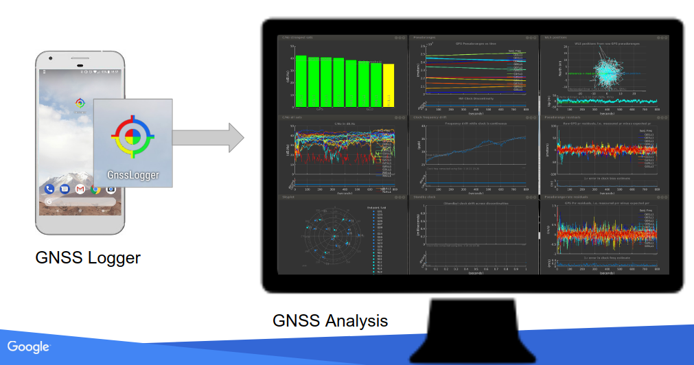
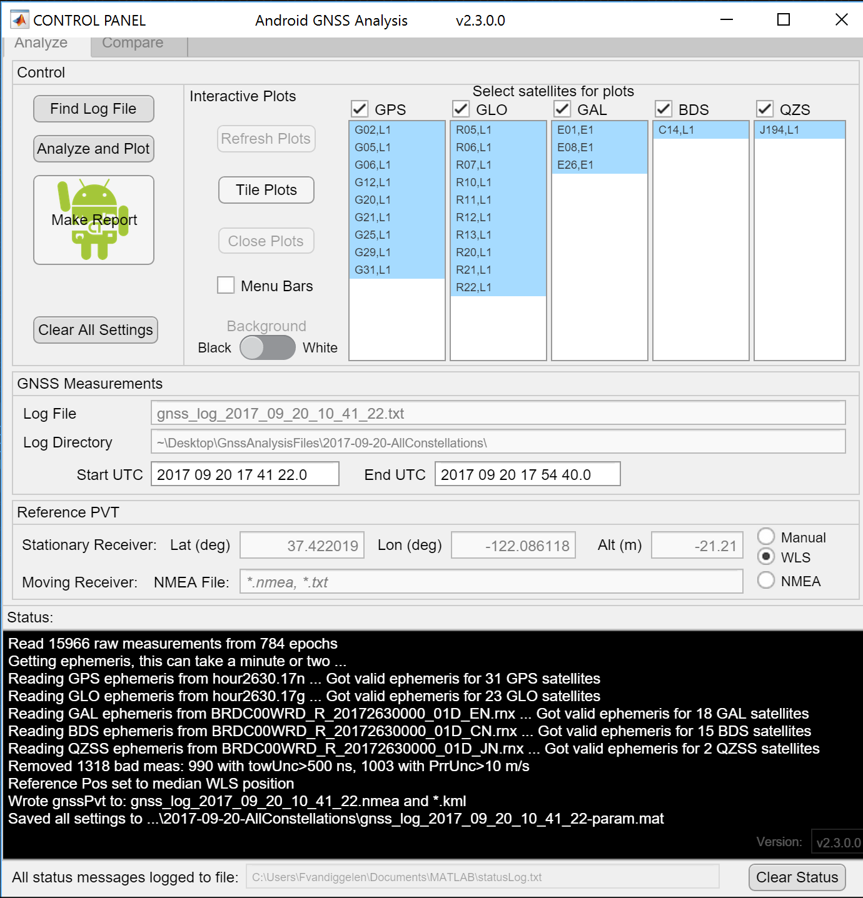
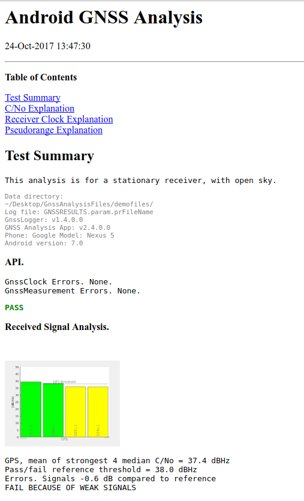

# Google的GNSS(全球导航卫星系统)分析工具

原标题：GNSS Analysis Tools from Google  
链接：[https://android-developers.googleblog.com/2017/10/gnss-analysis-tools-from-google.html](https://android-developers.googleblog.com/2017/10/gnss-analysis-tools-from-google.html)  
作者：Frank van Diggelen (软件工程师)  
翻译：[arjinmc](https://github.com/arjinmc)  

去年在Android Nougat，我们引入了用于从Android设备检索全球导航卫星系统（GNSS）原始测量的API。过去一周，我们公开发布了[GNSS分析工具](https://developer.android.com/guide/topics/sensors/gnss.html#analyze)来处理和分析这些测量。

Android拥有超过20亿台设备，Android手机由许多不同的制造商生产。这些工具的主要目的是使设备制造商能够详细了解GNSS接收机在每个特定设备设计中的工作状况，从而改进其设备中的设计和GNSS性能。 然而，随着公开的工具，研究和应用程序开发者社区也具有重要的价值。

## 如何使用该工具

GNSS分析工具是一个桌面应用程序，用于将原始的GNSS测量记录从Android设备作为输入接口。

  

该桌面应用程序提供交互式图，分为三列，显示RF，时钟和测量的行为。该数据使你可以非常详细地了解GNSS接收机的行为，包括接收机时钟偏移和漂移到1纳秒和1 ppb的量级，并以卫星为基础的测量误差。这使你能够在迄今为止几乎无法访问的芯片制造商本身几乎无法进行高级分析。

该工具支持多星座（GPS，GLONASS，Galileo(伽利略星)，BeiDou(北斗星)和QZSS(日本卫星系统)和多频。下图显示了由双频芯片跟踪的L1，L5，E1和E5信号的卫星位置。

  

这些工具提供了一个交互式控制画面，你可以从中进行操作，如下所示。从此控制屏幕，你可以更改背景颜色，启用菜单栏打印或保存，并选择特定的卫星图。

  

## 接收机测试报告

这些工具还提供接收器的自动测试报告。点击“Make Report”自动创建测试报告。该报告评估API实现，接收信号，时钟行为和测量精度。在每种情况下，它将根据已知的良好基准的性能报告PASS或FAIL。该测试报告主要用于设备制造商在重新设计和实现新设备时使用。示例报告如下所示。

  

我们提供这些分析工具的目标是让设备制造商，研究人员和开发者掌握数据和知识，为我们的客户使Android变得更好。你可以访问[GNSS测量站点](https://g.co/gnsstools)了解更多信息并下载此应用程序。