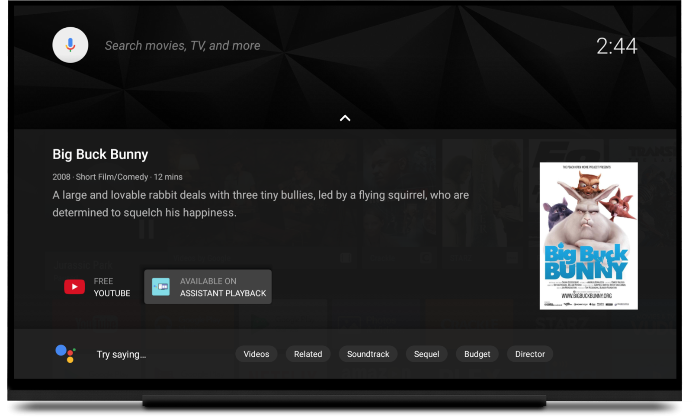

# 使用Google Assistant在Android TV上进行视频播放

原标题：Video Playback with the Google Assistant on Android TV  
链接：[https://android-developers.googleblog.com/2017/10/video-playback-with-google-assistant-on.html](https://android-developers.googleblog.com/2017/10/video-playback-with-google-assistant-on.html)  
作者：Benjamin Baxter （开发程序工程师)
翻译：[arjinmc](https://github.com/arjinmc)  

## 如何将Google助手移植到电视应用中

   

今年早些时候，我们[宣布了](https://www.blog.google/products/assistant/coming-soon-google-assistant-android-tv-and-more/)Google助手将会来到Android TV，并[已到来](https://www.blog.google/products/assistant/your-google-assistant-now-on-android-tv/)。[Android电视](https://assistant.google.com/intl/en_us/platforms/tv/)上的[Google Assistant](https://assistant.google.com/)可让用户发现，启动和控制媒体内容，控制诸如灯泡等智能设备。你的助理还了解你正在电视上进行互动，因此你可以在观看你喜爱的电影和电视节目时获得最佳体验。

Google Assistant具有内置的功能，可以了解“观看超人特工队”和媒体控件（如暂停，快进等）等命令。本文将介绍如何将Google Assistant集成到应用程序中。

没有新的API与Google Assistant集成。你只需要遵循Google Assistant从应用程序中预期的模式。如果你想试用和使用API​​和助手，可以[从github下载此示例](https://github.com/googlesamples/leanback-assistant)。

## 发现

Google Assistant已经进行了一些更改，以改善Android TV上的查找信息。

   

有几种方法可以通过Google Assisant向用户公开你的内容。

## 服务器端集成。（[需要注册和登机](https://docs.google.com/forms/d/e/1FAIpQLSdHdj-7o2c3fsMpClRfKL9qJiCrPlnmJ55oHE9jIpytKLm06w/viewform)）

你需要[将内容目录提供给Google](https://developers.google.com/search/docs/data-types/tv-movies)。你的应用之外，此Google数据被吸收并可供Google Assistant使用。

这不是Google Assistant的特定内容。它还可以启用其他Google服务，例如在Google搜索，Google Play，Google Home App和Android TV上搜索和发现。

## 客户端集成。（适用于所有应用）

如果你的应用程序已经[可以搜索](https://developer.android.com/training/tv/discovery/searchable.html)，那么你只需要处理[EXTRA_START_PLAYBACK](https://developer.android.com/reference/android/support/v4/content/IntentCompat.html#EXTRA_START_PLAYBACK)标志，稍后再详细介绍。如果在搜索结果中明确指定了应用名称，或者用户是否已经在你的应用中，内容将自动播放。

一旦你的应用程序可以搜索，你可以通过询问助手进行测试，或者如果你处于较大的区域，请通过运行以下adb命令安静地进行测试：

```code 
adb shell am start -a "android.search.action.GLOBAL_SEARCH" --es query \"The Incredibles\" 
```

响应搜索查询的每个应用程序将显示一行显示其搜索结果。请注意，YouTube和示例应用程序“Assistant播放”每个都会收到自己的行与搜索查询匹配的内容。

对于诸如“玩Big Buck Bunny”的特定搜索，助手将向每张应用程序提供一张与[搜索查询完全匹配](https://developer.android.com/training/tv/discovery/searchable.html#details)的按钮的卡片。在下面的屏幕截图中，你可以看到示例应用程序“助手播放”，显示为可以观看Big Buck Bunny的选项。

   

Google助手有时会直接启动应用开始播放内容。发生这种情况的一个例子是当内容是应用程序的排他性时; “玩 the Netflix original House of Cards”。

## 启动

当用户从搜索结果中选择视频时，会将intent发送到你的应用。intent action的优先顺序如下：

1. 在从游标返回的游标中指定的Intent（[SUGGEST_COLUMN_INTENT_ACTION](https://developer.android.com/reference/android/app/SearchManager.html#SUGGEST_COLUMN_INTENT_ACTION)）。
2. Intent在[searchable.xml](https://developer.android.com/guide/topics/search/searchable-config.html)文件中具有[searchSuggestIntentAction](https://developer.android.com/guide/topics/search/searchable-config.html#searchSuggestIntentAction)值。
3. 默认为ACTION_VIEW。

此外，如果播放应立即开始，助手还会通过一个额外的信号。你的应用程序应该能够处理intent，并期待一个额外的boolan值的[EXTRA_START_PLAYBACK](https://developer.android.com/reference/android/support/v4/content/IntentCompat.html#EXTRA_START_PLAYBACK)。

```java
import static android.support.v4.content.IntentCompat.EXTRA_START_PLAYBACK;

public class SearchableActivity extends Activity {

   @Override
   protected void onCreate(@Nullable Bundle savedInstanceState) {
       super.onCreate(savedInstanceState);
       if (getIntent() != null) {
           // Retrieve video from getIntent().getData().

           boolean startPlayback = getIntent().getBooleanExtra(EXTRA_START_PLAYBACK, false);
           Log.d(TAG, "Should start playback? " + (startPlayback ? "yes" : "no"));

           if (startPlayback) {
               // Start playback.
               startActivity(...);
           } else {
               // Show details for movie.
               startActivity(...);
           }
       }
       finish();
   }
}
```

你可以通过修改和运行以下adb命令来测试。如果你的应用有自定义操作，请使用自定义操作替换android.intent.action.VIEW。使用你从助手查询返回的URI 替换[-d参数的值](https://developer.android.com/studio/command-line/adb.html#IntentSpec)。

```code 
adb shell 'am start -a android.intent.action.VIEW --ez
android.intent.extra.START_PLAYBACK true -d <URI> -f 0x14000000'
```

该<i>-f</i>参数是逻辑或从值[FLAG_ACTIVITY_NEW_TASK](https://developer.android.com/reference/android/content/Intent.html#FLAG_ACTIVITY_NEW_TASK) | [FLAG_ACTIVITY_CLEAR_TOP](https://developer.android.com/reference/android/content/Intent.html#FLAG_ACTIVITY_CLEAR_TOP)。这将迫使你的activity新鲜推出。

例如，在示例应用程序中，你可以运行以下命令来启动“Big Buck Bunny”的播放，就像助手已启动的那样。

```code
adb shell 'am start -a android.intent.action.VIEW --ez
android.intent.extra.START_PLAYBACK true -d 
content://com.example.android.assistantplayback/video/2 -n
com.example.android.assistantplayback/.SearchableActivity -f 0x14000000'
```

上面的URI除了从查询返回的[SearchManager.SUGGEST_COLUMN_INTENT_DATA_ID](https://developer.android.com/reference/android/app/SearchManager.html#SUGGEST_COLUMN_INTENT_DATA_ID)（2）的值之外，还可以在[searchable.xml](https://github.com/googlesamples/leanback-assistant/blob/master/app/src/main/res/xml/searchable.xml)（content：//com.example.android.assistantplayback/video/）中的android：searchSuggestIntentData值定义该值。

请注意，Google Assistant可能会在7天内缓存Intent。你的应用可能会收到不再可用的内容的播放请求。Intent处理程序应设计为无状态的，而不是依赖任何以前的知识来处理深层链接。你的应用程序应优雅地处理这种情况。一个解决方案是显示一条错误消息，让用户登陆你的主Activity或其他相关Activity。

## 回放

如果你的应用程序正确地[实现了MediaSession](https://developer.android.com/guide/topics/media-apps/working-with-a-media-session.html)，那么你的应用程序应该立即工作，而无需更改。

   
[Blender基金会](http://www.blender.org/)所有。根据知[识共享署名3.0](http://creativecommons.org/licenses/by/3.0/)授权许可。

Google Assistant假定你的应用程序处理传输控件。助手使用[TransportControls](https://developer.android.com/reference/android/media/session/MediaController.TransportControls.html)将媒体命令发送到你的应用程序的MediaSession。视频应用程序必须尽可能支持以下控件：

* 播放/暂停/停止
* 上一页下一页
* 倒带/快进（实现[seekTo()](https://developer.android.com/reference/android/media/session/MediaController.TransportControls.html#seekTo(long))）

你可以通过实现[MediaSession.Callback](https://developer.android.com/reference/android/media/session/MediaSession.Callback.html)轻松获取这些控件的钩子。如果你使用[PlaybackTransportControlGlue](https://developer.android.com/reference/android/support/v17/leanback/media/PlaybackTransportControlGlue.html)播放视频，则所有回调都需要同步glue和MediaSession。否则使用此回调来同步播放器。

```java
public class MyMediaSessionCallback extends MediaSessionCompat.Callback {

   private final PlaybackTransportControlGlue<?> mGlue;

   public MediaSessionCallback(PlaybackTransportControlGlue<?> glue) {
       mGlue = glue;
   }

   @Override
   public void onPlay() {
       Log.d(TAG, "MediaSessionCallback: onPlay()");
       mGlue.play();
       updateMediaSessionState(...);
   }

   @Override
   public void onPause() {
       Log.d(TAG, "MediaSessionCallback: onPause()");
       mGlue.pause();
       updateMediaSessionState(...);
   }

   @Override
   public void onSeekTo(long position) {
       Log.d(TAG, "MediaSessionCallback: onSeekTo()");
       mGlue.seekTo(position);
       updateMediaSessionState(...);
   }

   @Override
   public void onStop() {
       Log.d(TAG, "MediaSessionCallback: onStop()");
       // Handle differently based on your use case.
   }

   @Override
   public void onSkipToNext() {
       Log.d(TAG, "MediaSessionCallback: onSkipToNext()");
       playAndUpdateMediaSession(...);
   }

   @Override
   public void onSkipToPrevious() {
       Log.d(TAG, "MediaSessionCallback: onSkipToPrevious()");
       playAndUpdateMediaSession(...);
   }
}
```

## 继续学习

查看以下文章和培训文档，以继续了解MediaSession和Video应用程序。

* [与Google助手进行互动](https://developer.android.com/guide/topics/media-apps/interacting-with-assistant.html)
* [MediaSession实现视频](https://developer.android.com/guide/topics/media-apps/video-app/building-a-video-player-activity.html)
* [了解MediaSession](https://medium.com/google-developers/understanding-mediasession-part-1-3-e4d2725f18e4)

要在Android TV上使用Google Assistant，请下载[示例应用程序](https://github.com/googlesamples/leanback-assistant)，并在运行Android M或更高版本的Nvidia Shield上运行。

如果你想继续讨论，请在[Twitter](https://twitter.com/benjamintravels)上回复或与我交谈。