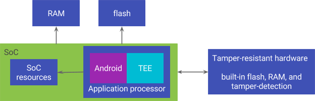

# Pixel 2的安全模块如何派生企业级安全性

原标题：How the Pixel 2’s security module delivers enterprise-grade security  
链接：[https://android-developers.googleblog.com/2017/11/how-pixel-2s-security-module-delivers.html](https://android-developers.googleblog.com/2017/11/how-pixel-2s-security-module-delivers.html)  
作者：Xiaowen Xin (Android安全团队)  
翻译：[arjinmc](https://github.com/arjinmc)  

新的Google Pixel 2带有一个专用的硬件安全模块，能够抵御物理攻击。该硬件模块执行锁屏密码验证，并且比单独使用软件更好地保护你的锁屏。

要了解有关新保护的更多信息，我们首先回顾一下锁屏的作用。启用锁屏可以保护你的数据，而不仅仅是针对休闲盗贼，还可以防止复杂的攻击。包括所有Pixel手机在内的许多Android设备都使用你的锁屏密码来派生出用于加密数据的密钥。在重新启动后第一次将手机解锁之前，攻击者无法在不知道密码的情况下恢复密钥（以及数据）。为了防止[暴力](https://en.wikipedia.org/wiki/Brute-force_attack)猜测你的密码，运行Android 7.0或更高版本的设备在安全的环境中验证你的尝试，从而限制你多次重复猜测。只有当安全环境已成功验证你的密码时，才会显示用于派生磁盘加密密钥的设备和用户特定的密钥。

## 防篡改硬件的好处

这些保护措施的目标是防止攻击者在不知道密码的情况下解密你的数据，但保护措施与验证密码的安全环境一样强大。在防篡改硬件中执行这些类型的安全关键操作显着增加了攻击难度。

  

防篡改硬件采用与[片块系统](https://en.wikipedia.org/wiki/System_on_a_chip)（SoC）分离的独立芯片形式。它包含了自己的闪存，RAM和其他资源在一个包中，所以它可以完全控制自己的执行。它也可以检测和防御外部的物理篡改尝试。尤其是：

* 由于它拥有自己的专用RAM，因此可以抵御诸如[TruSpy高速缓存通道说明书](https://eprint.iacr.org/2016/980.pdf)中所述的许多侧通道信息泄漏攻击。
* 因为它有自己的专用闪存，所以很难干涉其持久存储状态的能力。
* 它直接从内部ROM和闪存加载它的操作系统和软件，并且控制所有的更新，所以攻击者不能直接篡改它的软件来注入恶意代码。
* 防篡改硬件可抵御许多物理故障注入技术，包括尝试在正常工作条件（例如电压错误，时钟速度错误或温度错误）之外运行。这在[SmartCard IC平台保护配置文件](https://www.commoncriteriaportal.org/files/ppfiles/ssvgpp01.pdf)等规范中是标准化的，并且防篡改硬件通常经过这些标准的认证。
* 防篡改硬件通常安装在能抵抗物理穿透的封装中，并设计用于抵抗旁路通道攻击，包括功率分析，时序分析和电磁嗅探，如[SoC到EM文章](https://eprint.iacr.org/2015/561.pdf)中所述。

## Pixel 2中的安全模块

新的Google Pixel 2附带了一个使用防篡改硬件构建的安全模块，可以保护你的锁屏和数据免受许多复杂的硬件攻击。

除了已经提到的所有优点之外，Pixel 2中的安全模块还可以帮助保护你免受纯软件攻击：

1. 因为它执行的功能非常少，所以它有一个超级小的攻击面。
2. 如果在安全模块中发生密码验证，即使在其他地方进行了完全的妥协，攻击者也无法首先获取安全模块，而无法获取你的磁盘加密密钥。
3. 安全模块的设计使包括Google在内的任何人都无法在不知道密码的情况下将密码验证逻辑更新为虚拟版本。

## 总结

与许多其他Google产品（例如[Chromebook](https://www.chromium.org/developers/design-documents/tpm-usage)和[Cloud](https://cloudplatform.googleblog.com/2017/08/Titan-in-depth-security-in-plaintext.html)）一样，Android和Pixel正在投入额外的硬件保护，以使你的设备更安全。借助全新的Google Pixel 2，你的数据可以更安全地抵御一整套复杂的硬件攻击。

